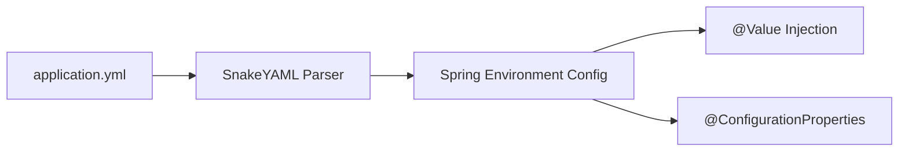

# Lesson 6: Configuration with YAML in Spring Boot

> 🌐 **Language / ភាសា:** 🇬🇧 **[English](README.md)** | 🇰🇭 [ភាសាខ្មែរ (Khmer)](README.kh.md)  
> 🧭 **Navigation:** [📚 Module Index](../README.md) | [← Previous Lesson](../05-application-properties/README.md) | [Next Lesson →](../07-spring-boot-actuator/README.md)

> 📂 **Runnable Example Project:**  
> 👉 **Complete Project:** [Bookstore YAML Configuration](../../examples/01-rest-api-crud)  
> 📄 **Source Code Files:** [`application.yml`](../../examples/01-rest-api-crud/src/main/resources/application.yml)


---

## Table of Contents
1. [Introduction to YAML](#introduction-to-yaml)
2. [Comparison: .properties vs .yml (.yaml)](#comparison-properties-vs-yml-yaml)
3. [YAML Syntax Structure in Spring Boot](#yaml-syntax-structure-in-spring-boot)
4. [Managing Profiles with Multi-document YAML](#managing-profiles-with-multi-document-yaml)
5. [Binding Configuration to Java Objects (@ConfigurationProperties)](#binding-configuration-to-java-objects-configurationproperties)
6. [Best Practices and Common Pitfalls](#best-practices-and-common-pitfalls)

---

## Introduction to YAML
**YAML** (YAML Ain't Markup Language) is a human-readable data-serialization language. Spring Boot offers first-class support for `application.yml` (and `application.yaml`) right out of the box using SnakeYAML on the runtime classpath.



---

## Comparison: .properties vs .yml (.yaml)

### 1. Flat `application.properties`:
```properties
server.port=8080
server.servlet.context-path=/api
spring.datasource.url=jdbc:mysql://localhost:3306/mydb
spring.datasource.username=root
spring.datasource.password=secret
spring.datasource.driver-class-name=com.mysql.cj.jdbc.Driver
```

### 2. Hierarchical `application.yml`:
```yaml
server:
  port: 8080
  servlet:
    context-path: /api

spring:
  datasource:
    url: jdbc:mysql://localhost:3306/mydb
    username: root
    password: secret
    driver-class-name: com.mysql.cj.jdbc.Driver
```

### Comparison Matrix:
| Feature | application.properties | application.yml |
| :--- | :--- | :--- |
| **Readability** | Verbose with repeated prefixes | Clean, clear hierarchical visual tree |
| **List / Array Support** | Cumbersome index-based syntax | Natural hyphen lists (`- item`) |
| **Multi-document Profiles** | Limited | Native document splitting with `---` |
| **Formatting Sensitivity** | Lenient with whitespace | Strict indentation (No Tabs allowed) |

---

## YAML Syntax Structure in Spring Boot

### 1. Key-Value and Nested Objects
```yaml
app:
  name: "E-Commerce Microservice"
  version: 1.0.0
  description: >
    Production-grade enterprise backend service
    built with Spring Boot 3.x
```

### 2. Lists and Arrays
```yaml
security:
  whitelist-paths:
    - /api/v1/auth/**
    - /swagger-ui/**
    - /actuator/health
```

### 3. Maps / Key-Value Dictionaries
```yaml
app:
  currency-rates:
    USD: 1.0
    KHR: 4100.0
    THB: 35.5
```

---

## Managing Profiles with Multi-document YAML

In modern Spring Boot (2.4+), multi-document YAML files allow configuring environment profiles within a single `application.yml` using `---`:

```yaml
spring:
  application:
    name: payment-service
  profiles:
    active: dev

---
spring:
  config:
    activate:
      on-profile: dev
server:
  port: 8080
logging:
  level:
    root: DEBUG

---
spring:
  config:
    activate:
      on-profile: prod
server:
  port: 443
logging:
  level:
    root: INFO
```

---

## Binding Configuration to Java Objects (@ConfigurationProperties)

The recommended approach to consume complex YAML configurations is using type-safe `@ConfigurationProperties`:

### 1. YAML Definition:
```yaml
app:
  mail:
    host: smtp.example.com
    port: 587
    timeout: 5000
    auth-enabled: true
```

### 2. Java Record Definition:
```java
package com.example.config;

import org.springframework.boot.context.properties.ConfigurationProperties;

@ConfigurationProperties(prefix = "app.mail")
public record MailProperties(
    String host,
    int port,
    int timeout,
    boolean authEnabled
) {}
```

### 3. Enable Configuration Scanning:
```java
@SpringBootApplication
@ConfigurationPropertiesScan
public class DemoApplication {
    public static void main(String[] args) {
        SpringApplication.run(DemoApplication.class, args);
    }
}
```

---

## Best Practices and Common Pitfalls
- **Never use Tab characters**: Always use standard 2-space indentation to avoid YAML parsing exceptions.
- **Prefer `@ConfigurationProperties` over `@Value`**: Grouped properties are validated, type-safe, and facilitate IDE autocompletion.
- **Follow Kebab-Case in YAML Keys**: Spring Boot automatically maps kebab-case (`auth-enabled`) to camelCase (`authEnabled`) in Java code via relaxed binding.

---

## 🧭 Lesson Navigation

| Previous Lesson | Module Index | Next Lesson |
| :--- | :---: | :--- |
| [← Managing Configuration with Application Properties](../05-application-properties/README.md) | [📚 Module Index](../README.md) | [Production Readiness & Observability with Spring Boot Actuator →](../07-spring-boot-actuator/README.md) |
