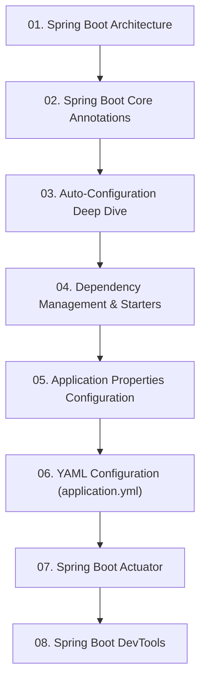

# Module 3: លក្ខណៈពិសេសស្នូលរបស់ Spring Boot (Core Features)

> 🌐 **ភាសា / Language:** 🇰🇭 **[ភាសាខ្មែរ (Khmer)](README.kh.md)** | 🇬🇧 [English](README.md)

## 📖 សេចក្តីផ្តើមអំពី Module

ស្វែងយល់ពីបច្ចេកវិទ្យាស្នូលរបស់ Spring Boot៖ ស្ថាបត្យកម្ម Layered, Annotations សំខាន់ៗ, យន្តការ Auto-Configuration, Starters, Properties/YAML, Actuator, និង DevTools។

---

## 🗺️ ផែនទីសិក្សាប្រចាំ Module (Learning Roadmap)

---

## 📚 បញ្ជីមេរៀនក្នុង Module (8 Lessons)

| មេរៀន (Lesson) | ប្រធានបទ (Topic) | ការពិពណ៌នា (Description) |
| :---: | :--- | :--- |
| **01** | [Spring Boot Architecture](01-spring-boot-architecture/README.kh.md) | ស្ថាបត្យកម្ម 4-Layer និងដំណើរការ Request-Response |
| **02** | [Spring Boot Core Annotations](02-spring-boot-annotations/README.kh.md) | បណ្តុំ Annotations សំខាន់ៗបំផុតដែលត្រូវចេះក្នុង Spring Boot |
| **03** | [Auto-Configuration Deep Dive](03-auto-configuration/README.kh.md) | យន្តការកំណត់រចនាសម្ព័ន្ធស្វ័យប្រវត្តិ និង @Conditional |
| **04** | [Dependency Management & Starters](04-dependency-management/README.kh.md) | ការគ្រប់គ្រង Dependencies តាម Starters និង Spring Boot BOM |
| **05** | [Application Properties Configuration](05-application-properties/README.kh.md) | ការកំណត់ Properties, @Value, និង @ConfigurationProperties |
| **06** | [YAML Configuration (application.yml)](06-yaml-configuration/README.kh.md) | ការប្រើប្រាស់ YAML, Hierarchical structure, និង Multi-Profiles |
| **07** | [Spring Boot Actuator](07-spring-boot-actuator/README.kh.md) | ការត្រួតពិនិត្យសុខភាពប្រព័ន្ធតាម /health, /metrics, /info |
| **08** | [Spring Boot DevTools](08-spring-boot-devtools/README.kh.md) | បង្កើនល្បឿនអភិវឌ្ឍន៍ជាមួយ Automatic Restart និង LiveReload |

---

## 🧭 ការរុករក (Navigation)

| ថយក្រោយ (Previous) | មាតិកាចម្បង (Main Index) | បន្ទាប់ (Next Module) |
| :--- | :---: | :--- |
| [Module 2: Spring Core Concept](../02-spring-core-concept/README.kh.md) | [📚 មាតិកា Spring Boot](../README.kh.md) | [Module 4: REST APIs →](../04-spring-boot-with-rest-api/README.kh.md) |
