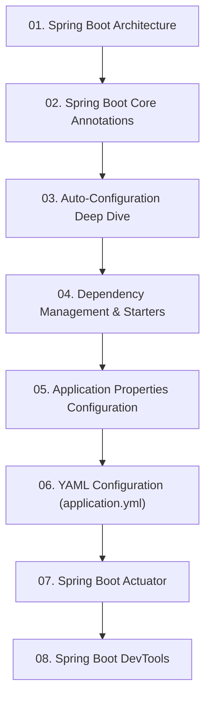

# Module 3: Spring Boot Core Features & Runtime Engine

> 🌐 **Language / ភាសា:** 🇰🇭 [ភាសាខ្មែរ (Khmer)](README.kh.md) | 🇬🇧 **[English](README.md)**

## 📖 Module Overview

Mastering the runtime engine of Spring Boot: layered architecture, core annotations, auto-configuration conditions, dependency management, YAML profiles, Actuator, and DevTools.

---

## 🗺️ Module Learning Roadmap

---

## 📚 Lessons in This Module (8 Lessons)

| Lesson | Topic | Description |
| :---: | :--- | :--- |
| **01** | [Spring Boot Architecture](01-spring-boot-architecture/README.md) | Layered architecture and internal request-response flow |
| **02** | [Spring Boot Core Annotations](02-spring-boot-annotations/README.md) | Comprehensive guide to indispensable Spring Boot annotations |
| **03** | [Auto-Configuration Deep Dive](03-auto-configuration/README.md) | Under the hood: Auto-Configuration and @Conditional annotations |
| **04** | [Dependency Management & Starters](04-dependency-management/README.md) | Opinionated starter POMs and transitive dependency management |
| **05** | [Application Properties Configuration](05-application-properties/README.md) | Configuration via application.properties and type-safe binding |
| **06** | [YAML Configuration (application.yml)](06-yaml-configuration/README.md) | Configuring application.yml and multi-environment profiles |
| **07** | [Spring Boot Actuator](07-spring-boot-actuator/README.md) | Production telemetry via Actuator health, metrics, and env endpoints |
| **08** | [Spring Boot DevTools](08-spring-boot-devtools/README.md) | Accelerating development with sub-second restarts and LiveReload |

---

## 🧭 Navigation

| Previous | Main Index | Next Module |
| :--- | :---: | :--- |
| [Module 2: Spring Core Concept](../02-spring-core-concept/README.md) | [📚 Spring Boot Home](../README.md) | [Module 4: REST APIs →](../04-spring-boot-with-rest-api/README.md) |
