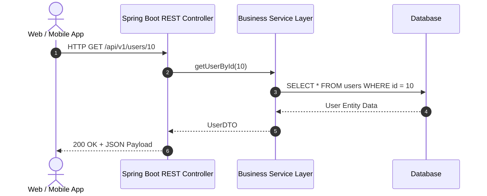

# មេរៀនទី ១: សេចក្តីផ្តើមអំពី RESTful Web Services (Introduction to RESTful Web Services)

> 🌐 **ភាសា / Language:** 🇰🇭 **[ភាសាខ្មែរ (Khmer)](README.kh.md)** | 🇬🇧 [English](README.md)  
> 🧭 **រុករក:** [📚 មាតិកា Module](../README.kh.md) | [← មេរៀនមុន](../../03-spring-boot-core-features/08-spring-boot-devtools/README.kh.md) | [មេរៀនបន្ទាប់ →](../02-rest-controller/README.kh.md)

---

## មាតិកា (Table of Contents)
1. [តើអ្វីទៅជា REST និង RESTful Web Services?](#តើអ្វីទៅជា-rest-និង-restful-web-services)
2. [គោលការណ៍គ្រឹះទាំង ៦ នៃ REST (6 Architectural Constraints)](#គោលការណ៍គ្រឹះទាំង-៦-នៃ-rest)
3. [HTTP Methods និង Status Codes សំខាន់ៗ](#http-methods-និង-status-codes-សំខាន់ៗ)
4. [រចនាសម្ព័ន្ធ Resource URI Design Best Practices](#រចនាសម្ព័ន្ធ-resource-uri-design-best-practices)
5. [ហេតុអ្វីត្រូវជ្រើសរើស Spring Boot សម្រាប់ REST APIs?](#ហេតុអ្វីត្រូវជ្រើសរើស-spring-boot-សម្រាប់-rest-apis)
6. [សង្ខេប](#សង្ខេប)

---

## តើអ្វីទៅជា REST និង RESTful Web Services?
**REST** តំណាងឱ្យ **Representational State Transfer** ដែលត្រូវបានបង្កើតឡើងដោយលោក Roy Fielding ក្នុងឆ្នាំ ២០០០។ វាជាស្ថាបត្យកម្មបែប Architectural Style សម្រាប់ប្រព័ន្ធ Distributed Hypermedia Systems ដែលប្រើប្រាស់ពិធីការ HTTP ក្នុងការទំនាក់ទំនងរវាង Client (ដូចជា Web, Mobile App, Frontend) និង Server។

**RESTful Web Service** គឺជា Web API ដែលគោរពតាមលក្ខខណ្ឌ និងគោលការណ៍ណែនាំរបស់ REST Architecture ទាំងស្រុង។

---

## គោលការណ៍គ្រឹះទាំង ៦ នៃ REST

1. **Client-Server Architecture**: បែងចែកដាច់ស្រឡះរវាង User Interface (Client) និង Data Storage / Business Logic (Server)។
2. **Statelessness**: រាល់ Request នីមួយៗពី Client ត្រូវតែមានព័ត៌មានគ្រប់គ្រាន់សម្រាប់ Server ដំណើរការ ដោយ Server មិនត្រូវរក្សា Session State របស់ Client លើ Memory ឡើយ។
3. **Cacheability**: ព័ត៌មានឆ្លើយតប (Response) ត្រូវកំណត់ច្បាស់ថាតើអាច Cache បាន ឬមិនបាន (តាមរយៈ HTTP Headers ដូចជា `Cache-Control`, `ETag`)។
4. **Uniform Interface**: ចំណុចប្រទាក់រួមស្តង់ដារ ដោយប្រើ HTTP Methods (GET, POST, PUT, DELETE), Resource URIs, និង Data Representations (JSON/XML)។
5. **Layered System**: Client មិនចាំបាច់ដឹងថាវាភ្ជាប់ដោយផ្ទាល់ទៅ Server ឬឆ្លងកាត់ Intermediaries ដូចជា Load Balancers, Proxies ឬ API Gateways ឡើយ។
6. **Code on Demand (Optional)**: Server អាចបញ្ជូន executable code (ដូចជា JavaScript) ទៅកាន់ Client ដើម្បីដំណើរការបណ្តោះអាសន្ន។

---

## HTTP Methods និង Status Codes សំខាន់ៗ

### HTTP Methods:
- **GET**: ទាញយកទិន្នន័យពី Resource (Safe & Idempotent)
- **POST**: បង្កើត Resource ថ្មី (Not Idempotent)
- **PUT**: ធ្វើបច្ចុប្បន្នភាព Resource ទាំងមូល (Idempotent)
- **PATCH**: កែប្រែទិន្នន័យតែមួយផ្នែកតូចនៃ Resource (Not necessarily Idempotent)
- **DELETE**: លុប Resource ចេញ (Idempotent)

### HTTP Status Code Categories:
- **2xx (Success)**: `200 OK`, `201 Created`, `204 No Content`
- **3xx (Redirection)**: `301 Moved Permanently`, `304 Not Modified`
- **4xx (Client Errors)**: `400 Bad Request`, `401 Unauthorized`, `403 Forbidden`, `404 Not Found`, `409 Conflict`
- **5xx (Server Errors)**: `500 Internal Server Error`, `502 Bad Gateway`, `503 Service Unavailable`

---

## រចនាសម្ព័ន្ធ Resource URI Design Best Practices

- ប្រើប្រាស់ **Plural Nouns** (នាមពហុវចនៈ) សម្រាប់ Resource URI:
  - ✅ `/api/v1/products`
  - ❌ `/api/v1/getProduct`
- ប្រើ Sub-resources សម្រាប់បង្ហាញទំនាក់ទំនង Hierarchical:
  - ✅ `/api/v1/users/42/orders` (ទាញយក orders របស់ user លេខ ៤២)
- ប្រើ Query Parameters សម្រាប់ Filter, Sort, និង Pagination:
  - ✅ `/api/v1/products?category=electronics&page=0&size=20&sort=price,asc`

---

## ហេតុអ្វីត្រូវជ្រើសរើស Spring Boot សម្រាប់ REST APIs?
- **Embedded Web Server**: រួមបញ្ចូល Tomcat / Jetty ស្រាប់ ដោយពុំបាច់ deploy WAR ស្មុគស្មាញ។
- **Jackson Integration**: បម្លែង Java Objects ទៅ JSON និងពី JSON មក Java Objects ដោយស្វ័យប្រវត្តិ។
- **Declarative Annotations**: `@RestController`, `@GetMapping`, `@PostMapping` ធ្វើឱ្យកូដខ្លី និងងាយយល់។
- **Validation & Exception Handling**: គាំទ្រ Hibernate Validator (`@Valid`) និង `@RestControllerAdvice` កម្រិតខ្ពស់។

---

## 🧭 ការរុករកមេរៀន (Lesson Navigation)

| ថយក្រោយ (Previous) | មាតិកា Module (Index) | បន្ទាប់ (Next) |
| :--- | :---: | :--- |
| [← បង្កើនល្បឿនអភិវឌ្ឍន៍ជាមួយ Spring Boot DevTools (Developer Tools)](../../03-spring-boot-core-features/08-spring-boot-devtools/README.kh.md) | [📚 បញ្ជីមេរៀន Module](../README.kh.md) | [ការបង្កើត REST Controller ជាមួយ @RestController →](../02-rest-controller/README.kh.md) |
