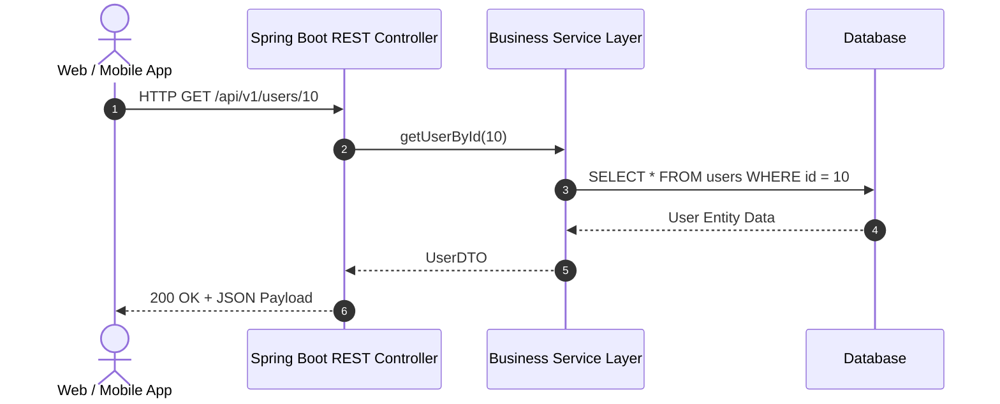

# Lesson 1: Introduction to RESTful Web Services

> 🌐 **Language / ភាសា:** 🇬🇧 **[English](README.md)** | 🇰🇭 [ភាសាខ្មែរ (Khmer)](README.kh.md)  
> 🧭 **Navigation:** [📚 Module Index](../README.md) | [← Previous Lesson](../../03-spring-boot-core-features/08-spring-boot-devtools/README.md) | [Next Lesson →](../02-rest-controller/README.md)

---

## Table of Contents
1. [What is REST and RESTful Web Services?](#what-is-rest-and-restful-web-services)
2. [The 6 Architectural Constraints of REST](#the-6-architectural-constraints-of-rest)
3. [Key HTTP Methods and Status Codes](#key-http-methods-and-status-codes)
4. [Resource URI Design Best Practices](#resource-uri-design-best-practices)
5. [Why Choose Spring Boot for REST APIs?](#why-choose-spring-boot-for-rest-apis)
6. [Summary](#summary)

---

## What is REST and RESTful Web Services?
**REST** stands for **Representational State Transfer**, introduced by Roy Fielding in his 2000 doctoral dissertation. It is an architectural style for distributed hypermedia systems that leverages standard HTTP protocols to facilitate stateless communication between clients (web browsers, mobile applications) and servers.

A **RESTful Web Service** is any web service and API implementation that strictly adheres to the REST architectural constraints.

---

## The 6 Architectural Constraints of REST

1. **Client-Server Separation**: Strict separation of concerns between user interface/presentation (client) and data storage/business rules (server).
2. **Statelessness**: Every client request must contain all necessary authentication and context data. The server does not store client session state between requests.
3. **Cacheability**: Responses must explicitly define themselves as cacheable or non-cacheable to improve network efficiency (`Cache-Control`, `ETag`).
4. **Uniform Interface**: Standardized interactions via HTTP verbs (GET, POST, PUT, DELETE), standard resource naming, and representations (JSON/XML).
5. **Layered System**: The client cannot tell whether it communicates directly with the end server or an intermediary such as an API Gateway, Proxy, or Load Balancer.
6. **Code on Demand (Optional)**: Servers can temporarily extend client functionality by transferring executable code (e.g., scripts).

---

## Key HTTP Methods and Status Codes

### HTTP Methods:
- **GET**: Retrieve resource representation (Safe & Idempotent)
- **POST**: Create a new resource (Not Idempotent)
- **PUT**: Replace/Update an entire resource (Idempotent)
- **PATCH**: Partially modify an existing resource
- **DELETE**: Remove a resource (Idempotent)

### HTTP Status Code Categories:
- **2xx (Success)**: `200 OK`, `201 Created`, `204 No Content`
- **3xx (Redirection)**: `301 Moved Permanently`, `304 Not Modified`
- **4xx (Client Errors)**: `400 Bad Request`, `401 Unauthorized`, `403 Forbidden`, `404 Not Found`, `409 Conflict`
- **5xx (Server Errors)**: `500 Internal Server Error`, `502 Bad Gateway`, `503 Service Unavailable`

---

## Resource URI Design Best Practices

- Use **Plural Nouns** for resource endpoints:
  - ✅ `/api/v1/products`
  - ❌ `/api/v1/getProduct`
- Express hierarchical relationships with sub-resources:
  - ✅ `/api/v1/users/42/orders` (Orders belonging to user 42)
- Use Query Parameters for filtering, pagination, and sorting:
  - ✅ `/api/v1/products?category=electronics&page=0&size=20&sort=price,asc`

---

## Why Choose Spring Boot for REST APIs?
- **Embedded Web Server**: Embedded Tomcat/Jetty allows running as a standalone executable JAR.
- **Auto-Configured Jackson**: Automatically handles bidirectional Java Object <-> JSON serialization.
- **Clean Annotations**: `@RestController`, `@GetMapping`, `@PostMapping` eliminate boilerplate.
- **Enterprise-Grade Validation & Error Handling**: Seamless integration with Hibernate Validator and `@RestControllerAdvice`.

---

## 🧭 Lesson Navigation

| Previous Lesson | Module Index | Next Lesson |
| :--- | :---: | :--- |
| [← Accelerating Development with Spring Boot DevTools](../../03-spring-boot-core-features/08-spring-boot-devtools/README.md) | [📚 Module Index](../README.md) | [Building REST Controllers with @RestController →](../02-rest-controller/README.md) |
