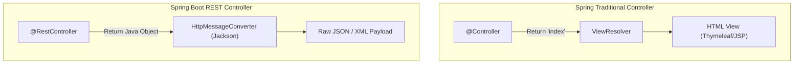

# មេរៀនទី ២: ការបង្កើត REST Controller ជាមួយ @RestController

> 🌐 **ភាសា / Language:** 🇰🇭 **[ភាសាខ្មែរ (Khmer)](README.kh.md)** | 🇬🇧 [English](README.md)  
> 🧭 **រុករក:** [📚 មាតិកា Module](../README.kh.md) | [← មេរៀនមុន](../01-intro-to-restful-web-services/README.kh.md) | [មេរៀនបន្ទាប់ →](../03-request-mapping/README.kh.md)

> 📂 **កូដគំរូជាក់ស្តែង (Runnable Example Project):**  
> 👉 **គម្រោងពេញលេញ:** [Bookstore REST API (@RestController & Endpoints)](../../examples/01-rest-api-crud)  
> 📄 **File កូដជាក់ស្តែង:** [`BookController.java`](../../examples/01-rest-api-crud/src/main/java/com/example/bookstore/controller/BookController.java) | [`BookResponse.java`](../../examples/01-rest-api-crud/src/main/java/com/example/bookstore/dto/BookResponse.java)


## មាតិកា (Table of Contents)

- [1. ការស្វែងយល់អំពី REST API និង HTTP Methods](#1-ការស្វែងយល់អំពី-rest-api-និង-http-methods)
- [2. ភាពខុសគ្នារវាង `@Controller` និង `@RestController`](#2-ភាពខុសគ្នារវាង-controller-និង-restcontroller)
- [3. Mapping Annotations ក្នុង Spring Boot](#3-mapping-annotations-ក្នុង-spring-boot)
- [4. ការគ្រប់គ្រង HTTP Status Codes ជាមួយ `ResponseEntity`](#4-ការគ្រប់គ្រង-http-status-codes-ជាមួយ-responseentity)
- [5. ឧទាហរណ៍ជាក់ស្តែង៖ Product Management Controller](#5-ឧទាហរណ៍ជាក់ស្តែង-product-management-controller)
- [6. សង្ខេប](#6-សង្ខេប)

---

## 1. ការស្វែងយល់អំពី REST API និង HTTP Methods

**REST (Representational State Transfer)** គឺជាស្តង់ដារស្ថាបត្យកម្មដ៏ពេញនិយមបំផុតសម្រាប់បង្កើត Web APIs ដើម្បីអនុញ្ញាតឱ្យ Frontend (Web, Mobile, Desktop) អាចប្រាស្រ័យទាក់ទងជាមួយ Backend តាមរយៈពិធីការ **HTTP**។

### គោលការណ៍ HTTP Methods សំខាន់ៗទាំង ៥៖

| HTTP Method | សកម្មភាព (CRUD Action) | គោលបំណង (Purpose) | លក្ខណៈ Idempotent |
| :--- | :--- | :--- | :--- |
| **`GET`** | **R**ead | ទាញយកទិន្នន័យពី Server (មិនកែប្រែទិន្នន័យ) | ✅ Yes |
| **`POST`** | **C**reate | បង្កើត Record ថ្មីលើ Server | ❌ No |
| **`PUT`** | **U**pdate (Replace) | ជំនួស ឬកែប្រែទិន្នន័យទាំងមូលនៃ Record | ✅ Yes |
| **`PATCH`** | **U**pdate (Partial) | កែប្រែតែចំណុចខ្លះនៃទិន្នន័យ (កែតែ Field ខ្លះ) | ❌ No / Context |
| **`DELETE`** | **D**elete | លុបទិន្នន័យចេញពី Server | ✅ Yes |

---

## 2. ភាពខុសគ្នារវាង `@Controller` និង `@RestController`

ក្នុង Spring MVC បុរាណ យើងប្រើប្រាស់ `@Controller` ដើម្បី Return HTML Templates (JSP, Thymeleaf)។ តែក្នុងសម័យទំនើបនេះ យើងចង់បានតែទិន្នន័យ JSON ឬ XML សុទ្ធសាធដើម្បីបញ្ជូនទៅឱ្យ Single Page Apps ឬ Mobile Apps។

```
@RestController = @Controller + @ResponseBody
```



- `@Controller`: Method នីមួយៗ return ឈ្មោះ View (HTML Template Name)។
- `@ResponseBody`: ប្រាប់ Spring ឱ្យបម្លែង Object ដែល return ចេញពី Java ទៅជា JSON ដោយផ្ទាល់ដាក់ក្នុង HTTP Response Body។
- `@RestController`: សន្សំសំចៃពេល ដោយយើងមិនបាច់សរសេរ `@ResponseBody` នៅលើរាល់ Method ទាំងអស់ឡើយ។

---

## 3. Mapping Annotations ក្នុង Spring Boot

ជំនួសឱ្យការសរសេរ `@RequestMapping(value = "/path", method = RequestMethod.GET)` ដ៏វែងអន្លាយ Spring Boot ផ្តល់ Shortcut Annotations យ៉ាងស្រស់ស្អាត៖

| Shortcut Annotation | សមមូលនឹង RequestMapping | ឧទាហរណ៍ URI |
| :--- | :--- | :--- |
| `@GetMapping` | `@RequestMapping(method = RequestMethod.GET)` | `GET /api/v1/products` |
| `@PostMapping` | `@RequestMapping(method = RequestMethod.POST)` | `POST /api/v1/products` |
| `@PutMapping` | `@RequestMapping(method = RequestMethod.PUT)` | `PUT /api/v1/products/10` |
| `@PatchMapping` | `@RequestMapping(method = RequestMethod.PATCH)` | `PATCH /api/v1/products/10` |
| `@DeleteMapping` | `@RequestMapping(method = RequestMethod.DELETE)` | `DELETE /api/v1/products/10` |

---

## 4. ការគ្រប់គ្រង HTTP Status Codes ជាមួយ `ResponseEntity`

ជំនួសឱ្យការ Return Object ធម្មតាដែលតែងតែទទួលបាន HTTP Status `200 OK` យើងគួរប្រើប្រាស់ `ResponseEntity<T>` ដើម្បីកំណត់ HTTP Status Code, Custom Headers, និង Response Body ឱ្យបានត្រឹមត្រូវតាមស្តង់ដារ HTTP RESTful៖

- `200 OK`: ជោគជ័យទូទៅ (`GET`, `PUT`).
- `201 Created`: បង្កើត Record ថ្មីជោគជ័យ (`POST`).
- `204 No Content`: សកម្មភាពជោគជ័យ តែគ្មាន Data ត្រូវ return (`DELETE`).
- `400 Bad Request`: Input របស់ Client មិនត្រឹមត្រូវ។
- `404 Not Found`: រកមិនឃើញ Resource ក្នុង Database។
- `500 Internal Server Error`: កំហុសបច្ចេកទេសក្នុង Server។

---

## 5. ឧទាហរណ៍ជាក់ស្តែង៖ Product Management Controller

សូមមើលគំរូកូដ Controller ពេញលេញដែលអនុវត្តតាម Best Practices៖

```java
package com.example.demo.controller;

import org.springframework.http.HttpStatus;
import org.springframework.http.ResponseEntity;
import org.springframework.web.bind.annotation.*;

import java.util.*;

@RestController
@RequestMapping("/api/v1/products")
public class ProductController {

    // ឧទាហរណ៍ Mock Memory Storage (ជំនួស Database បណ្តោះអាសន្ន)
    private final Map<Long, String> productStore = new HashMap<>();

    public ProductController() {
        productStore.put(1L, "MacBook Pro M3");
        productStore.put(2L, "iPhone 16 Pro");
    }

    // 1. GET ALL
    @GetMapping
    public ResponseEntity<Collection<String>> getAllProducts() {
        return ResponseEntity.ok(productStore.values());
    }

    // 2. GET BY ID
    @GetMapping("/{id}")
    public ResponseEntity<String> getProductById(@PathVariable Long id) {
        String product = productStore.get(id);
        if (product == null) {
            return ResponseEntity.status(HttpStatus.NOT_FOUND)
                                 .body("រកមិនឃើញផលិតផលដែលមាន ID = " + id);
        }
        return ResponseEntity.ok(product);
    }

    // 3. CREATE (POST)
    @PostMapping
    public ResponseEntity<String> createProduct(@RequestBody Map<String, String> payload) {
        Long newId = (long) (productStore.size() + 1);
        String productName = payload.get("name");
        productStore.put(newId, productName);

        return ResponseEntity.status(HttpStatus.CREATED)
                             .body("បានបង្កើតផលិតផលជោគជ័យ (ID: " + newId + ")");
    }

    // 4. UPDATE (PUT)
    @PutMapping("/{id}")
    public ResponseEntity<String> updateProduct(@PathVariable Long id, @RequestBody Map<String, String> payload) {
        if (!productStore.containsKey(id)) {
            return ResponseEntity.notFound().build();
        }
        productStore.put(id, payload.get("name"));
        return ResponseEntity.ok("បានកែប្រែផលិតផលជោគជ័យ");
    }

    // 5. DELETE
    @DeleteMapping("/{id}")
    public ResponseEntity<Void> deleteProduct(@PathVariable Long id) {
        if (!productStore.containsKey(id)) {
            return ResponseEntity.notFound().build();
        }
        productStore.remove(id);
        return ResponseEntity.noContent().build(); // 204 No Content
    }
}
```

---

## 6. សង្ខេប

- `@RestController` បង្កប់ `@ResponseBody` មកជាមួយស្រាប់ ដែលបម្លែង Return Value ជា JSON ដោយស្វ័យប្រវត្តិ។
- ប្រើប្រាស់ `@RequestMapping` នៅលើ Class Level ដើម្បីកំណត់ Base URL Prefix ដូចជា `/api/v1/...`។
- ប្រើ Shortcuts ដូចជា `@GetMapping`, `@PostMapping`, `@PutMapping`, `@DeleteMapping` ដើម្បីភាពច្បាស់លាស់។
- ប្រើប្រាស់ `ResponseEntity<T>` ជានិច្ច ដើម្បីគ្រប់គ្រង HTTP Status Codes (200, 201, 204, 404) ឱ្យសមស្របតាមស្តង់ដារ REST API។

---
## 🧭 ការរុករកមេរៀន (Lesson Navigation)

| ថយក្រោយ (Previous) | មាតិកា Module (Index) | បន្ទាប់ (Next) |
| :--- | :---: | :--- |
| [← សេចក្តីផ្តើមអំពី RESTful Web Services (Introduction to RESTful Web Services)](../01-intro-to-restful-web-services/README.kh.md) | [📚 បញ្ជីមេរៀន Module](../README.kh.md) | [ការប្រើប្រាស់ @RequestMapping (Deep Dive into @RequestMapping) →](../03-request-mapping/README.kh.md) |
