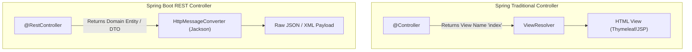

# Lesson 2: Building REST Controllers with @RestController

> 🌐 **Language / ភាសា:** 🇬🇧 **[English](README.md)** | 🇰🇭 [ភាសាខ្មែរ (Khmer)](README.kh.md)  
> 🧭 **Navigation:** [📚 Module Index](../README.md) | [← Previous Lesson](../01-intro-to-restful-web-services/README.md) | [Next Lesson →](../03-request-mapping/README.md)

> 📂 **Runnable Example Project:**  
> 👉 **Complete Project:** [Bookstore REST API (@RestController & Endpoints)](../../examples/01-rest-api-crud)  
> 📄 **Source Code Files:** [`BookController.java`](../../examples/01-rest-api-crud/src/main/java/com/example/bookstore/controller/BookController.java) | [`BookResponse.java`](../../examples/01-rest-api-crud/src/main/java/com/example/bookstore/dto/BookResponse.java)


## Table of Contents

- [1. Understanding REST APIs and HTTP Methods](#1-understanding-rest-apis-and-http-methods)
- [2. Difference Between `@Controller` and `@RestController`](#2-difference-between-controller-and-restcontroller)
- [3. Mapping Annotations in Spring Boot](#3-mapping-annotations-in-spring-boot)
- [4. Managing HTTP Status Codes with `ResponseEntity`](#4-managing-http-status-codes-with-responseentity)
- [5. Practical Example: Product Management Controller](#5-practical-example-product-management-controller)
- [6. Summary](#6-summary)

---

## 1. Understanding REST APIs and HTTP Methods

**REST (Representational State Transfer)** is the preeminent architectural standard for developing modern web services, enabling disparate clients (Web Single-Page Apps, Mobile Clients, IoT devices) to interact with backend services across the **HTTP protocol**.

### The 5 Core HTTP Methods:

| HTTP Method | CRUD Action | Purpose | Idempotent |
| :--- | :--- | :--- | :--- |
| **`GET`** | **R**ead | Retrieve resource representations without server state modification | ✅ Yes |
| **`POST`** | **C**reate | Submit data to create a new subordinate resource | ❌ No |
| **`PUT`** | **U**pdate (Replace) | Atomically replace an existing target resource with payload | ✅ Yes |
| **`PATCH`** | **U**pdate (Partial) | Apply partial modifications to an existing target resource | ❌ No / Context |
| **`DELETE`** | **D**elete | Remove a designated target resource from the server | ✅ Yes |

---

## 2. Difference Between `@Controller` and `@RestController`

In legacy Spring MVC architectures, `@Controller` returns view identifiers (HTML view resolution like JSP or Thymeleaf). In RESTful API architectures, services return serialized payloads directly (typically JSON or XML).

```
@RestController = @Controller + @ResponseBody
```



- `@Controller`: Method return values resolve to template view names.
- `@ResponseBody`: Instructs Spring MVC to serialize return values directly into the HTTP response body via configured message converters.
- `@RestController`: Convenience meta-annotation combining `@Controller` and `@ResponseBody`, eliminating boilerplate annotations across all endpoints.

---

## 3. Mapping Annotations in Spring Boot

Instead of verbose `@RequestMapping(value = "/path", method = RequestMethod.GET)` configurations, Spring Boot introduces dedicated shortcut annotations:

| Shortcut Annotation | Equivalent RequestMapping | Sample URI |
| :--- | :--- | :--- |
| `@GetMapping` | `@RequestMapping(method = RequestMethod.GET)` | `GET /api/v1/products` |
| `@PostMapping` | `@RequestMapping(method = RequestMethod.POST)` | `POST /api/v1/products` |
| `@PutMapping` | `@RequestMapping(method = RequestMethod.PUT)` | `PUT /api/v1/products/10` |
| `@PatchMapping` | `@RequestMapping(method = RequestMethod.PATCH)` | `PATCH /api/v1/products/10` |
| `@DeleteMapping` | `@RequestMapping(method = RequestMethod.DELETE)` | `DELETE /api/v1/products/10` |

---

## 4. Managing HTTP Status Codes with `ResponseEntity`

Instead of returning raw Java objects defaulting invariably to `200 OK`, use `ResponseEntity<T>` to explicitly configure HTTP status codes, response headers, and bodies according to RESTful semantics:

- `200 OK`: Standard success response for `GET` and `PUT`.
- `201 Created`: Resource successfully minted (`POST`), typically accompanied by a `Location` header.
- `204 No Content`: Successful execution with an intentionally empty body (`DELETE`).
- `400 Bad Request`: Client validation error or malformed payload.
- `404 Not Found`: Target resource does not exist.
- `500 Internal Server Error`: Unhandled server exception.

---

## 5. Practical Example: Product Management Controller

Review this comprehensive controller demonstrating production idioms:

```java
package com.example.demo.controller;

import org.springframework.http.HttpStatus;
import org.springframework.http.ResponseEntity;
import org.springframework.web.bind.annotation.*;

import java.util.*;

@RestController
@RequestMapping("/api/v1/products")
public class ProductController {

    // Temporary in-memory store for demonstration
    private final Map<Long, String> productStore = new HashMap<>();

    public ProductController() {
        productStore.put(1L, "MacBook Pro M3");
        productStore.put(2L, "iPhone 16 Pro");
    }

    // 1. GET ALL
    @GetMapping
    public ResponseEntity<Collection<String>> getAllProducts() {
        return ResponseEntity.ok(productStore.values());
    }

    // 2. GET BY ID
    @GetMapping("/{id}")
    public ResponseEntity<String> getProductById(@PathVariable Long id) {
        String product = productStore.get(id);
        if (product == null) {
            return ResponseEntity.status(HttpStatus.NOT_FOUND)
                                 .body("Product not found with ID = " + id);
        }
        return ResponseEntity.ok(product);
    }

    // 3. CREATE (POST)
    @PostMapping
    public ResponseEntity<String> createProduct(@RequestBody Map<String, String> payload) {
        Long newId = (long) (productStore.size() + 1);
        String productName = payload.get("name");
        productStore.put(newId, productName);

        return ResponseEntity.status(HttpStatus.CREATED)
                             .body("Product created successfully with ID: " + newId);
    }

    // 4. UPDATE (PUT)
    @PutMapping("/{id}")
    public ResponseEntity<String> updateProduct(@PathVariable Long id, @RequestBody Map<String, String> payload) {
        if (!productStore.containsKey(id)) {
            return ResponseEntity.notFound().build();
        }
        productStore.put(id, payload.get("name"));
        return ResponseEntity.ok("Product updated successfully");
    }

    // 5. DELETE
    @DeleteMapping("/{id}")
    public ResponseEntity<Void> deleteProduct(@PathVariable Long id) {
        if (!productStore.containsKey(id)) {
            return ResponseEntity.notFound().build();
        }
        productStore.remove(id);
        return ResponseEntity.noContent().build(); // 204 No Content
    }
}
```

---

## 6. Summary

- `@RestController` natively bundles `@ResponseBody`, automatically serializing outputs into JSON.
- Leverage `@RequestMapping` at the class declaration to provide uniform base path prefixes (e.g., `/api/v1/...`).
- Prefer semantic mapping annotations (`@GetMapping`, `@PostMapping`, etc.) over generic mappings.
- Wrap handler returns in `ResponseEntity<T>` to explicitly convey HTTP statuses matching REST conventions.

---
## 🧭 Lesson Navigation

| Previous Lesson | Module Index | Next Lesson |
| :--- | :---: | :--- |
| [← Introduction to RESTful Web Services](../01-intro-to-restful-web-services/README.md) | [📚 Module Index](../README.md) | [Deep Dive into @RequestMapping →](../03-request-mapping/README.md) |
