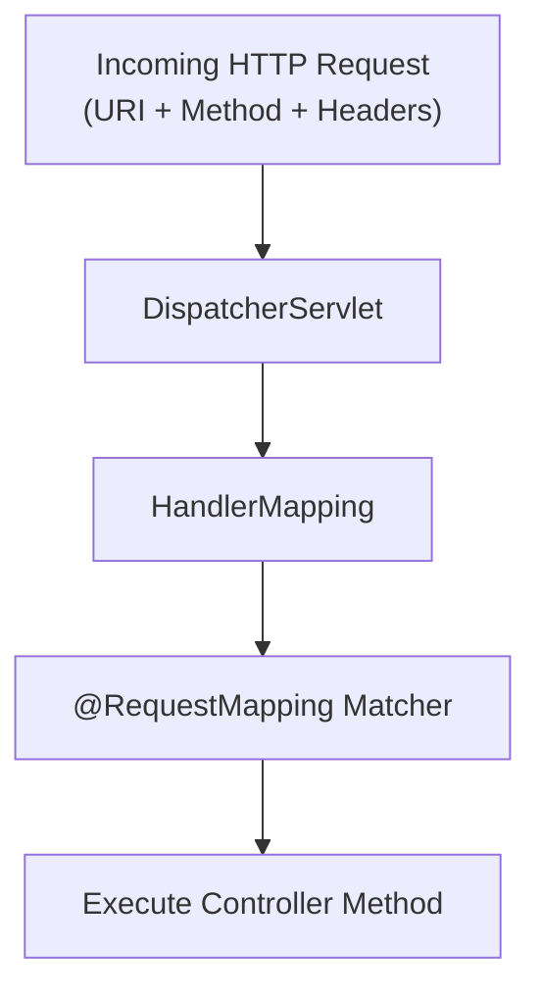

# មេរៀនទី ៣: ការប្រើប្រាស់ @RequestMapping (Deep Dive into @RequestMapping)
> 🧭 **រុករក:** [📚 មាតិកា Module](../README.md) | [← មេរៀនមុន](../02-rest-controller/README.md) | [មេរៀនបន្ទាប់ →](../04-get-and-post-mapping/README.md)

> 📂 **កូដគំរូជាក់ស្តែង (Runnable Example Project):**  
> 👉 **គម្រោងពេញលេញ:** [Bookstore REST API (@RequestMapping)](../../examples/01-rest-api-crud)  
> 📄 **File កូដជាក់ស្តែង:** [`BookController.java`](../../examples/01-rest-api-crud/src/main/java/com/example/bookstore/controller/BookController.java)


---

## មាតិកា (Table of Contents)
1. [តើអ្វីទៅជា @RequestMapping?](#តើអ្វីទៅជា-requestmapping)
2. [Attributes សំខាន់ៗនៃ @RequestMapping](#attributes-សំខាន់ៗនៃ-requestmapping)
3. [ការកំណត់ Base URL នៅកម្រិត Class Level](#ការកំណត់-base-url-នៅកម្រិត-class-level)
4. [Filtering តាមរយៈ Headers និង Content-Type (consumes / produces)](#filtering-តាមរយៈ-headers-និង-content-type-consumes--produces)
5. [ការប្រៀបធៀប @RequestMapping ជាមួយ Composed Annotations](#ការប្រៀបធៀប-requestmapping-ជាមួយ-composed-annotations)
6. [សង្ខេប & Best Practices](#សង្ខេប--best-practices)

---

## តើអ្វីទៅជា @RequestMapping?
`@RequestMapping` គឺជា core annotation នៅក្នុង Spring MVC សម្រាប់ map web HTTP requests ទៅកាន់ handler methods នៅក្នុង Controller classes។ វាអាចដាក់នៅកម្រិត Class (ដើម្បីកំណត់ Base Path) ឬនៅកម្រិត Method (ដើម្បីកំណត់ Action ជាក់លាក់)។



---

## Attributes សំខាន់ៗនៃ @RequestMapping

| Attribute | ប្រភេទ | ការពិពណ៌នា |
| :--- | :--- | :--- |
| `value` / `path` | `String[]` | URL path mapping (ឧ. `/api/v1/orders`) |
| `method` | `RequestMethod[]` | HTTP Method (GET, POST, PUT, DELETE, etc.) |
| `params` | `String[]` | Filter request ដោយផ្អែកលើ Query Parameter ដែលមាន |
| `headers` | `String[]` | Filter request ផ្អែកលើវត្តមាន ឬតម្លៃនៃ HTTP Header |
| `consumes` | `String[]` | កំណត់ Request Body Media Type (ឧ. `application/json`) |
| `produces` | `String[]` | កំណត់ Response Media Type (ឧ. `application/json`) |

---

## ការកំណត់ Base URL នៅកម្រិត Class Level

ការអនុវត្តល្អបំផុតគឺដាក់ `@RequestMapping` នៅលើ Class ដើម្បីជៀសវាងការសរសេរ URL ដដែលៗ៖

```java
package com.example.controller;

import org.springframework.web.bind.annotation.*;
import java.util.List;

@RestController
@RequestMapping("/api/v1/employees")
public class EmployeeController {

    // Matches: GET /api/v1/employees
    @RequestMapping(method = RequestMethod.GET)
    public List<String> getAllEmployees() {
        return List.of("Dara", "Sokha", "Bopha");
    }

    // Matches: POST /api/v1/employees
    @RequestMapping(method = RequestMethod.POST)
    public String createEmployee(@RequestBody String name) {
        return "Employee " + name + " created!";
    }
}
```

---

## Filtering តាមរយៈ Headers និង Content-Type (consumes / produces)

យើងអាចកំណត់លក្ខខណ្ឌអោយ method ដំណើរការបានលុះត្រាតែ request មាន Header ឬ Media Type ត្រឹមត្រូវ៖

```java
@RestController
@RequestMapping("/api/v1/reports")
public class ReportController {

    // ដំណើរការតែពេល client ផ្ញើ Header "X-API-VERSION=2" ប៉ុណ្ណោះ
    @RequestMapping(
        value = "/summary",
        method = RequestMethod.GET,
        headers = "X-API-VERSION=2",
        produces = "application/json"
    )
    public String getV2Report() {
        return "{"version": 2, "status": "ACTIVE"}";
    }

    // ទទួលតែ request ដែលមាន Content-Type ជា application/json
    @RequestMapping(
        value = "/upload",
        method = RequestMethod.POST,
        consumes = "application/json",
        produces = "application/json"
    )
    public String handleJsonPayload(@RequestBody String payload) {
        return "{"message": "Received successfully"}";
    }
}
```

---

## ការប្រៀបធៀប @RequestMapping ជាមួយ Composed Annotations

ចាប់ពី Spring 4.3 មក Spring បានណែនាំ Composed Shortcut Annotations ដូចជា `@GetMapping`, `@PostMapping`៖

```java
// បែបប្រពៃណីចាស់ (Verbose):
@RequestMapping(value = "/users", method = RequestMethod.GET)

// បែបសម័យទំនើប (Modern & Clean):
@GetMapping("/users")
```

---

## សង្ខេប & Best Practices
- ប្រើប្រាស់ `@RequestMapping("/base-path")` នៅកម្រិត **Class Level**។
- នៅកម្រិត **Method Level**, គួរប្រើ Shortcut Composed Annotations (`@GetMapping`, `@PostMapping`, etc.) ជំនួសវិញ ដើម្បីឱ្យកូដខ្លី និងច្បាស់លាស់។
- កំណត់ `consumes` និង `produces` អោយបានច្បាស់លាស់សម្រាប់ API Documentation និងចៀសវាង Payload Mismatch។

---

## 🧭 ការរុករកមេរៀន (Lesson Navigation)

| ថយក្រោយ (Previous) | មាតិកា Module (Index) | បន្ទាប់ (Next) |
| :--- | :---: | :--- |
| [← ការបង្កើត REST Controller ជាមួយ @RestController](../02-rest-controller/README.md) | [📚 បញ្ជីមេរៀន Module](../README.md) | [ការប្រើប្រាស់ @GetMapping និង @PostMapping (Mastering @GetMapping & @PostMapping) →](../04-get-and-post-mapping/README.md) |
