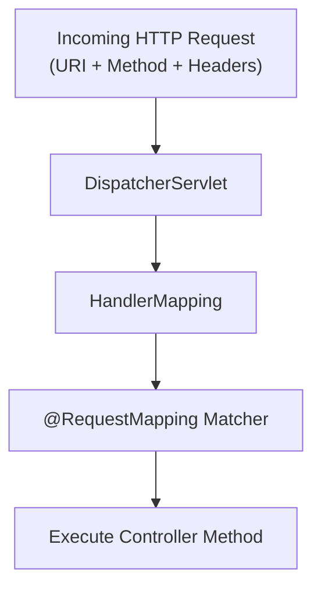

# Lesson 3: Deep Dive into @RequestMapping

> 🌐 **Language / ភាសា:** 🇬🇧 **[English](README.md)** | 🇰🇭 [ភាសាខ្មែរ (Khmer)](README.kh.md)  
> 🧭 **Navigation:** [📚 Module Index](../README.md) | [← Previous Lesson](../02-rest-controller/README.md) | [Next Lesson →](../04-get-and-post-mapping/README.md)

> 📂 **Runnable Example Project:**  
> 👉 **Complete Project:** [Bookstore REST API (@RequestMapping)](../../examples/01-rest-api-crud)  
> 📄 **Source Code Files:** [`BookController.java`](../../examples/01-rest-api-crud/src/main/java/com/example/bookstore/controller/BookController.java)


---

## Table of Contents
1. [What is @RequestMapping?](#what-is-requestmapping)
2. [Key Attributes of @RequestMapping](#key-attributes-of-requestmapping)
3. [Class-Level vs Method-Level Mapping](#class-level-vs-method-level-mapping)
4. [Filtering by Headers and Media Types (consumes / produces)](#filtering-by-headers-and-media-types-consumes--produces)
5. [@RequestMapping vs Composed Annotations](#requestmapping-vs-composed-annotations)
6. [Summary & Best Practices](#summary--best-practices)

---

## What is @RequestMapping?
`@RequestMapping` is the foundational annotation in Spring MVC used to map web HTTP requests to specific handler classes or handler methods. It can be declared at the class level (to specify a shared base URL) and at the method level (to define narrow handler actions).



---

## Key Attributes of @RequestMapping

| Attribute | Type | Description |
| :--- | :--- | :--- |
| `value` / `path` | `String[]` | The URL mapping paths (e.g. `/api/v1/orders`) |
| `method` | `RequestMethod[]` | The HTTP method constraints (GET, POST, PUT, DELETE, etc.) |
| `params` | `String[]` | Matches requests based on presence or value of query parameters |
| `headers` | `String[]` | Matches requests based on specific HTTP header conditions |
| `consumes` | `String[]` | Request body media type constraint (e.g. `application/json`) |
| `produces` | `String[]` | Response body media type constraint (e.g. `application/json`) |

---

## Class-Level vs Method-Level Mapping

A best practice is placing `@RequestMapping` at the class level to establish a uniform base route:

```java
package com.example.controller;

import org.springframework.web.bind.annotation.*;
import java.util.List;

@RestController
@RequestMapping("/api/v1/employees")
public class EmployeeController {

    // Matches: GET /api/v1/employees
    @RequestMapping(method = RequestMethod.GET)
    public List<String> getAllEmployees() {
        return List.of("Dara", "Sokha", "Bopha");
    }

    // Matches: POST /api/v1/employees
    @RequestMapping(method = RequestMethod.POST)
    public String createEmployee(@RequestBody String name) {
        return "Employee " + name + " created!";
    }
}
```

---

## Filtering by Headers and Media Types (consumes / produces)

You can narrow request matching based on explicit header requirements or media types:

```java
@RestController
@RequestMapping("/api/v1/reports")
public class ReportController {

    // Executes only when client specifies "X-API-VERSION=2"
    @RequestMapping(
        value = "/summary",
        method = RequestMethod.GET,
        headers = "X-API-VERSION=2",
        produces = "application/json"
    )
    public String getV2Report() {
        return "{"version": 2, "status": "ACTIVE"}";
    }

    // Restricts request body to JSON and produces JSON
    @RequestMapping(
        value = "/upload",
        method = RequestMethod.POST,
        consumes = "application/json",
        produces = "application/json"
    )
    public String handleJsonPayload(@RequestBody String payload) {
        return "{"message": "Received successfully"}";
    }
}
```

---

## @RequestMapping vs Composed Annotations

Starting with Spring 4.3, composed annotations serve as method-level shortcuts for common HTTP verbs:

```java
// Verbose legacy mapping:
@RequestMapping(value = "/users", method = RequestMethod.GET)

// Clean modern shortcut:
@GetMapping("/users")
```

---

## Summary & Best Practices
- Define `@RequestMapping("/base-path")` at the **class level** for clean route modularity.
- At the **method level**, always prefer composed shortcuts (`@GetMapping`, `@PostMapping`, etc.).
- Explicitly define `consumes` and `produces` attributes for clarity and accurate OpenAPI/Swagger documentation generation.

---

## 🧭 Lesson Navigation

| Previous Lesson | Module Index | Next Lesson |
| :--- | :---: | :--- |
| [← Building REST Controllers with @RestController](../02-rest-controller/README.md) | [📚 Module Index](../README.md) | [Mastering @GetMapping & @PostMapping →](../04-get-and-post-mapping/README.md) |
