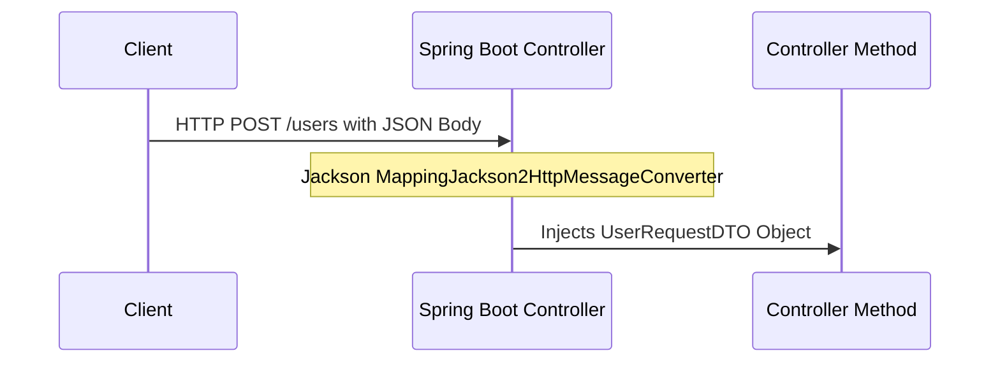

# មេរៀនទី ៧: ការប្រើប្រាស់ @RequestBody (Handling Request Body in Spring Boot)
> 🧭 **រុករក:** [📚 មាតិកា Module](../README.md) | [← មេរៀនមុន](../06-pathvariable-and-requestparam/README.md) | [មេរៀនបន្ទាប់ →](../08-build-rest-api-example/README.md)

> 📂 **កូដគំរូជាក់ស្តែង (Runnable Example Project):**  
> 👉 **គម្រោងពេញលេញ:** [Bookstore REST API (@RequestBody)](../../examples/01-rest-api-crud)  
> 📄 **File កូដជាក់ស្តែង:** [`BookController.java`](../../examples/01-rest-api-crud/src/main/java/com/example/bookstore/controller/BookController.java) | [`CreateBookRequest.java`](../../examples/01-rest-api-crud/src/main/java/com/example/bookstore/dto/CreateBookRequest.java)


---

## មាតិកា (Table of Contents)
1. [តើអ្វីទៅជា @RequestBody?](#តើអ្វីទៅជា-requestbody)
2. [ដំណើរការ Deserialization របស់ Jackson (HttpMessageConverter)](#ដំណើរការ-deserialization-របស់-jackson-httpmessageconverter)
3. [ការរួមបញ្ចូល Validation ជាមួយ @Valid](#ការរួមបញ្ចូល-validation-ជាមួយ-valid)
4. [ការប្រើប្រាស់ Records ជា DTOs ក្នុង Java 17+](#ការប្រើប្រាស់-records-ជា-dtos-ក្នុង-java-17)
5. [កំហុសទូទៅ (HttpMessageNotReadableException) និងដំណោះស្រាយ](#កំហុសទូទៅ-httpmessagenotreadableexception-និងដំណោះស្រាយ)

---

## តើអ្វីទៅជា @RequestBody?
`@RequestBody` ត្រូវបានប្រើប្រាស់នៅលើ method parameter នៃ Controller ដើម្បីប្រាប់អោយ Spring Boot ទាញយក HTTP Request Body (ជាទូទៅជា JSON ឬ XML) ហើយ Deserializes វាទៅជា Java Object ឬ Java Record តាមរយៈ `HttpMessageConverter` (Jackson)។



---

## ការរួមបញ្ចូល Validation ជាមួយ @Valid

យើងគួរតែដាក់ `@Valid` នៅជាប់ `@RequestBody` ជានិច្ច ដើម្បីឱ្យ Hibernate Validator ធ្វើការផ្ទៀងផ្ទាត់ទិន្នន័យមុនពេលបញ្ជូនទៅ Service Layer៖

```java
@PostMapping
public ResponseEntity<UserResponse> createUser(@Valid @RequestBody CreateUserRequest request) {
    UserResponse created = userService.create(request);
    return ResponseEntity.status(HttpStatus.CREATED).body(created);
}
```

### DTO Record Definition:
```java
public record CreateUserRequest(
    @NotBlank(message = "Username cannot be blank")
    @Size(min = 3, max = 50, message = "Username must be between 3 and 50 characters")
    String username,

    @NotBlank(message = "Email cannot be blank")
    @Email(message = "Email should be valid")
    String email,

    @NotNull(message = "Age is required")
    @Min(value = 18, message = "User must be at least 18 years old")
    Integer age
) {}
```

---

## កំហុសទូទៅ (HttpMessageNotReadableException)
ប្រសិនបើ Client ផ្ញើ JSON ដែលមាន Syntax Error (ដូចជាភ្លេចសញ្ញា comma `,` ឬ quotes `"`) ឬមិនត្រូវ Type (ឧទាហរណ៍ ផ្ញើអក្សរទៅកាន់ Integer field), Spring Boot នឹងបោះ exception `HttpMessageNotReadableException` (HTTP 400 Bad Request)។

---

## 🧭 ការរុករកមេរៀន (Lesson Navigation)

| ថយក្រោយ (Previous) | មាតិកា Module (Index) | បន្ទាប់ (Next) |
| :--- | :---: | :--- |
| [← ការគ្រប់គ្រងទិន្នន័យ Input ជាមួយ @PathVariable និង @RequestParam](../06-pathvariable-and-requestparam/README.md) | [📚 បញ្ជីមេរៀន Module](../README.md) | [បង្កើត Complete REST API Example មួយពេញលេញ (Building a Complete RESTful API) →](../08-build-rest-api-example/README.md) |
