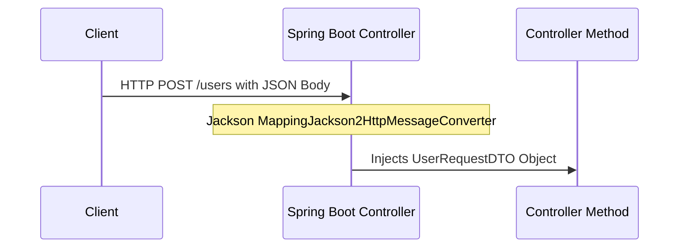

# Lesson 7: Handling Request Body with @RequestBody

> 🌐 **Language / ភាសា:** 🇬🇧 **[English](README.md)** | 🇰🇭 [ភាសាខ្មែរ (Khmer)](README.kh.md)  
> 🧭 **Navigation:** [📚 Module Index](../README.md) | [← Previous Lesson](../06-pathvariable-and-requestparam/README.md) | [Next Lesson →](../08-build-rest-api-example/README.md)

> 📂 **Runnable Example Project:**  
> 👉 **Complete Project:** [Bookstore REST API (@RequestBody)](../../examples/01-rest-api-crud)  
> 📄 **Source Code Files:** [`BookController.java`](../../examples/01-rest-api-crud/src/main/java/com/example/bookstore/controller/BookController.java) | [`CreateBookRequest.java`](../../examples/01-rest-api-crud/src/main/java/com/example/bookstore/dto/CreateBookRequest.java)


---

## Table of Contents
1. [What is @RequestBody?](#what-is-requestbody)
2. [Jackson Deserialization Mechanism (HttpMessageConverter)](#jackson-deserialization-mechanism-httpmessageconverter)
3. [Combining with Bean Validation (@Valid)](#combining-with-bean-validation-valid)
4. [Using Java 17+ Records as DTOs](#using-java-17-records-as-dtos)
5. [Handling HttpMessageNotReadableException](#handling-httpmessagenotreadableexception)

---

## What is @RequestBody?
`@RequestBody` binds the incoming HTTP request body payload (typically JSON or XML) directly to a domain or Data Transfer Object (DTO) parameter in a Spring Controller method. The conversion is performed by Spring's `MappingJackson2HttpMessageConverter`.



---

## Combining with Bean Validation (@Valid)

Always pair `@RequestBody` with `@Valid` to enforce declarative data validation constraints prior to entering business logic:

```java
@PostMapping
public ResponseEntity<UserResponse> createUser(@Valid @RequestBody CreateUserRequest request) {
    UserResponse created = userService.create(request);
    return ResponseEntity.status(HttpStatus.CREATED).body(created);
}
```

### Modern DTO Record Definition:
```java
public record CreateUserRequest(
    @NotBlank(message = "Username cannot be blank")
    @Size(min = 3, max = 50, message = "Username must be between 3 and 50 characters")
    String username,

    @NotBlank(message = "Email cannot be blank")
    @Email(message = "Email should be valid")
    String email,

    @NotNull(message = "Age is required")
    @Min(value = 18, message = "User must be at least 18 years old")
    Integer age
) {}
```

---

## Handling HttpMessageNotReadableException
When client payloads violate JSON syntax standards or attempt incompatible type deserialization (e.g. passing a string into an integer field), Spring Boot raises `HttpMessageNotReadableException` returning an HTTP 400 Bad Request.

---

## 🧭 Lesson Navigation

| Previous Lesson | Module Index | Next Lesson |
| :--- | :---: | :--- |
| [← Handling Input with @PathVariable and @RequestParam](../06-pathvariable-and-requestparam/README.md) | [📚 Module Index](../README.md) | [Building a Complete RESTful API Example →](../08-build-rest-api-example/README.md) |
