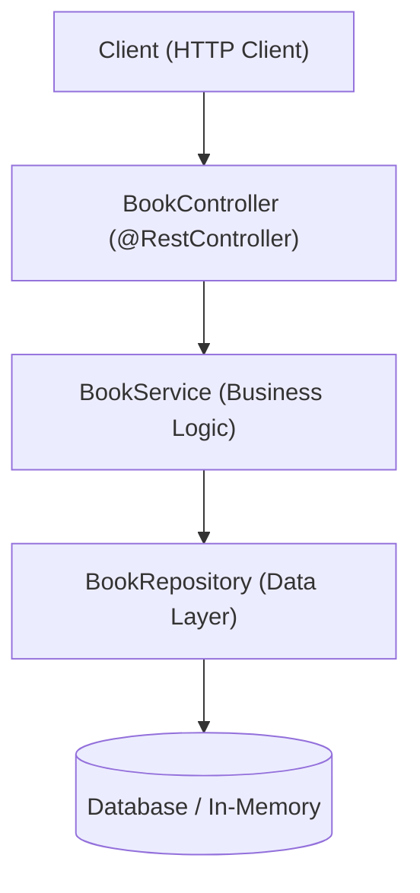

# មេរៀនទី ៨: បង្កើត Complete REST API Example មួយពេញលេញ (Building a Complete RESTful API)

> 🌐 **ភាសា / Language:** 🇰🇭 **[ភាសាខ្មែរ (Khmer)](README.kh.md)** | 🇬🇧 [English](README.md)  
> 🧭 **រុករក:** [📚 មាតិកា Module](../README.kh.md) | [← មេរៀនមុន](../07-requestbody/README.kh.md) | [មេរៀនបន្ទាប់ →](../09-json-serialization-jackson/README.kh.md)

> 📂 **កូដគំរូជាក់ស្តែង (Runnable Example Project):**  
> 👉 **គម្រោងពេញលេញ:** [Bookstore Complete CRUD REST API](../../examples/01-rest-api-crud)  
> 📄 **File កូដជាក់ស្តែង:** [`BookController.java`](../../examples/01-rest-api-crud/src/main/java/com/example/bookstore/controller/BookController.java) | [`BookService.java`](../../examples/01-rest-api-crud/src/main/java/com/example/bookstore/service/BookService.java) | [`BookRepository.java`](../../examples/01-rest-api-crud/src/main/java/com/example/bookstore/repository/BookRepository.java) | [`CreateBookRequest.java`](../../examples/01-rest-api-crud/src/main/java/com/example/bookstore/dto/CreateBookRequest.java) | [`BookResponse.java`](../../examples/01-rest-api-crud/src/main/java/com/example/bookstore/dto/BookResponse.java)


---

## មាតិកា (Table of Contents)
1. [ទិដ្ឋភាពទូទៅនៃគម្រោង (Project Overview)](#ទិដ្ឋភាពទូទៅនៃគម្រោង)
2. [រចនាសម្ព័ន្ធ Folder Architecture](#រចនាសម្ព័ន្ធ-folder-architecture)
3. [ការបង្កើត Model / Entity & Repository](#ការបង្កើត-model--entity--repository)
4. [ការបង្កើត Service Layer](#ការបង្កើត-service-layer)
5. [ការបង្កើត REST Controller ពេញលេញ](#ការបង្កើត-rest-controller-ពេញលេញ)
6. [ការធ្វើតេស្តជាមួយ cURL](#ការធ្វើតេស្តជាមួយ-curl)

---

## ទិដ្ឋភាពទូទៅនៃគម្រោង
នៅក្នុងមេរៀននេះ យើងនឹងបង្កើត **Book Management REST API** មួយពេញលេញដែលគាំទ្រ CRUD operations គ្រប់ជ្រុងជ្រោយ ដោយអនុវត្តតាម Clean Architecture Standard។



---

## រចនាសម្ព័ន្ធ Folder Architecture
```
src/main/java/com/example/bookstore/
├── controller/
│   └── BookController.java
├── service/
│   ├── BookService.java
│   └── impl/BookServiceImpl.java
├── repository/
│   └── BookRepository.java
├── model/
│   └── Book.java
└── dto/
    ├── CreateBookRequest.java
    └── BookResponse.java
```

---

## ការបង្កើត Model & DTOs

```java
package com.example.bookstore.dto;

import jakarta.validation.constraints.*;
import java.math.BigDecimal;

public record CreateBookRequest(
    @NotBlank String title,
    @NotBlank String author,
    @NotBlank String isbn,
    @Positive BigDecimal price
) {}

public record BookResponse(
    Long id,
    String title,
    String author,
    String isbn,
    BigDecimal price
) {}
```

---

## ការបង្កើត REST Controller ពេញលេញ

```java
package com.example.bookstore.controller;

import com.example.bookstore.dto.*;
import com.example.bookstore.service.BookService;
import jakarta.validation.Valid;
import org.springframework.http.*;
import org.springframework.web.bind.annotation.*;
import java.net.URI;
import java.util.List;

@RestController
@RequestMapping("/api/v1/books")
public class BookController {

    private final BookService bookService;

    public BookController(BookService bookService) {
        this.bookService = bookService;
    }

    @GetMapping
    public ResponseEntity<List<BookResponse>> getAllBooks() {
        return ResponseEntity.ok(bookService.getAllBooks());
    }

    @GetMapping("/{id}")
    public ResponseEntity<BookResponse> getBookById(@PathVariable Long id) {
        return ResponseEntity.ok(bookService.getBookById(id));
    }

    @PostMapping
    public ResponseEntity<BookResponse> createBook(@Valid @RequestBody CreateBookRequest request) {
        BookResponse response = bookService.createBook(request);
        URI location = URI.create("/api/v1/books/" + response.id());
        return ResponseEntity.created(location).body(response);
    }

    @PutMapping("/{id}")
    public ResponseEntity<BookResponse> updateBook(
            @PathVariable Long id,
            @Valid @RequestBody CreateBookRequest request) {
        return ResponseEntity.ok(bookService.updateBook(id, request));
    }

    @DeleteMapping("/{id}")
    public ResponseEntity<Void> deleteBook(@PathVariable Long id) {
        bookService.deleteBook(id);
        return ResponseEntity.noContent().build();
    }
}
```

---

## ការធ្វើតេស្តជាមួយ cURL

```bash
# 1. Create a book
curl -X POST http://localhost:8080/api/v1/books \
  -H "Content-Type: application/json" \
  -d '{"title":"Spring Boot in Action","author":"Craig Walls","isbn":"978-1617292545","price":39.99}'

# 2. Get all books
curl -X GET http://localhost:8080/api/v1/books

# 3. Delete a book
curl -X DELETE http://localhost:8080/api/v1/books/1
```

---

## 🧭 ការរុករកមេរៀន (Lesson Navigation)

| ថយក្រោយ (Previous) | មាតិកា Module (Index) | បន្ទាប់ (Next) |
| :--- | :---: | :--- |
| [← ការប្រើប្រាស់ @RequestBody (Handling Request Body in Spring Boot)](../07-requestbody/README.kh.md) | [📚 បញ្ជីមេរៀន Module](../README.kh.md) | [ការបម្លែង JSON និង Jackson ជាមួយ DTOs & Java Records →](../09-json-serialization-jackson/README.kh.md) |
