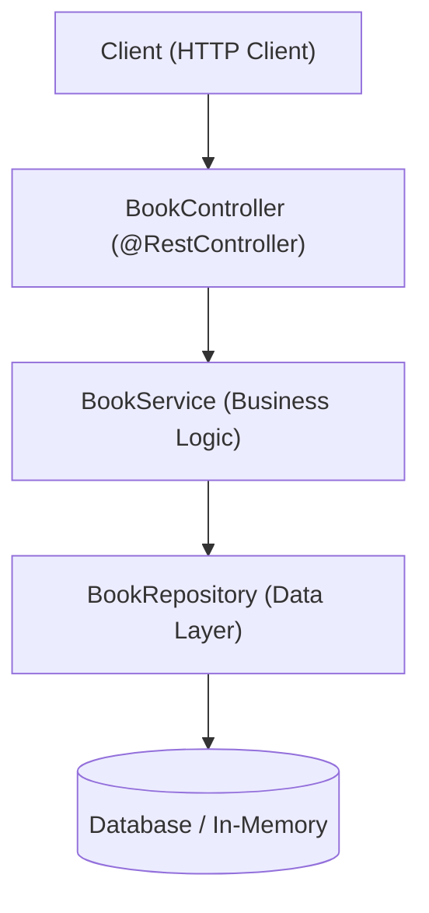

# Lesson 8: Building a Complete RESTful API Example

> 🌐 **Language / ភាសា:** 🇬🇧 **[English](README.md)** | 🇰🇭 [ភាសាខ្មែរ (Khmer)](README.kh.md)  
> 🧭 **Navigation:** [📚 Module Index](../README.md) | [← Previous Lesson](../07-requestbody/README.md) | [Next Lesson →](../09-json-serialization-jackson/README.md)

> 📂 **Runnable Example Project:**  
> 👉 **Complete Project:** [Bookstore Complete CRUD REST API](../../examples/01-rest-api-crud)  
> 📄 **Source Code Files:** [`BookController.java`](../../examples/01-rest-api-crud/src/main/java/com/example/bookstore/controller/BookController.java) | [`BookService.java`](../../examples/01-rest-api-crud/src/main/java/com/example/bookstore/service/BookService.java) | [`BookRepository.java`](../../examples/01-rest-api-crud/src/main/java/com/example/bookstore/repository/BookRepository.java) | [`CreateBookRequest.java`](../../examples/01-rest-api-crud/src/main/java/com/example/bookstore/dto/CreateBookRequest.java) | [`BookResponse.java`](../../examples/01-rest-api-crud/src/main/java/com/example/bookstore/dto/BookResponse.java)


---

## Table of Contents
1. [Project Overview](#project-overview)
2. [Folder & Package Architecture](#folder--package-architecture)
3. [Creating Models and DTOs](#creating-models-and-dtos)
4. [Service Layer Implementation](#service-layer-implementation)
5. [Complete REST Controller Implementation](#complete-rest-controller-implementation)
6. [Testing with cURL](#testing-with-curl)

---

## Project Overview
In this lesson, we build a complete production-grade **Book Management REST API** supporting all CRUD operations adhering to clean layered architecture.



---

## Folder & Package Architecture
```
src/main/java/com/example/bookstore/
├── controller/
│   └── BookController.java
├── service/
│   ├── BookService.java
│   └── impl/BookServiceImpl.java
├── repository/
│   └── BookRepository.java
├── model/
│   └── Book.java
└── dto/
    ├── CreateBookRequest.java
    └── BookResponse.java
```

---

## Creating Models and DTOs

```java
package com.example.bookstore.dto;

import jakarta.validation.constraints.*;
import java.math.BigDecimal;

public record CreateBookRequest(
    @NotBlank String title,
    @NotBlank String author,
    @NotBlank String isbn,
    @Positive BigDecimal price
) {}

public record BookResponse(
    Long id,
    String title,
    String author,
    String isbn,
    BigDecimal price
) {}
```

---

## Complete REST Controller Implementation

```java
package com.example.bookstore.controller;

import com.example.bookstore.dto.*;
import com.example.bookstore.service.BookService;
import jakarta.validation.Valid;
import org.springframework.http.*;
import org.springframework.web.bind.annotation.*;
import java.net.URI;
import java.util.List;

@RestController
@RequestMapping("/api/v1/books")
public class BookController {

    private final BookService bookService;

    public BookController(BookService bookService) {
        this.bookService = bookService;
    }

    @GetMapping
    public ResponseEntity<List<BookResponse>> getAllBooks() {
        return ResponseEntity.ok(bookService.getAllBooks());
    }

    @GetMapping("/{id}")
    public ResponseEntity<BookResponse> getBookById(@PathVariable Long id) {
        return ResponseEntity.ok(bookService.getBookById(id));
    }

    @PostMapping
    public ResponseEntity<BookResponse> createBook(@Valid @RequestBody CreateBookRequest request) {
        BookResponse response = bookService.createBook(request);
        URI location = URI.create("/api/v1/books/" + response.id());
        return ResponseEntity.created(location).body(response);
    }

    @PutMapping("/{id}")
    public ResponseEntity<BookResponse> updateBook(
            @PathVariable Long id,
            @Valid @RequestBody CreateBookRequest request) {
        return ResponseEntity.ok(bookService.updateBook(id, request));
    }

    @DeleteMapping("/{id}")
    public ResponseEntity<Void> deleteBook(@PathVariable Long id) {
        bookService.deleteBook(id);
        return ResponseEntity.noContent().build();
    }
}
```

---

## Testing with cURL

```bash
# 1. Create a book
curl -X POST http://localhost:8080/api/v1/books \
  -H "Content-Type: application/json" \
  -d '{"title":"Spring Boot in Action","author":"Craig Walls","isbn":"978-1617292545","price":39.99}'

# 2. Get all books
curl -X GET http://localhost:8080/api/v1/books

# 3. Delete a book
curl -X DELETE http://localhost:8080/api/v1/books/1
```

---

## 🧭 Lesson Navigation

| Previous Lesson | Module Index | Next Lesson |
| :--- | :---: | :--- |
| [← Handling Request Body with @RequestBody](../07-requestbody/README.md) | [📚 Module Index](../README.md) | [JSON Serialization & Jackson with DTOs and Java Records →](../09-json-serialization-jackson/README.md) |
