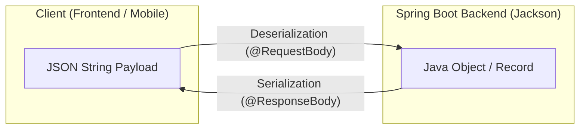

# មេរៀនទី ៩: ការបម្លែង JSON និង Jackson ជាមួយ DTOs & Java Records
> 🧭 **រុករក:** [📚 មាតិកា Module](../README.md) | [← មេរៀនមុន](../08-build-rest-api-example/README.md) | [មេរៀនបន្ទាប់ →](../10-exception-handling/README.md)

> 📂 **កូដគំរូជាក់ស្តែង (Runnable Example Project):**  
> 👉 **គម្រោងពេញលេញ:** [Bookstore Jackson JSON Records](../../examples/01-rest-api-crud)  
> 📄 **File កូដជាក់ស្តែង:** [`CreateBookRequest.java`](../../examples/01-rest-api-crud/src/main/java/com/example/bookstore/dto/CreateBookRequest.java) | [`BookResponse.java`](../../examples/01-rest-api-crud/src/main/java/com/example/bookstore/dto/BookResponse.java)


## មាតិកា (Table of Contents)

- [1. Jackson និងតួនាទីក្នុង Spring Boot](#1-jackson-និងតួនាទីក្នុង-spring-boot)
- [2. ដំណើរការ Serialization vs Deserialization](#2-ដំណើរការ-serialization-vs-deserialization)
- [3. Jackson Annotations សំខាន់ៗបំផុតដែលត្រូវចេះ](#3-jackson-annotations-សំខាន់ៗបំផុតដែលត្រូវចេះ)
- [4. ហេតុអ្វីមិនគួរ Expose Database Entity ចេញក្រៅ API (DTO Pattern)](#4-ហេតុអ្វីមិនគួរ-expose-database-entity-ចេញក្រៅ-api-dto-pattern)
- [5. ប្រើប្រាស់ Java 17+ Records ធ្វើជា DTOs ដ៏ទំនើប](#5-ប្រើប្រាស់-java-17-records-ធ្វើជា-dtos-ដ៏ទំនើប)
- [6. ការកំណត់ទម្រង់កាលបរិច្ឆេទ Date/Time ជាមួយ `@JsonFormat`](#6-ការកំណត់ទម្រង់កាលបរិច្ឆេទ-datetime-ជាមួយ-jsonformat)
- [7. សង្ខេប](#7-សង្ខេប)

---

## 1. Jackson និងតួនាទីក្នុង Spring Boot

នៅពេលអ្នកបញ្ចូល `spring-boot-starter-web` នោះ Spring Boot នឹងទាញយកបណ្ណាល័យ **Jackson** មកដោយស្វ័យប្រវត្តិ។ 
Jackson គឺជា JSON Engine ដ៏លឿន និងមានអនុភាពបំផុតនៅក្នុងពិភព Java ដែលមាន `ObjectMapper` ដើរតួជាអ្នកបម្លែងទិន្នន័យរវាង Java Objects និង JSON Strings។

---

## 2. ដំណើរការ Serialization vs Deserialization



- **Serialization (សៀរៀលឡាយសិន):** ការបម្លែង Java Object ទៅជាទម្រង់ JSON String ដើម្បីបញ្ជូនទៅ Client តាម HTTP Response Body។
- **Deserialization (ដេសៀរៀលឡាយសិន):** ការទទួល JSON String ពី Client តាម HTTP Request Body ហើយបម្លែងវាទៅជា Java Object សម្រាប់ឱ្យ Controller យកទៅដំណើរការ។

---

## 3. Jackson Annotations សំខាន់ៗបំផុតដែលត្រូវចេះ

| Annotation | ការពន្យល់ | ឧទាហរណ៍ជាក់ស្តែង |
| :--- | :--- | :--- |
| **`@JsonProperty`** | កំណត់ឈ្មោះ Field ក្នុង JSON ឱ្យខុសពីឈ្មោះ Java Variable (ដូចជា snake_case ទៅ camelCase) | `@JsonProperty("first_name") String firstName` |
| **`@JsonIgnore`** | ការពារមិនឱ្យ Field នោះបង្ហាញក្នុង JSON ឬមិនទទួលពី JSON (ដូចជា Password) | `@JsonIgnore String passwordHash` |
| **`@JsonInclude`** | បង្ហាញតែ Field ណាដែលមិនទទេ (Ignore null fields) | `@JsonInclude(JsonInclude.Include.NON_NULL)` |
| **`@JsonFormat`** | កំណត់ Pattern សម្រាប់កាលបរិច្ឆេទ LocalDate / LocalDateTime | `@JsonFormat(pattern = "yyyy-MM-dd HH:mm:ss")` |

---

## 4. ហេតុអ្វីមិនគួរ Expose Database Entity ចេញក្រៅ API (DTO Pattern)

> ⚠️ **កំហុសធ្ងន់ធ្ងររបស់ Junior Developer:**
> ការ Return JPA Entity (ឧ. `UserEntity`) ចេញទៅក្រៅ API ដោយផ្ទាល់!

### ផលប៉ះពាល់អវិជ្ជមាន៖
1. **Security Risk (Over-posting / Mass Assignment):** Client អាច Hack ដោយផ្ញើ Field `isAdmin: true` ឬលួចមើល Password Hash។
2. **Circular Dependency (Infinite Recursion):** បើសិន Entity មាន Relationship `@OneToMany` និង `@ManyToOne` នោះ Jackson នឹងវិលជុំគ្នាគ្មានទីបញ្ចប់រហូតដល់ធ្លាក់ `StackOverflowError`។
3. **Coupling:** រាល់ពេល Database Table កែប្រែ នោះ API Contract នឹងបាក់បែកភ្លាមៗ។

👉 **ដំណោះស្រាយ:** ប្រើ **DTO (Data Transfer Object)** ដើម្បីបំបែកទម្រង់ទិន្នន័យ API ដាច់ចេញពី Database Schema!

---

## 5. ប្រើប្រាស់ Java 17+ Records ធ្វើជា DTOs ដ៏ទំនើប

ចាប់ពី Java 16/17 ឡើងទៅ យើងលែងត្រូវការសរសេរ Boilerplate Code (Getters, Setters, `equals`, `hashCode`, `toString`) ឬពឹងផ្អែកលើ Lombok សម្រាប់ DTOs ទៀតហើយ។ **Java Records** គឺជា Immutable Data Carriers ដ៏ល្អឥតខ្ចោះជាមួយ Jackson!

### ឧទាហរណ៍ DTOs ជាមួយ Java Record៖

```java
package com.example.demo.dto;

import com.fasterxml.jackson.annotation.JsonFormat;
import com.fasterxml.jackson.annotation.JsonProperty;
import java.time.LocalDateTime;

// 1. Request DTO សម្រាប់ទទួលទិន្នន័យពី Client
public record RegisterUserRequest(
        @JsonProperty("full_name") String fullName,
        String email,
        String password
) {}

// 2. Response DTO សម្រាប់ Return ទៅ Client (លាក់បាំង Password)
public record UserResponse(
        Long id,
        @JsonProperty("full_name") String fullName,
        String email,
        
        @JsonFormat(pattern = "yyyy-MM-dd HH:mm:ss")
        LocalDateTime createdAt
) {}
```

---

## 6. ការកំណត់ទម្រង់កាលបរិច្ឆេទ Date/Time ជាមួយ `@JsonFormat`

កាលបរិច្ឆេទក្នុង Java (`LocalDateTime`) ប្រសិនបើមិនកំណត់ទម្រង់ទេ អាចនឹងបង្ហាញជា Array លេខ `[2026, 9, 13, 15, 30]` ដែលពិបាកសម្រាប់ Frontend ក្នុងការ Parse។ យើងកំណត់ឱ្យវាចេញជា ISO-8601 String ស្អាត៖

```java
public record OrderResponse(
        String orderNumber,
        Double amount,
        @JsonFormat(shape = JsonFormat.Shape.STRING, pattern = "yyyy-MM-dd'T'HH:mm:ss", timezone = "Asia/Phnom_Penh")
        LocalDateTime orderDate
) {}
```

---

## 7. សង្ខេប

- Jackson គឺជាម៉ាស៊ីនបម្លែងទិន្នន័យលំនាំដើមរបស់ Spring Boot។
- ប្រើ `@JsonProperty` សម្រាប់ mapping ឈ្មោះផ្សេងគ្នា និង `@JsonIgnore` សម្រាប់លាក់ទិន្នន័យសម្ងាត់។
- អនុវត្ត **DTO Pattern** ជានិច្ច កុំ Return Entity ចេញក្រៅ API ដោយផ្ទាល់។
- ប្រើប្រាស់ **Java Records** សម្រាប់បង្កើត DTOs ដោយសារវាមានលក្ខណៈ Immutable, Concise, និងស៊ីចង្វាក់គ្នាបំផុតជាមួយ Spring Boot 3 & Jackson។

---
## 🧭 ការរុករកមេរៀន (Lesson Navigation)

| ថយក្រោយ (Previous) | មាតិកា Module (Index) | បន្ទាប់ (Next) |
| :--- | :---: | :--- |
| [← បង្កើត Complete REST API Example មួយពេញលេញ (Building a Complete RESTful API)](../08-build-rest-api-example/README.md) | [📚 បញ្ជីមេរៀន Module](../README.md) | [ការគ្រប់គ្រង Exception ជាសកល (Global Exception Handling) ជាមួយ @RestControllerAdvice →](../10-exception-handling/README.md) |
