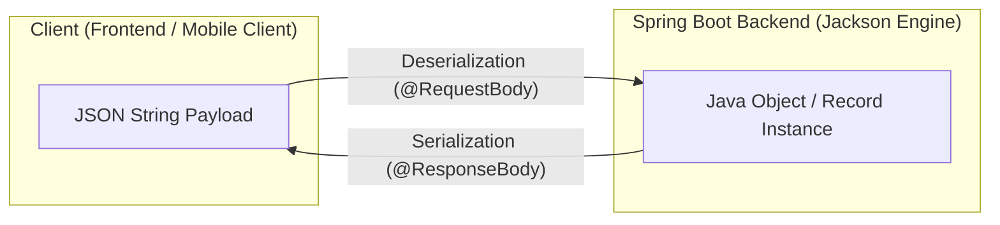

# Lesson 9: JSON Serialization & Jackson with DTOs and Java Records

> 🌐 **Language / ភាសា:** 🇬🇧 **[English](README.md)** | 🇰🇭 [ភាសាខ្មែរ (Khmer)](README.kh.md)  
> 🧭 **Navigation:** [📚 Module Index](../README.md) | [← Previous Lesson](../08-build-rest-api-example/README.md) | [Next Lesson →](../10-exception-handling/README.md)

> 📂 **Runnable Example Project:**  
> 👉 **Complete Project:** [Bookstore Jackson JSON Records](../../examples/01-rest-api-crud)  
> 📄 **Source Code Files:** [`CreateBookRequest.java`](../../examples/01-rest-api-crud/src/main/java/com/example/bookstore/dto/CreateBookRequest.java) | [`BookResponse.java`](../../examples/01-rest-api-crud/src/main/java/com/example/bookstore/dto/BookResponse.java)


## Table of Contents

- [1. Jackson and its Role in Spring Boot](#1-jackson-and-its-role-in-spring-boot)
- [2. Serialization vs Deserialization Workflow](#2-serialization-vs-deserialization-workflow)
- [3. Essential Jackson Annotations](#3-essential-jackson-annotations)
- [4. The DTO Pattern: Why Never Expose Database Entities](#4-the-dto-pattern-why-never-expose-database-entities)
- [5. Modern Immutable DTOs with Java 17+ Records](#5-modern-immutable-dtos-with-java-17-records)
- [6. Formatting Dates and Times with `@JsonFormat`](#6-formatting-dates-and-times-with-jsonformat)
- [7. Summary](#7-summary)

---

## 1. Jackson and its Role in Spring Boot

When including `spring-boot-starter-web`, Spring Boot automatically pulls in **Jackson** as its default JSON processing library.
Jackson is the industry standard in the Java ecosystem for performant, feature-rich JSON parsing and generation, anchored by its core engine: `ObjectMapper`.

---

## 2. Serialization vs Deserialization Workflow



- **Serialization:** Converting in-memory Java objects into a standardized JSON string payload dispatched in the HTTP response body.
- **Deserialization:** Parsing an incoming JSON string payload from the HTTP request body and instantiating strongly-typed Java objects for controller consumption.

---

## 3. Essential Jackson Annotations

| Annotation | Description | Practical Example |
| :--- | :--- | :--- |
| **`@JsonProperty`** | Explicitly defines custom JSON property names (e.g., snake_case to camelCase conversion) | `@JsonProperty("first_name") String firstName` |
| **`@JsonIgnore`** | Prevents sensitive or internal fields from being serialized or deserialized | `@JsonIgnore String passwordHash` |
| **`@JsonInclude`** | Suppresses properties under specific conditions (e.g., excluding null fields) | `@JsonInclude(JsonInclude.Include.NON_NULL)` |
| **`@JsonFormat`** | Formats date, time, and timestamp values according to explicit patterns | `@JsonFormat(pattern = "yyyy-MM-dd HH:mm:ss")` |

---

## 4. The DTO Pattern: Why Never Expose Database Entities

> ⚠️ **Critical Architectural Anti-Pattern:**
> Exposing JPA Entities (e.g., `UserEntity`) directly via REST controller endpoints.

### Real-World Pitfalls:
1. **Security Vulnerabilities (Mass Assignment):** Malicious clients could manipulate unauthorized database fields (e.g., injecting `isAdmin: true` or accessing hashed credentials).
2. **Circular Reference Deadlocks:** Bi-directional relationships (`@OneToMany` paired with `@ManyToOne`) trigger infinite recursion during serialization, terminating in a `StackOverflowError`.
3. **Tight Architectural Coupling:** Any underlying database column refactoring abruptly breaks external API consumer contracts.

👉 **Solution:** Implement the **DTO (Data Transfer Object)** pattern to strictly isolate the external API schema from internal persistence models!

---

## 5. Modern Immutable DTOs with Java 17+ Records

Beginning with Java 16/17, verbose boilerplate (getters, setters, `equals`, `hashCode`, `toString`) and reliance on third-party annotation processors like Lombok are obsolete for simple data containers. **Java Records** provide first-class immutable data carriers natively supported by Jackson:

### Example DTOs Using Java Records:

```java
package com.example.demo.dto;

import com.fasterxml.jackson.annotation.JsonFormat;
import com.fasterxml.jackson.annotation.JsonProperty;
import java.time.LocalDateTime;

// 1. Request DTO capturing incoming client payload
public record RegisterUserRequest(
        @JsonProperty("full_name") String fullName,
        String email,
        String password
) {}

// 2. Response DTO projecting client-safe data (sensitive fields omitted)
public record UserResponse(
        Long id,
        @JsonProperty("full_name") String fullName,
        String email,
        
        @JsonFormat(pattern = "yyyy-MM-dd HH:mm:ss")
        LocalDateTime createdAt
) {}
```

---

## 6. Formatting Dates and Times with `@JsonFormat`

By default, Java 8 Date/Time types (`LocalDateTime`) can serialize into numeric arrays like `[2026, 9, 13, 15, 30]`, which hampers frontend parsing. Use `@JsonFormat` to enforce ISO-8601 formatting:

```java
public record OrderResponse(
        String orderNumber,
        Double amount,
        @JsonFormat(shape = JsonFormat.Shape.STRING, pattern = "yyyy-MM-dd'T'HH:mm:ss", timezone = "Asia/Phnom_Penh")
        LocalDateTime orderDate
) {}
```

---

## 7. Summary

- Jackson serves as Spring Boot's default serialization and deserialization engine.
- Utilize `@JsonProperty` for schema translation and `@JsonIgnore` to safeguard private fields.
- Strictly adhere to the **DTO pattern** to decouple API contracts from database entities.
- Adopt **Java Records** for concise, immutable, and robust DTO representations.

---
## 🧭 Lesson Navigation

| Previous Lesson | Module Index | Next Lesson |
| :--- | :---: | :--- |
| [← Building a Complete RESTful API Example](../08-build-rest-api-example/README.md) | [📚 Module Index](../README.md) | [Robust Global Exception Handling with @RestControllerAdvice →](../10-exception-handling/README.md) |
