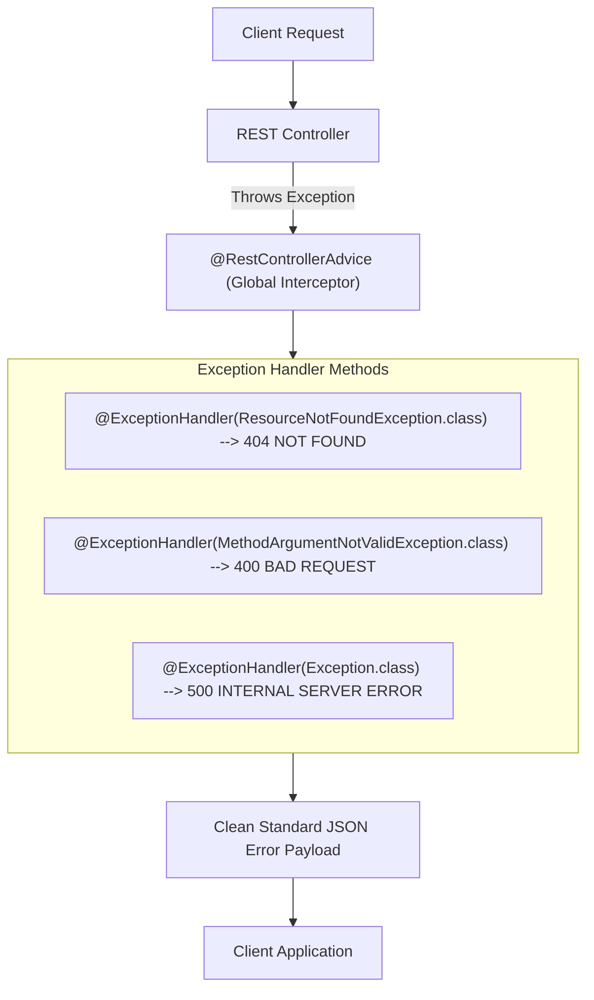

# មេរៀនទី ១០: ការគ្រប់គ្រង Exception ជាសកល (Global Exception Handling) ជាមួយ @RestControllerAdvice

> 🌐 **ភាសា / Language:** 🇰🇭 **[ភាសាខ្មែរ (Khmer)](README.kh.md)** | 🇬🇧 [English](README.md)  
> 🧭 **រុករក:** [📚 មាតិកា Module](../README.kh.md) | [← មេរៀនមុន](../09-json-serialization-jackson/README.kh.md) | [មេរៀនបន្ទាប់ →](../11-validation/README.kh.md)

> 📂 **កូដគំរូជាក់ស្តែង (Runnable Example Project):**  
> 👉 **គម្រោងពេញលេញ:** [Bookstore @RestControllerAdvice](../../examples/01-rest-api-crud)  
> 📄 **File កូដជាក់ស្តែង:** [`GlobalExceptionHandler.java`](../../examples/01-rest-api-crud/src/main/java/com/example/bookstore/exception/GlobalExceptionHandler.java) | [`BookController.java`](../../examples/01-rest-api-crud/src/main/java/com/example/bookstore/controller/BookController.java)


## មាតិកា (Table of Contents)

- [1. ហេតុអ្វីបានជាត្រូវមាន Global Exception Handling?](#1-ហេតុអ្វីបានជាត្រូវមាន-global-exception-handling)
- [2. ការស្វែងយល់អំពី `@RestControllerAdvice` និង `@ExceptionHandler`](#2-ការស្វែងយល់អំពី-restcontrolleradvice-និង-exceptionhandler)
- [3. ការបង្កើត Custom Business Exceptions](#3-ការបង្កើត-custom-business-exceptions)
- [4. ទម្រង់ឆ្លើយតបស្តង់ដារ Error Response DTO](#4-ទម្រង់ឆ្លើយតបស្តង់ដារ-error-response-dto)
- [5. ការចាប់ទាញកំហុស Validation ឱ្យចេញជា JSON ស្អាត](#5-ការចាប់ទាញកំហុស-validation-ឱ្យចេញជា-json-ស្អាត)
- [6. មុខងារថ្មី RFC 7807 / RFC 9457 `ProblemDetail` ក្នុង Spring Boot 3](#6-មុខងារថ្មី-rfc-7807--rfc-9457-problemdetail-ក្នុង-spring-boot-3)
- [7. សង្ខេប](#7-សង្ខេប)

---

## 1. ហេតុអ្វីបានជាត្រូវមាន Global Exception Handling?

នៅពេលមានបញ្ហាកើតឡើងក្នុងកម្មវិធី (ឧទាហរណ៍ រកទិន្នន័យមិនឃើញ ឬ Database ដាច់ Connection) ប្រសិនបើយើងមិនគ្រប់គ្រងវាទេ៖
1. **Security Vulnerability:** Spring Boot អាចនឹងបង្ហាញ Stack Trace វែងអន្លាយទៅកាន់ User ដែលជាព័ត៌មានលម្អិតអំពី Package, Class, និង Database Table អាចឱ្យ Hacker ឆ្លៀតឱកាសវាយប្រហារបាន។
2. **Inconsistent Error Formats:** Controller មួយឆ្លើយតបកំហុសបែបមួយ Controller មួយទៀតឆ្លើយតបបែបផ្សេង ធ្វើឱ្យ Frontend ពិបាកសរសេរកូដចាប់ Error។
3. **HTTP 500 សុទ្ធសាធ:** កំហុសដែលបណ្តាលមកពី Client (ដូចជា ID មិនមាន) គួរតែចេញ `404 Not Found` តែបែរជាធ្លាក់ `500 Server Error` ទៅវិញ។

👉 **ដំណោះស្រាយ:** បង្កើត **Global Exception Handler** តែមួយគត់សម្រាប់គ្រប់គ្រងរាល់ Exception ទាំងអស់ក្នុងប្រព័ន្ធ!

---

## 2. ការស្វែងយល់អំពី `@RestControllerAdvice` និង `@ExceptionHandler`



- `@RestControllerAdvice`: គឺជា Annotation ប្រភេទ AOP (Aspect-Oriented) ដែលដើរតួជាអ្នកតាមស្តាប់ (Interceptor) រាល់កំហុសទាំងអស់ដែលធ្លាក់ចេញពីគ្រប់ Controller។
- `@ExceptionHandler`: កំណត់ Method ជាក់លាក់ដើម្បីដោះស្រាយប្រភេទ Exception ណាមួយ។

---

## 3. ការបង្កើត Custom Business Exceptions

បង្កើត Exception ផ្ទាល់ខ្លួនដើម្បីបញ្ជាក់ពីបញ្ហាអាជីវកម្មច្បាស់លាស់៖

```java
package com.example.demo.exception;

public class ResourceNotFoundException extends RuntimeException {
    public ResourceNotFoundException(String message) {
        super(message);
    }
}
```

---

## 4. ទម្រង់ឆ្លើយតបស្តង់ដារ Error Response DTO

```java
package com.example.demo.dto;

import java.time.LocalDateTime;

public record ErrorResponse(
        int statusCode,
        String error,
        String message,
        String path,
        LocalDateTime timestamp
) {
    public ErrorResponse(int statusCode, String error, String message, String path) {
        this(statusCode, error, message, path, LocalDateTime.now());
    }
}
```

---

## 5. ការចាប់ទាញកំហុស Validation ឱ្យចេញជា JSON ស្អាត

នេះគឺជា Global Exception Handler ពេញលេញដែលដោះស្រាយទាំង Resource Not Found និងកំហុស Bean Validation៖

```java
package com.example.demo.exception;

import com.example.demo.dto.ErrorResponse;
import jakarta.servlet.http.HttpServletRequest;
import org.springframework.http.HttpStatus;
import org.springframework.http.ResponseEntity;
import org.springframework.validation.FieldError;
import org.springframework.web.bind.MethodArgumentNotValidException;
import org.springframework.web.bind.annotation.ExceptionHandler;
import org.springframework.web.bind.annotation.RestControllerAdvice;

import java.util.HashMap;
import java.util.Map;

@RestControllerAdvice
public class GlobalExceptionHandler {

    // 1. ចាប់ ResourceNotFoundException -> HTTP 404
    @ExceptionHandler(ResourceNotFoundException.class)
    public ResponseEntity<ErrorResponse> handleNotFound(ResourceNotFoundException ex, HttpServletRequest request) {
        ErrorResponse error = new ErrorResponse(
                HttpStatus.NOT_FOUND.value(),
                "Not Found",
                ex.getMessage(),
                request.getRequestURI()
        );
        return ResponseEntity.status(HttpStatus.NOT_FOUND).body(error);
    }

    // 2. ចាប់ Validation Error (@Valid បរាជ័យ) -> HTTP 400
    @ExceptionHandler(MethodArgumentNotValidException.class)
    public ResponseEntity<Map<String, Object>> handleValidationErrors(MethodArgumentNotValidException ex) {
        Map<String, String> fieldErrors = new HashMap<>();
        for (FieldError error : ex.getBindingResult().getFieldErrors()) {
            fieldErrors.put(error.getField(), error.getDefaultMessage());
        }

        Map<String, Object> response = new HashMap<>();
        response.put("statusCode", HttpStatus.BAD_REQUEST.value());
        response.put("error", "Validation Failed");
        response.put("details", fieldErrors);

        return ResponseEntity.status(HttpStatus.BAD_REQUEST).body(response);
    }

    // 3. ចាប់រាល់ Exception ផ្សេងៗដែលមិនរំពឹងទុក -> HTTP 500
    @ExceptionHandler(Exception.class)
    public ResponseEntity<ErrorResponse> handleGlobalException(Exception ex, HttpServletRequest request) {
        ErrorResponse error = new ErrorResponse(
                HttpStatus.INTERNAL_SERVER_ERROR.value(),
                "Internal Server Error",
                "មានបញ្ហាបច្ចេកទេសក្នុងម៉ាស៊ីនបម្រើ សូមព្យាយាមម្តងទៀត",
                request.getRequestURI()
        );
        return ResponseEntity.status(HttpStatus.INTERNAL_SERVER_ERROR).body(error);
    }
}
```

---

## 6. មុខងារថ្មី RFC 7807 / RFC 9457 `ProblemDetail` ក្នុង Spring Boot 3

ចាប់ពី Spring Boot 3 / Spring Framework 6 ឡើងទៅ ស្ថាបត្យកម្មបានគាំទ្រស្តង់ដារអន្តរជាតិ **RFC 7807 Problem Details for HTTP APIs** ដោយផ្ទាល់តាមរយៈ Class `ProblemDetail`៖

```java
@ExceptionHandler(ResourceNotFoundException.class)
public ProblemDetail handleProblemDetail(ResourceNotFoundException ex) {
    ProblemDetail problem = ProblemDetail.forStatusAndDetail(HttpStatus.NOT_FOUND, ex.getMessage());
    problem.setTitle("Resource Not Found");
    problem.setProperty("service", "Inventory-Service");
    return problem;
}
```

---

## 7. សង្ខេប

- មិនត្រូវទុកឱ្យ Exception ធ្លាក់ចេញទៅកាន់ Client ដោយគ្មានការគ្រប់គ្រងឡើយ។
- ប្រើប្រាស់ `@RestControllerAdvice` រួមជាមួយ `@ExceptionHandler` ដើម្បីបង្កើតចំណុចកណ្តាលសម្រាប់ Handle កំហុស។
- បម្លែងកំហុស Validation ទៅជា Key-Value Map ដើម្បីងាយស្រួលឱ្យ Frontend បង្ហាញ Error Message នៅក្រោម Input Field នីមួយៗ។

---
## 🧭 ការរុករកមេរៀន (Lesson Navigation)

| ថយក្រោយ (Previous) | មាតិកា Module (Index) | បន្ទាប់ (Next) |
| :--- | :---: | :--- |
| [← ការបម្លែង JSON និង Jackson ជាមួយ DTOs & Java Records](../09-json-serialization-jackson/README.kh.md) | [📚 បញ្ជីមេរៀន Module](../README.kh.md) | [ការផ្ទៀងផ្ទាត់ទិន្នន័យ (Input Validation) ជាមួយ Jakarta Bean Validation →](../11-validation/README.kh.md) |
