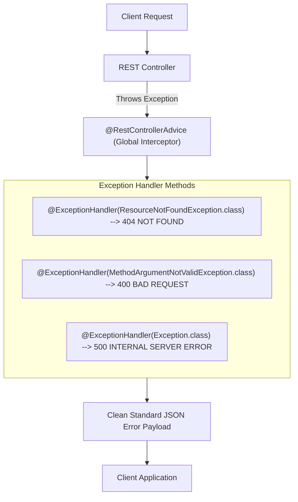

# Lesson 10: Robust Global Exception Handling with @RestControllerAdvice

> 🌐 **Language / ភាសា:** 🇬🇧 **[English](README.md)** | 🇰🇭 [ភាសាខ្មែរ (Khmer)](README.kh.md)  
> 🧭 **Navigation:** [📚 Module Index](../README.md) | [← Previous Lesson](../09-json-serialization-jackson/README.md) | [Next Lesson →](../11-validation/README.md)

> 📂 **Runnable Example Project:**  
> 👉 **Complete Project:** [Bookstore @RestControllerAdvice](../../examples/01-rest-api-crud)  
> 📄 **Source Code Files:** [`GlobalExceptionHandler.java`](../../examples/01-rest-api-crud/src/main/java/com/example/bookstore/exception/GlobalExceptionHandler.java) | [`BookController.java`](../../examples/01-rest-api-crud/src/main/java/com/example/bookstore/controller/BookController.java)


## Table of Contents

- [1. Why Global Exception Handling is Critical](#1-why-global-exception-handling-is-critical)
- [2. Understanding `@RestControllerAdvice` and `@ExceptionHandler`](#2-understanding-restcontrolleradvice-and-exceptionhandler)
- [3. Designing Custom Business Exceptions](#3-designing-custom-business-exceptions)
- [4. Defining a Unified Error Response DTO](#4-defining-a-unified-error-response-dto)
- [5. Translating Bean Validation Failures into Clean JSON](#5-translating-bean-validation-failures-into-clean-json)
- [6. Modern RFC 7807 / RFC 9457 `ProblemDetail` in Spring Boot 3](#6-modern-rfc-7807--rfc-9457-problemdetail-in-spring-boot-3)
- [7. Summary](#7-summary)

---

## 1. Why Global Exception Handling is Critical

Leaving unhandled runtime exceptions in an application produces severe real-world repercussions:
1. **Security Exposure:** Spring Boot default error pages may leak exhaustive stack traces disclosing internal classpaths, package structures, and SQL queries to malicious actors.
2. **Inconsistent Error Contracts:** Different controllers returning disparate error shapes frustrate frontend web and mobile developers.
3. **HTTP 500 Distortion:** Client-induced errors (such as querying nonexistent resource IDs) incorrectly register as fatal server faults (`500 Internal Server Error`) instead of semantic client notifications (`404 Not Found`).

👉 **Solution:** Implement an enterprise-grade **Global Exception Handler** acting as a unified error interception gateway!

---

## 2. Understanding `@RestControllerAdvice` and `@ExceptionHandler`



- `@RestControllerAdvice`: A specialized meta-annotation leveraging Aspect-Oriented Programming (AOP) to intercept uncaught exceptions thrown across all controller endpoints.
- `@ExceptionHandler`: Binds specific Java exception classes to corresponding handler methods.

---

## 3. Designing Custom Business Exceptions

Create targeted runtime exceptions conveying domain-specific business states:

```java
package com.example.demo.exception;

public class ResourceNotFoundException extends RuntimeException {
    public ResourceNotFoundException(String message) {
        super(message);
    }
}
```

---

## 4. Defining a Unified Error Response DTO

```java
package com.example.demo.dto;

import java.time.LocalDateTime;

public record ErrorResponse(
        int statusCode,
        String error,
        String message,
        String path,
        LocalDateTime timestamp
) {
    public ErrorResponse(int statusCode, String error, String message, String path) {
        this(statusCode, error, message, path, LocalDateTime.now());
    }
}
```

---

## 5. Translating Bean Validation Failures into Clean JSON

The following production-ready exception handler handles domain resource mismatches, validation failures, and uncaught system exceptions:

```java
package com.example.demo.exception;

import com.example.demo.dto.ErrorResponse;
import jakarta.servlet.http.HttpServletRequest;
import org.springframework.http.HttpStatus;
import org.springframework.http.ResponseEntity;
import org.springframework.validation.FieldError;
import org.springframework.web.bind.MethodArgumentNotValidException;
import org.springframework.web.bind.annotation.ExceptionHandler;
import org.springframework.web.bind.annotation.RestControllerAdvice;

import java.util.HashMap;
import java.util.Map;

@RestControllerAdvice
public class GlobalExceptionHandler {

    // 1. Handle ResourceNotFoundException -> HTTP 404
    @ExceptionHandler(ResourceNotFoundException.class)
    public ResponseEntity<ErrorResponse> handleNotFound(ResourceNotFoundException ex, HttpServletRequest request) {
        ErrorResponse error = new ErrorResponse(
                HttpStatus.NOT_FOUND.value(),
                "Not Found",
                ex.getMessage(),
                request.getRequestURI()
        );
        return ResponseEntity.status(HttpStatus.NOT_FOUND).body(error);
    }

    // 2. Handle Validation Failures (@Valid trigger) -> HTTP 400
    @ExceptionHandler(MethodArgumentNotValidException.class)
    public ResponseEntity<Map<String, Object>> handleValidationErrors(MethodArgumentNotValidException ex) {
        Map<String, String> fieldErrors = new HashMap<>();
        for (FieldError error : ex.getBindingResult().getFieldErrors()) {
            fieldErrors.put(error.getField(), error.getDefaultMessage());
        }

        Map<String, Object> response = new HashMap<>();
        response.put("statusCode", HttpStatus.BAD_REQUEST.value());
        response.put("error", "Validation Failed");
        response.put("details", fieldErrors);

        return ResponseEntity.status(HttpStatus.BAD_REQUEST).body(response);
    }

    // 3. Fallback for generic uncaught exceptions -> HTTP 500
    @ExceptionHandler(Exception.class)
    public ResponseEntity<ErrorResponse> handleGlobalException(Exception ex, HttpServletRequest request) {
        ErrorResponse error = new ErrorResponse(
                HttpStatus.INTERNAL_SERVER_ERROR.value(),
                "Internal Server Error",
                "An unexpected error occurred. Please contact system support.",
                request.getRequestURI()
        );
        return ResponseEntity.status(HttpStatus.INTERNAL_SERVER_ERROR).body(error);
    }
}
```

---

## 6. Modern RFC 7807 / RFC 9457 `ProblemDetail` in Spring Boot 3

Spring Boot 3 introduces direct compliance with **RFC 7807 Problem Details for HTTP APIs** through the first-class `ProblemDetail` abstraction:

```java
@ExceptionHandler(ResourceNotFoundException.class)
public ProblemDetail handleProblemDetail(ResourceNotFoundException ex) {
    ProblemDetail problem = ProblemDetail.forStatusAndDetail(HttpStatus.NOT_FOUND, ex.getMessage());
    problem.setTitle("Resource Not Found");
    problem.setProperty("service", "Inventory-Service");
    return problem;
}
```

---

## 7. Summary

- Unchecked exceptions must never leak directly into client responses.
- Combine `@RestControllerAdvice` with `@ExceptionHandler` for centralized, maintainable fault interception.
- Flatten validation errors into explicit field-to-message mappings to enable smooth form error binding on frontend clients.
- Leverage Spring Boot 3's built-in `ProblemDetail` specification when targeting standardized API compliance.

---
## 🧭 Lesson Navigation

| Previous Lesson | Module Index | Next Lesson |
| :--- | :---: | :--- |
| [← JSON Serialization & Jackson with DTOs and Java Records](../09-json-serialization-jackson/README.md) | [📚 Module Index](../README.md) | [Input Validation with Jakarta Bean Validation →](../11-validation/README.md) |
