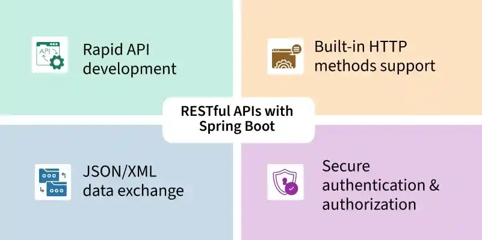
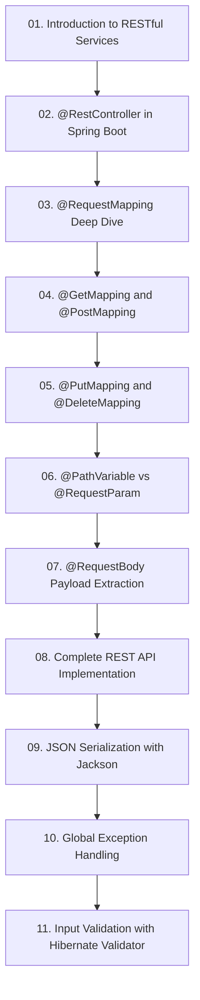

# Module 4: ការកសាង RESTful Web APIs (REST API with Spring Boot)

> 🌐 **ភាសា / Language:** 🇰🇭 **[ភាសាខ្មែរ (Khmer)](README.kh.md)** | 🇬🇧 [English](README.md)

> 📂 **គម្រោងកូដគំរូជាក់ស្តែងសម្រាប់ Module នេះ (Runnable Project):**  
> 👉 **[Bookstore REST API CRUD (Spring Boot 3)](../examples/01-rest-api-crud)**  
> គម្រោង Maven ពេញលេញរួមមាន Controller, Service, Repository, DTO Records, Validation, និង Exception Handling។

---

## 📖 សេចក្តីផ្តើមអំពី Module

ស្ថាបត្យកម្ម Web API ទំនើប៖ Controllers, Routing, Request Parameters, Request Body, Jackson JSON, DTO Pattern, Input Validation, និង Global Exception Handling។

---

## 🗺️ ផែនទីសិក្សាប្រចាំ Module (Learning Roadmap)

---

## 📚 បញ្ជីមេរៀនក្នុង Module (11 Lessons)

| មេរៀន (Lesson) | ប្រធានបទ (Topic) | ការពិពណ៌នា (Description) |
| :---: | :--- | :--- |
| **01** | [Introduction to RESTful Services](01-intro-to-restful-web-services/README.kh.md) | ស្ថាបត្យកម្ម REST គោលការណ៍ HTTP Methods និង Best Practices |
| **02** | [@RestController in Spring Boot](02-rest-controller/README.kh.md) | @RestController vs @Controller និង ResponseBody |
| **03** | [@RequestMapping Deep Dive](03-request-mapping/README.kh.md) | ការកំណត់ Route, Base URL, និង HTTP Method Filtering |
| **04** | [@GetMapping and @PostMapping](04-get-and-post-mapping/README.kh.md) | ការទាញយកទិន្នន័យ (GET) និងការបង្កើត Resource ថ្មី (POST) |
| **05** | [@PutMapping and @DeleteMapping](05-put-and-delete-mapping/README.kh.md) | ការកែប្រែទិន្នន័យទាំងមូល (PUT) និងការលុប (DELETE) |
| **06** | [@PathVariable vs @RequestParam](06-pathvariable-and-requestparam/README.kh.md) | ការចាប់យក URL Path Segments និង Query Parameters |
| **07** | [@RequestBody Payload Extraction](07-requestbody/README.kh.md) | ការទទួល និងបម្លែង JSON Payload មកជា Java Object |
| **08** | [Complete REST API Implementation](08-build-rest-api-example/README.kh.md) | កូដគំរូជាក់ស្តែងពេញលេញនៃការបង្កើត REST API មួយ |
| **09** | [JSON Serialization with Jackson](09-json-serialization-jackson/README.kh.md) | ការបម្លែង JSON, Jackson Annotations, DTOs, និង Java Records |
| **10** | [Global Exception Handling](10-exception-handling/README.kh.md) | ការគ្រប់គ្រង Error កម្រិតសកលជាមួយ @RestControllerAdvice |
| **11** | [Input Validation with Hibernate Validator](11-validation/README.kh.md) | ការផ្ទៀងផ្ទាត់ទិន្នន័យជាមួយ Jakarta Bean Validation (@Valid) |

---

## 🧭 ការរុករក (Navigation)

| ថយក្រោយ (Previous) | មាតិកាចម្បង (Main Index) | បន្ទាប់ (Next Module) |
| :--- | :---: | :--- |
| [Module 3: Core Features](../03-spring-boot-core-features/README.kh.md) | [📚 មាតិកា Spring Boot](../README.kh.md) | [Module 5: Database & JPA →](../05-spring-boot-database-and-data-jpa/README.kh.md) |
