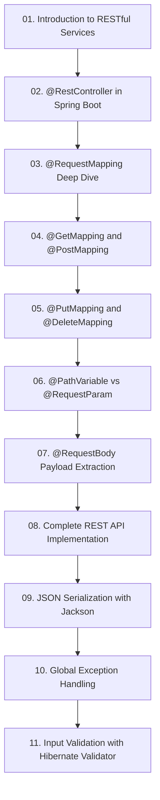

# Module 4: Building RESTful Web APIs with Spring Boot

> 🌐 **Language / ភាសា:** 🇰🇭 [ភាសាខ្មែរ (Khmer)](README.kh.md) | 🇬🇧 **[English](README.md)**

> 📂 **Runnable Example Project for this Module:**  
> 👉 **[Bookstore REST API CRUD (Spring Boot 3)](../examples/01-rest-api-crud)**  
> Complete Maven project featuring Controller, Service, Repository, DTO Records, Validation, and Exception Handling.

---

## 📖 Module Overview

Production RESTful API architecture: controllers, semantic routing, parameters, request body binding, Jackson serialization, DTOs, Bean Validation, and centralized exception handling.

---

## 🗺️ Module Learning Roadmap

---

## 📚 Lessons in This Module (11 Lessons)

| Lesson | Topic | Description |
| :---: | :--- | :--- |
| **01** | [Introduction to RESTful Services](01-intro-to-restful-web-services/README.md) | REST architecture, constraints, and HTTP semantics |
| **02** | [@RestController in Spring Boot](02-rest-controller/README.md) | @RestController meta-annotation and JSON conversion |
| **03** | [@RequestMapping Deep Dive](03-request-mapping/README.md) | Path routing, headers, and media type mapping with @RequestMapping |
| **04** | [@GetMapping and @PostMapping](04-get-and-post-mapping/README.md) | Handling read requests with @GetMapping and writes with @PostMapping |
| **05** | [@PutMapping and @DeleteMapping](05-put-and-delete-mapping/README.md) | Resource updates with @PutMapping and removals with @DeleteMapping |
| **06** | [@PathVariable vs @RequestParam](06-pathvariable-and-requestparam/README.md) | Extracting path variables vs query string parameters |
| **07** | [@RequestBody Payload Extraction](07-requestbody/README.md) | Capturing and deserializing incoming request payloads with @RequestBody |
| **08** | [Complete REST API Implementation](08-build-rest-api-example/README.md) | Step-by-step implementation of an end-to-end REST API |
| **09** | [JSON Serialization with Jackson](09-json-serialization-jackson/README.md) | JSON serialization/deserialization, annotations, and Java Records |
| **10** | [Global Exception Handling](10-exception-handling/README.md) | Centralized fault handling with @RestControllerAdvice and RFC 7807 |
| **11** | [Input Validation with Hibernate Validator](11-validation/README.md) | Declarative validation constraints with Jakarta Bean Validation |

---

## 🧭 Navigation

| Previous | Main Index | Next Module |
| :--- | :---: | :--- |
| [Module 3: Core Features](../03-spring-boot-core-features/README.md) | [📚 Spring Boot Home](../README.md) | [Module 5: Database & JPA →](../05-spring-boot-database-and-data-jpa/README.md) |
