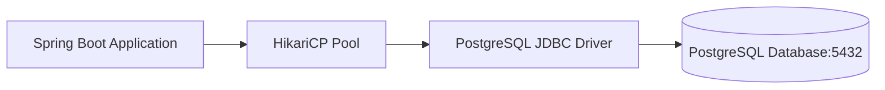

# Lesson 2: Integration with PostgreSQL

> 🌐 **Language / ភាសា:** 🇬🇧 **[English](README.md)** | 🇰🇭 [ភាសាខ្មែរ (Khmer)](README.kh.md)  
> 🧭 **Navigation:** [📚 Module Index](../README.md) | [← Previous Lesson](../01-integration-with-mysql/README.md) | [Next Lesson →](../03-integration-with-mongodb/README.md)

> 📂 **Runnable Example Project:**  
> 👉 **Complete Project:** [Todo App with PostgreSQL](../../examples/02-spring-data-jpa-postgresql)  
> 📄 **Source Code Files:** [`application.yml`](../../examples/02-spring-data-jpa-postgresql/src/main/resources/application.yml) | [`pom.xml`](../../examples/02-spring-data-jpa-postgresql/pom.xml) | [`Todo.java`](../../examples/02-spring-data-jpa-postgresql/src/main/java/com/example/todo/model/Todo.java)


---

## Table of Contents
1. [Introduction to PostgreSQL in Spring Boot](#introduction-to-postgresql-in-spring-boot)
2. [Maven Dependency Setup](#maven-dependency-setup)
3. [Configuring DataSource in application.yml](#configuring-datasource-in-applicationyml)
4. [Entity and Repository Implementation](#entity-and-repository-implementation)
5. [Docker Compose for Local Development](#docker-compose-for-local-development)
6. [Production Best Practices](#production-best-practices)

---

## Introduction to PostgreSQL in Spring Boot
**PostgreSQL** is an advanced enterprise-grade open-source relational database. Spring Boot integrates with PostgreSQL via **Spring Data JPA** utilizing **HikariCP** as the high-performance default connection pool.



---

## Maven Dependency Setup

Add the required starter and JDBC driver to your `pom.xml`:

```xml
<dependencies>
    <!-- Spring Data JPA -->
    <dependency>
        <groupId>org.springframework.boot</groupId>
        <artifactId>spring-boot-starter-data-jpa</artifactId>
    </dependency>

    <!-- PostgreSQL JDBC Driver -->
    <dependency>
        <groupId>org.postgresql</groupId>
        <artifactId>postgresql</artifactId>
        <scope>runtime</scope>
    </dependency>
</dependencies>
```

---

## Configuring DataSource in application.yml

```yaml
spring:
  datasource:
    url: jdbc:postgresql://localhost:5432/ecommerce_db
    username: postgres
    password: mysecretpassword
    driver-class-name: org.postgresql.Driver
    hikari:
      maximum-pool-size: 10
      minimum-idle: 5
      idle-timeout: 300000
      connection-timeout: 20000

  jpa:
    hibernate:
      ddl-auto: update
    show-sql: true
    properties:
      hibernate:
        format_sql: true
        dialect: org.hibernate.dialect.PostgreSQLDialect
```

---

## Entity and Repository Implementation

### Product Entity:
```java
package com.example.model;

import jakarta.persistence.*;
import java.math.BigDecimal;

@Entity
@Table(name = "products")
public class Product {

    @Id
    @GeneratedValue(strategy = GenerationType.IDENTITY)
    private Long id;

    @Column(nullable = false, length = 150)
    private String name;

    @Column(nullable = false, precision = 10, scale = 2)
    private BigDecimal price;

    public Product() {}
    public Product(String name, BigDecimal price) {
        this.name = name;
        this.price = price;
    }
    public Long getId() { return id; }
    public String getName() { return name; }
    public void setName(String name) { this.name = name; }
    public BigDecimal getPrice() { return price; }
    public void setPrice(BigDecimal price) { this.price = price; }
}
```

### Product Repository:
```java
package com.example.repository;

import com.example.model.Product;
import org.springframework.data.jpa.repository.JpaRepository;
import org.springframework.stereotype.Repository;
import java.util.List;

@Repository
public interface ProductRepository extends JpaRepository<Product, Long> {
    List<Product> findByNameContainingIgnoreCase(String keyword);
}
```

---

## Docker Compose for Local Development

Quickly bootstrap a PostgreSQL instance using Docker:

```yaml
version: '3.8'
services:
  postgres:
    image: postgres:16-alpine
    container_name: postgres-dev
    environment:
      POSTGRES_DB: ecommerce_db
      POSTGRES_USER: postgres
      POSTGRES_PASSWORD: mysecretpassword
    ports:
      - "5432:5432"
    volumes:
      - pgdata:/var/lib/postgresql/data

volumes:
  pgdata:
```

---

## Production Best Practices
- **Avoid `ddl-auto: update` or `create` in production**: Employ database schema versioning tools like **Flyway** or **Liquibase**.
- Tune HikariCP connection pool parameters according to anticipated concurrency and database resources.
- Use `@Transactional(readOnly = true)` for read queries to optimize connection allocation and disable dirty checking overhead.

---

## 🧭 Lesson Navigation

| Previous Lesson | Module Index | Next Lesson |
| :--- | :---: | :--- |
| [← Spring Boot Integration with MySQL Database](../01-integration-with-mysql/README.md) | [📚 Module Index](../README.md) | [Integration with MongoDB (NoSQL) →](../03-integration-with-mongodb/README.md) |
