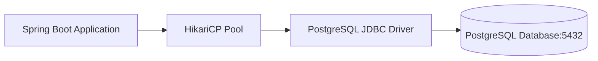

# មេរៀនទី ២: ការភ្ជាប់ Spring Boot ជាមួយ PostgreSQL (Integration with PostgreSQL)
> 🧭 **រុករក:** [📚 មាតិកា Module](../README.md) | [← មេរៀនមុន](../01-integration-with-mysql/README.md) | [មេរៀនបន្ទាប់ →](../03-integration-with-mongodb/README.md)

> 📂 **កូដគំរូជាក់ស្តែង (Runnable Example Project):**  
> 👉 **គម្រោងពេញលេញ:** [Todo App ជាមួយ PostgreSQL](../../examples/02-spring-data-jpa-postgresql)  
> 📄 **File កូដជាក់ស្តែង:** [`application.yml`](../../examples/02-spring-data-jpa-postgresql/src/main/resources/application.yml) | [`pom.xml`](../../examples/02-spring-data-jpa-postgresql/pom.xml) | [`Todo.java`](../../examples/02-spring-data-jpa-postgresql/src/main/java/com/example/todo/model/Todo.java)


---

## មាតិកា (Table of Contents)
1. [សេចក្តីផ្តើមអំពី PostgreSQL នៅក្នុង Spring Boot](#សេចក្តីផ្តើមអំពី-postgresql-នៅក្នុង-spring-boot)
2. [Maven Dependency Setup](#maven-dependency-setup)
3. [ការកំណត់រចនាសម្ព័ន្ធ DataSource ក្នុង application.yml](#ការកំណត់រចនាសម្ព័ន្ធ-datasource-ក្នុង-applicationyml)
4. [ការបង្កើត Entity និង Repository ជាក់ស្តែង](#ការបង្កើត-entity-និង-repository-ជាក់ស្តែង)
5. [Docker Compose សម្រាប់ Local PostgreSQL Development](#docker-compose-សម្រាប់-local-postgresql-development)
6. [Best Practices សម្រាប់ Production Database](#best-practices-សម្រាប់-production-database)

---

## សេចក្តីផ្តើមអំពី PostgreSQL នៅក្នុង Spring Boot
**PostgreSQL** គឺជាប្រព័ន្ធគ្រប់គ្រងមូលដ្ឋានទិន្នន័យទំនាក់ទំនងវត្ថុ (Object-Relational Database Management System - ORDBMS) ដែលមានឥទ្ធិពល និងស្តង់ដារខ្ពស់បំផុតលើពិភពលោក។ Spring Boot គាំទ្រ PostgreSQL យ៉ាងពេញទំហឹងតាមរយៈ **Spring Data JPA** និង **HikariCP Connection Pool**។



---

## Maven Dependency Setup

នៅក្នុង file `pom.xml`, បន្ថែម dependencies ដូចខាងក្រោម៖

```xml
<dependencies>
    <!-- Spring Data JPA -->
    <dependency>
        <groupId>org.springframework.boot</groupId>
        <artifactId>spring-boot-starter-data-jpa</artifactId>
    </dependency>

    <!-- PostgreSQL JDBC Driver -->
    <dependency>
        <groupId>org.postgresql</groupId>
        <artifactId>postgresql</artifactId>
        <scope>runtime</scope>
    </dependency>
</dependencies>
```

---

## ការកំណត់រចនាសម្ព័ន្ធ DataSource ក្នុង application.yml

```yaml
spring:
  datasource:
    url: jdbc:postgresql://localhost:5432/ecommerce_db
    username: postgres
    password: mysecretpassword
    driver-class-name: org.postgresql.Driver
    hikari:
      maximum-pool-size: 10
      minimum-idle: 5
      idle-timeout: 300000
      connection-timeout: 20000

  jpa:
    hibernate:
      ddl-auto: update
    show-sql: true
    properties:
      hibernate:
        format_sql: true
        dialect: org.hibernate.dialect.PostgreSQLDialect
```

---

## ការបង្កើត Entity និង Repository ជាក់ស្តែង

### Product Entity:
```java
package com.example.model;

import jakarta.persistence.*;
import java.math.BigDecimal;

@Entity
@Table(name = "products")
public class Product {

    @Id
    @GeneratedValue(strategy = GenerationType.IDENTITY)
    private Long id;

    @Column(nullable = false, length = 150)
    private String name;

    @Column(nullable = false, precision = 10, scale = 2)
    private BigDecimal price;

    // Constructors, Getters & Setters
    public Product() {}
    public Product(String name, BigDecimal price) {
        this.name = name;
        this.price = price;
    }
    public Long getId() { return id; }
    public String getName() { return name; }
    public void setName(String name) { this.name = name; }
    public BigDecimal getPrice() { return price; }
    public void setPrice(BigDecimal price) { this.price = price; }
}
```

### Product Repository:
```java
package com.example.repository;

import com.example.model.Product;
import org.springframework.data.jpa.repository.JpaRepository;
import org.springframework.stereotype.Repository;
import java.util.List;

@Repository
public interface ProductRepository extends JpaRepository<Product, Long> {
    List<Product> findByNameContainingIgnoreCase(String keyword);

}
```

---

## Docker Compose សម្រាប់ Local PostgreSQL Development

បង្កើត file `docker-compose.yml` ដើម្បី run PostgreSQL បានរហ័ស៖

```yaml
version: '3.8'
services:
  postgres:
    image: postgres:16-alpine
    container_name: postgres-dev
    environment:
      POSTGRES_DB: ecommerce_db
      POSTGRES_USER: postgres
      POSTGRES_PASSWORD: mysecretpassword
    ports:
      - "5432:5432"
    volumes:
      - pgdata:/var/lib/postgresql/data

volumes:
  pgdata:
```

---

## Best Practices សម្រាប់ Production Database
- **កុំប្រើ `ddl-auto: update` ឬ `create` លើ Production**: ត្រូវប្រើ Migration Tool ដូចជា **Flyway** ឬ **Liquibase**។
- កំណត់ទំហំ Connection Pool អោយបានត្រឹមត្រូវតាមរយៈ `spring.datasource.hikari.maximum-pool-size`។
- ប្រើប្រាស់ `@Transactional(readOnly = true)` លើ Method ដែលគ្រាន់តែ Query ទិន្នន័យដើម្បីបង្កើន Performance។

---

## 🧭 ការរុករកមេរៀន (Lesson Navigation)

| ថយក្រោយ (Previous) | មាតិកា Module (Index) | បន្ទាប់ (Next) |
| :--- | :---: | :--- |
| [← ការតភ្ជាប់ Spring Boot ជាមួយ MySQL Database](../01-integration-with-mysql/README.md) | [📚 បញ្ជីមេរៀន Module](../README.md) | [ការភ្ជាប់ Spring Boot ជាមួយ MongoDB (Integration with MongoDB NoSQL) →](../03-integration-with-mongodb/README.md) |
