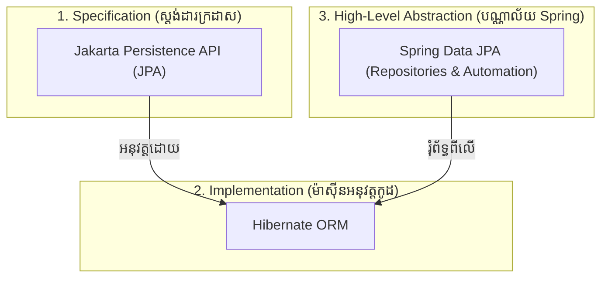

# មេរៀនទី ៤: មូលដ្ឋានគ្រឹះនៃ Spring Data JPA និង Entity Mapping

> 🌐 **ភាសា / Language:** 🇰🇭 **[ភាសាខ្មែរ (Khmer)](README.kh.md)** | 🇬🇧 [English](README.md)  
> 🧭 **រុករក:** [📚 មាតិកា Module](../README.kh.md) | [← មេរៀនមុន](../03-integration-with-mongodb/README.kh.md) | [មេរៀនបន្ទាប់ →](../05-spring-boot-jdbc-jdbctemplate/README.kh.md)

> 📂 **កូដគំរូជាក់ស្តែង (Runnable Example Project):**  
> 👉 **គម្រោងពេញលេញ:** [Todo App Spring Data JPA Entities & Repositories](../../examples/02-spring-data-jpa-postgresql)  
> 📄 **File កូដជាក់ស្តែង:** [`Todo.java`](../../examples/02-spring-data-jpa-postgresql/src/main/java/com/example/todo/model/Todo.java) | [`TodoRepository.java`](../../examples/02-spring-data-jpa-postgresql/src/main/java/com/example/todo/repository/TodoRepository.java)


## មាតិកា (Table of Contents)

- [1. ស្វែងយល់អំពី JPA, Hibernate, និង Spring Data JPA](#1-ស្វែងយល់អំពី-jpa-hibernate-និង-spring-data-jpa)
- [2. ស្ថាបត្យកម្ម ORM (Object-Relational Mapping)](#2-ស្ថាបត្យកម្ម-orm-object-relational-mapping)
- [3. Entity Mapping Annotations សំខាន់ៗ](#3-entity-mapping-annotations-សំខាន់ៗ)
- [4. យុទ្ធសាស្ត្របង្កើត Primary Key (`@GeneratedValue`)](#4-យុទ្ធសាស្ត្របង្កើត-primary-key-generatedvalue)
- [5. ឧទាហរណ៍ជាក់ស្តែង៖ Product Entity](#5-ឧទាហរណ៍ជាក់ស្តែង-product-entity)
- [6. សង្ខេប](#6-សង្ខេប)

---

## 1. ស្វែងយល់អំពី JPA, Hibernate, និង Spring Data JPA

អ្នករៀន Java ជាច្រើនតែងច្រឡំរវាងពាក្យទាំងបីនេះ៖



1. **JPA (Jakarta Persistence API):** គឺជា **Specification (ស្តង់ដារ ឬ Interface)** សុទ្ធសាធដែលកំណត់ពីរបៀបដែល Java Objects ត្រូវ Map ទៅកាន់ Relational Database Tables។ វាមិនមានកូដ Logic ដំណើរការផ្ទាល់ខ្លួនឡើយ។
2. **Hibernate:** គឺជា **Implementation (អ្នកអនុវត្ត)** ជាក់ស្តែងនៃស្តង់ដារ JPA។ Hibernate ជាអ្នកសរសេរ SQL Queries, គ្រប់គ្រង Connection, និងទាញ Data ចេញពី Database។
3. **Spring Data JPA:** គឺជាស្រទាប់បន្ថែមដែលបង្កើតឡើងដោយ Spring Framework ដើម្បីកាត់បន្ថយ Boilerplate Code។ វាជួយឱ្យយើងបង្កើត Repository Interface ដោយមិនបាច់សរសេរ SQL Query មួយជួរឡើយ!

---

## 2. ស្ថាបត្យកម្ម ORM (Object-Relational Mapping)

**ORM** គឺជាបច្ចេកទេសស្ពានចម្លងទិន្នន័យរវាងពិភពពីរដែលខុសគ្នាទាំងស្រុង៖
- **ពិភព Object-Oriented (Java):** គិតជា Classes, Objects, Inheritance, References។
- **ពិភព Relational Database (SQL):** គិតជា Tables, Rows, Columns, Foreign Keys។

---

## 3. Entity Mapping Annotations សំខាន់ៗ

| Annotation | តួនាទី | ឧទាហរណ៍ |
| :--- | :--- | :--- |
| **`@Entity`** | ប្រកាសថា Java Class នេះគឺជា JPA Entity ដែលត្រូវ Map ទៅ Table ក្នុង Database | `@Entity public class User` |
| **`@Table`** | កំណត់ឈ្មោះ Table និង Constraints ក្នុង Database (ប្រសិនបើមិនដាក់ វានឹងយកឈ្មោះ Class) | `@Table(name = "tbl_users")` |
| **`@Id`** | កំណត់ Field នេះជា Primary Key នៃ Table | `@Id private Long id;` |
| **`@GeneratedValue`** | កំណត់របៀបបង្កើត Primary Key ដោយស្វ័យប្រវត្តិ (Auto-increment) | `@GeneratedValue(strategy = GenerationType.IDENTITY)` |
| **`@Column`** | កំណត់ឈ្មោះ Column, `nullable`, `unique`, និងប្រវែងអក្សរ `length` | `@Column(name = "user_email", nullable = false, unique = true)` |
| **`@Enumerated`** | កំណត់របៀបរក្សាទុក Java Enum ក្នុង Database (`STRING` ឬ `ORDINAL`) | `@Enumerated(EnumType.STRING)` |
| **`@Transient`** | ប្រាប់ JPA ថាកុំ Save Field នេះចូល Database (សម្រាប់តែគណនាក្នុង Java) | `@Transient private double discountPrice;` |

> ⚠️ **ការដាស់តឿន:** សម្រាប់ Enum ត្រូវប្រើ `@Enumerated(EnumType.STRING)` ជានិច្ច! កុំប្រើ `ORDINAL` ព្រោះបើសិនយើងបន្ថែមតម្លៃថ្មីក្នុង Enum នោះលេខលំដាប់នឹងច្រឡូកច្រឡំក្នុង Database ចាស់។

---

## 4. យុទ្ធសាស្ត្របង្កើត Primary Key (`@GeneratedValue`)

Spring Data JPA គាំទ្រយុទ្ធសាស្ត្រសំខាន់ៗចំនួន ៤៖
- **`GenerationType.IDENTITY`:** ពឹងផ្អែកលើ Auto-Increment របស់ Database (ស័ក្តិសមបំផុតជាមួយ MySQL, PostgreSQL)។
- **`GenerationType.SEQUENCE`:** ប្រើ Database Sequence (លឿន និងស័ក្តិសមជាមួយ Oracle, PostgreSQL)។
- **`GenerationType.UUID`:** (ចាប់ពី Hibernate 6 / Spring Boot 3) បង្កើត String UUID 36 តួអក្សរដោយស្វ័យប្រវត្តិ។
- **`GenerationType.AUTO`:** ឱ្យ JPA ជ្រើសរើសដោយស្វ័យប្រវត្តិតាមប្រភេទ Database។

---

## 5. ឧទាហរណ៍ជាក់ស្តែង៖ Product Entity

```java
package com.example.demo.entity;

import jakarta.persistence.*;
import java.math.BigDecimal;
import java.time.LocalDateTime;

@Entity
@Table(name = "products")
public class Product {

    @Id
    @GeneratedValue(strategy = GenerationType.IDENTITY)
    private Long id;

    @Column(name = "product_name", nullable = false, length = 150)
    private String name;

    @Column(name = "price", nullable = false, precision = 10, scale = 2)
    private BigDecimal price;

    @Enumerated(EnumType.STRING)
    @Column(name = "status", nullable = false)
    private ProductStatus status;

    @Column(name = "created_at", updatable = false)
    private LocalDateTime createdAt;

    // Constructors
    public Product() {
        // JPA ទាមទារ No-Args Constructor ជាចាំបាច់!
    }

    public Product(String name, BigDecimal price, ProductStatus status) {
        this.name = name;
        this.price = price;
        this.status = status;
        this.createdAt = LocalDateTime.now();
    }

    // Getters and Setters ...
}
```

---

## 6. សង្ខេប

- JPA ជាស្តង់ដារ Interface, Hibernate ជាអ្នកអនុវត្តជាក់ស្តែង, ហើយ Spring Data JPA ជាស្រទាប់ជំនួយ Repository ដ៏មានឥទ្ធិពល។
- ប្រើ `@Entity` និង `@Table` លើ Class, និង `@Id` លើ Primary Key។
- ប្រើ `@Enumerated(EnumType.STRING)` ជានិច្ចសម្រាប់ Enum។
- JPA Entity ត្រូវតែមាន No-argument Constructor (Constructor ទទេ) ជានិច្ច ដើម្បីឱ្យ Hibernate អាច Instantiate Object បានតាមរយៈ Reflection។

---
## 🧭 ការរុករកមេរៀន (Lesson Navigation)

| ថយក្រោយ (Previous) | មាតិកា Module (Index) | បន្ទាប់ (Next) |
| :--- | :---: | :--- |
| [← ការភ្ជាប់ Spring Boot ជាមួយ MongoDB (Integration with MongoDB NoSQL)](../03-integration-with-mongodb/README.kh.md) | [📚 បញ្ជីមេរៀន Module](../README.kh.md) | [ការប្រើប្រាស់ Spring Boot JDBC និង JdbcTemplate (Spring Boot JDBC with JdbcTemplate) →](../05-spring-boot-jdbc-jdbctemplate/README.kh.md) |
