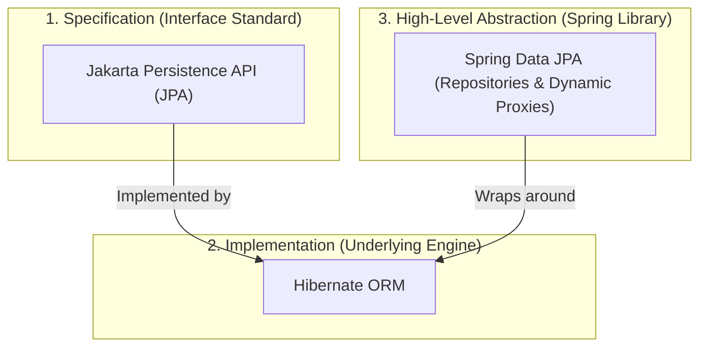

# Lesson 4: Spring Data JPA Fundamentals and Entity Mapping

> 🌐 **Language / ភាសា:** 🇬🇧 **[English](README.md)** | 🇰🇭 [ភាសាខ្មែរ (Khmer)](README.kh.md)  
> 🧭 **Navigation:** [📚 Module Index](../README.md) | [← Previous Lesson](../03-integration-with-mongodb/README.md) | [Next Lesson →](../05-spring-boot-jdbc-jdbctemplate/README.md)

> 📂 **Runnable Example Project:**  
> 👉 **Complete Project:** [Todo App Spring Data JPA Entities & Repositories](../../examples/02-spring-data-jpa-postgresql)  
> 📄 **Source Code Files:** [`Todo.java`](../../examples/02-spring-data-jpa-postgresql/src/main/java/com/example/todo/model/Todo.java) | [`TodoRepository.java`](../../examples/02-spring-data-jpa-postgresql/src/main/java/com/example/todo/repository/TodoRepository.java)


## Table of Contents

- [1. Dissecting JPA, Hibernate, and Spring Data JPA](#1-dissecting-jpa-hibernate-and-spring-data-jpa)
- [2. The ORM (Object-Relational Mapping) Paradigm](#2-the-orm-object-relational-mapping-paradigm)
- [3. Essential Entity Mapping Annotations](#3-essential-entity-mapping-annotations)
- [4. Primary Key Generation Strategies (`@GeneratedValue`)](#4-primary-key-generation-strategies-generatedvalue)
- [5. Practical Production Example: Product Entity](#5-practical-production-example-product-entity)
- [6. Summary](#6-summary)

---

## 1. Dissecting JPA, Hibernate, and Spring Data JPA

Software engineers frequently conflate these three foundational concepts:



1. **JPA (Jakarta Persistence API):** A vendor-neutral **specification** (standard interfaces and annotations) defining how relational tables map to object models in Java. It contains no executable persistence logic.
2. **Hibernate:** The industry-standard concrete **implementation** of the JPA specification. Hibernate translates high-level queries into dialect-specific SQL, manages connection state, and coordinates database sessions.
3. **Spring Data JPA:** An abstraction layer atop JPA providers. It generates boilerplate repository implementations dynamically at runtime via reflection and proxies, removing the need for manual SQL statement authoring.

---

## 2. The ORM (Object-Relational Mapping) Paradigm

**ORM** bridges the architectural impedance mismatch separating two disparate paradigms:
- **Object-Oriented Domain (Java):** Composed of classes, encapsulated objects, inheritance hierarchies, and polymorphic graph references.
- **Relational Domain (SQL):** Composed of normalized relational tables, rows, columns, foreign keys, and referential constraints.

---

## 3. Essential Entity Mapping Annotations

| Annotation | Purpose | Example |
| :--- | :--- | :--- |
| **`@Entity`** | Marks the Java class as a managed JPA persistence entity | `@Entity public class User` |
| **`@Table`** | Customizes underlying table metadata (table name, indexes, unique constraints) | `@Table(name = "tbl_users")` |
| **`@Id`** | Identifies the primary key attribute | `@Id private Long id;` |
| **`@GeneratedValue`** | Configures auto-generation strategies for the primary key | `@GeneratedValue(strategy = GenerationType.IDENTITY)` |
| **`@Column`** | Defines column-specific attributes (`name`, `nullable`, `unique`, `length`) | `@Column(name = "user_email", nullable = false, unique = true)` |
| **`@Enumerated`** | Dictates enum serialization in the persistence store (`STRING` vs `ORDINAL`) | `@Enumerated(EnumType.STRING)` |
| **`@Transient`** | Excludes non-persistent computed attributes from database schema mapping | `@Transient private double discountPrice;` |

> ⚠️ **Best Practice Warning:** Always annotate enums with `@Enumerated(EnumType.STRING)`. Using `ORDINAL` introduces database corruption if enum constants are later reordered or extended!

---

## 4. Primary Key Generation Strategies (`@GeneratedValue`)

Spring Data JPA supports 4 primary key generation strategies:
- **`GenerationType.IDENTITY`:** Delegates identifier assignment to native database auto-increment columns (optimized for MySQL, PostgreSQL).
- **`GenerationType.SEQUENCE`:** Utilizes database sequences for identifier batching (standard for Oracle, enterprise PostgreSQL).
- **`GenerationType.UUID`:** (Standardized in Hibernate 6 / Spring Boot 3) Generates RFC-compliant 36-character UUID strings natively.
- **`GenerationType.AUTO`:** Delegates strategy selection to the underlying persistence provider based on database dialect.

---

## 5. Practical Production Example: Product Entity

```java
package com.example.demo.entity;

import jakarta.persistence.*;
import java.math.BigDecimal;
import java.time.LocalDateTime;

@Entity
@Table(name = "products")
public class Product {

    @Id
    @GeneratedValue(strategy = GenerationType.IDENTITY)
    private Long id;

    @Column(name = "product_name", nullable = false, length = 150)
    private String name;

    @Column(name = "price", nullable = false, precision = 10, scale = 2)
    private BigDecimal price;

    @Enumerated(EnumType.STRING)
    @Column(name = "status", nullable = false)
    private ProductStatus status;

    @Column(name = "created_at", updatable = false)
    private LocalDateTime createdAt;

    // Default Constructor (Mandatory requirement for JPA reflective instantiation)
    public Product() {}

    public Product(String name, BigDecimal price, ProductStatus status) {
        this.name = name;
        this.price = price;
        this.status = status;
        this.createdAt = LocalDateTime.now();
    }

    // Getters and Setters omitted for brevity ...
}
```

---

## 6. Summary

- JPA establishes the specification, Hibernate implements the runtime engine, and Spring Data JPA delivers high-level repository conveniences.
- Apply `@Entity` and `@Table` at the class declaration and identify primary keys with `@Id`.
- Always serialize enums as strings via `@Enumerated(EnumType.STRING)`.
- Entities strictly require a no-argument constructor for Hibernate's reflection-based instantiation.

---
## 🧭 Lesson Navigation

| Previous Lesson | Module Index | Next Lesson |
| :--- | :---: | :--- |
| [← Integration with MongoDB (NoSQL)](../03-integration-with-mongodb/README.md) | [📚 Module Index](../README.md) | [Spring Boot JDBC with JdbcTemplate →](../05-spring-boot-jdbc-jdbctemplate/README.md) |
