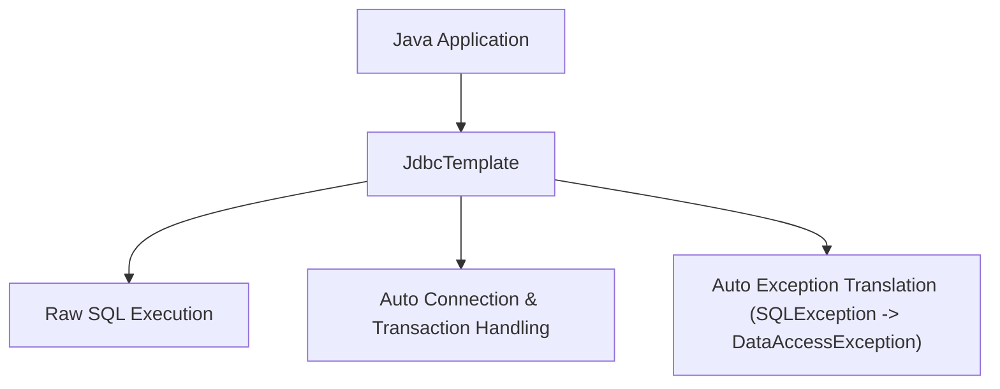

# មេរៀនទី ៥: ការប្រើប្រាស់ Spring Boot JDBC និង JdbcTemplate (Spring Boot JDBC with JdbcTemplate)

> 🌐 **ភាសា / Language:** 🇰🇭 **[ភាសាខ្មែរ (Khmer)](README.kh.md)** | 🇬🇧 [English](README.md)  
> 🧭 **រុករក:** [📚 មាតិកា Module](../README.kh.md) | [← មេរៀនមុន](../04-spring-data-jpa-basics/README.kh.md) | [មេរៀនបន្ទាប់ →](../06-crudrepository-vs-jparepository/README.kh.md)

---

## មាតិកា (Table of Contents)
1. [ហេតុអ្វីត្រូវប្រើ JdbcTemplate ជំនួស ឬរួមគ្នាជាមួយ JPA?](#ហេតុអ្វីត្រូវប្រើ-jdbctemplate)
2. [Dependency និង Setup](#dependency-និង-setup)
3. [CRUD Operations ជាមួយ JdbcTemplate](#crud-operations-ជាមួយ-jdbctemplate)
4. [ការប្រើប្រាស់ RowMapper សម្រាប់បម្លែងទិន្នន័យ ResultSet](#ការប្រើប្រាស់-rowmapper)
5. [NamedParameterJdbcTemplate សម្រាប់ Clean SQL Parameters](#namedparameterjdbctemplate)
6. [ការប្រៀបធៀប JdbcTemplate vs Spring Data JPA](#ការប្រៀបធៀប-jdbctemplate-vs-spring-data-jpa)

---

## ហេតុអ្វីត្រូវប្រើ JdbcTemplate?
ទោះបីជា **Spring Data JPA** ងាយស្រួល និងរហ័សក្នុងការអភិវឌ្ឍក៏ដោយ ប៉ុន្តែសម្រាប់ **Complex Reporting Queries**, **Bulk Batch Inserts**, ឬ **High-Performance SQL Optimization**, `JdbcTemplate` ផ្តល់នូវការគ្រប់គ្រង Raw SQL ផ្ទាល់ដោយគ្មាន overhead នៃ Hibernate ORM ឡើយ។



---

## Dependency និង Setup

```xml
<dependency>
    <groupId>org.springframework.boot</groupId>
    <artifactId>spring-boot-starter-jdbc</artifactId>
</dependency>
```

---

## CRUD Operations ជាមួយ JdbcTemplate

```java
@Repository
public class BookJdbcRepository {

    private final JdbcTemplate jdbcTemplate;

    public BookJdbcRepository(JdbcTemplate jdbcTemplate) {
        this.jdbcTemplate = jdbcTemplate;
    }

    // RowMapper definition
    private final RowMapper<Book> bookRowMapper = (rs, rowNum) -> new Book(
            rs.getLong("id"),
            rs.getString("title"),
            rs.getString("author"),
            rs.getBigDecimal("price")
    );

    public int save(Book book) {
        String sql = "INSERT INTO books (title, author, price) VALUES (?, ?, ?)";
        return jdbcTemplate.update(sql, book.getTitle(), book.getAuthor(), book.getPrice());
    }

    public Optional<Book> findById(Long id) {
        String sql = "SELECT * FROM books WHERE id = ?";
        List<Book> result = jdbcTemplate.query(sql, bookRowMapper, id);
        return result.stream().findFirst();
    }

    public List<Book> findAll() {
        return jdbcTemplate.query("SELECT * FROM books", bookRowMapper);
    }

    public int deleteById(Long id) {
        return jdbcTemplate.update("DELETE FROM books WHERE id = ?", id);
    }
}
```

---

## NamedParameterJdbcTemplate

ការប្រើសញ្ញាសួរ `?` នៅក្នុង SQL ងាយនឹងច្រឡំលំដាប់ parameters។ `NamedParameterJdbcTemplate` អនុញ្ញាតឱ្យយើងប្រើឈ្មោះប៉ារ៉ាម៉ែត្រ (Named Parameters)៖

```java
@Repository
public class OrderNamedDao {

    private final NamedParameterJdbcTemplate namedJdbc;

    public OrderNamedDao(NamedParameterJdbcTemplate namedJdbc) {
        this.namedJdbc = namedJdbc;
    }

    public List<Order> findOrdersByCustomerAndStatus(String customerCode, String status) {
        String sql = "SELECT * FROM orders WHERE customer_code = :code AND status = :status";
        MapSqlParameterSource params = new MapSqlParameterSource()
                .addValue("code", customerCode)
                .addValue("status", status);

        return namedJdbc.query(sql, params, new OrderRowMapper());
    }
}
```

---

## ការប្រៀបធៀប JdbcTemplate vs Spring Data JPA

| លក្ខណៈ | JdbcTemplate | Spring Data JPA |
| :--- | :--- | :--- |
| **កម្រិត Abstraction** | Low-level (Direct SQL) | High-level ORM |
| **Performance** | លឿនបំផុត (No ORM Overhead) | ល្អ ប៉ុន្តែត្រូវប្រុងប្រយ័ត្ន N+1 Problem |
| **Entity Relationships** | ត្រូវ map ដោយដៃទាំងអស់ | គាំទ្រ `@OneToMany`, `@ManyToMany` ស្វ័យប្រវត្ត |
| **ករណីប្រើប្រាស់ល្អបំផុត** | Reporting, Batch processing, Fine-tuned SQL | Standard OLTP CRUD Web Applications |

---

## 🧭 ការរុករកមេរៀន (Lesson Navigation)

| ថយក្រោយ (Previous) | មាតិកា Module (Index) | បន្ទាប់ (Next) |
| :--- | :---: | :--- |
| [← មូលដ្ឋានគ្រឹះនៃ Spring Data JPA និង Entity Mapping](../04-spring-data-jpa-basics/README.kh.md) | [📚 បញ្ជីមេរៀន Module](../README.kh.md) | [ការប្រៀបធៀប Repositories: CrudRepository vs JpaRepository →](../06-crudrepository-vs-jparepository/README.kh.md) |
