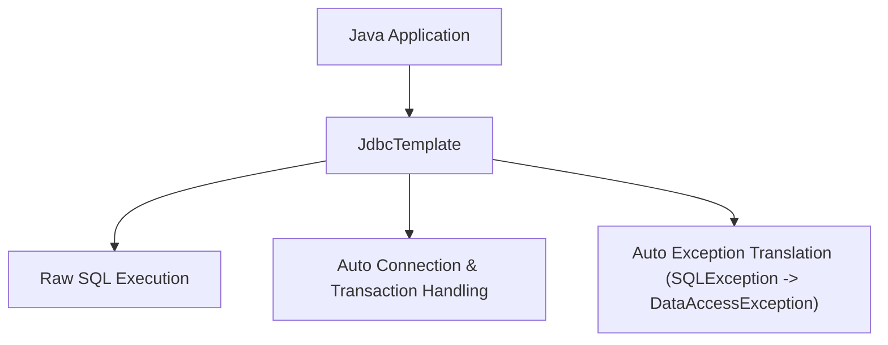

# Lesson 5: Spring Boot JDBC with JdbcTemplate

> 🌐 **Language / ភាសា:** 🇬🇧 **[English](README.md)** | 🇰🇭 [ភាសាខ្មែរ (Khmer)](README.kh.md)  
> 🧭 **Navigation:** [📚 Module Index](../README.md) | [← Previous Lesson](../04-spring-data-jpa-basics/README.md) | [Next Lesson →](../06-crudrepository-vs-jparepository/README.md)

---

## Table of Contents
1. [Why Use JdbcTemplate Over or Alongside JPA?](#why-use-jdbctemplate)
2. [Dependency and Configuration](#dependency-and-configuration)
3. [CRUD Operations with JdbcTemplate](#crud-operations-with-jdbctemplate)
4. [Mapping Results with RowMapper](#mapping-results-with-rowmapper)
5. [NamedParameterJdbcTemplate for Clean Parameters](#namedparameterjdbctemplate)
6. [Comparison: JdbcTemplate vs Spring Data JPA](#comparison-jdbctemplate-vs-spring-data-jpa)

---

## Why Use JdbcTemplate?
While **Spring Data JPA** provides immense rapid application development capabilities, **JdbcTemplate** remains superior for **complex reporting queries**, **high-speed batch operations**, and fine-grained query tuning without the caching and dirty-checking overhead of an ORM.



---

## Dependency and Configuration

```xml
<dependency>
    <groupId>org.springframework.boot</groupId>
    <artifactId>spring-boot-starter-jdbc</artifactId>
</dependency>
```

---

## CRUD Operations with JdbcTemplate

```java
@Repository
public class BookJdbcRepository {

    private final JdbcTemplate jdbcTemplate;

    public BookJdbcRepository(JdbcTemplate jdbcTemplate) {
        this.jdbcTemplate = jdbcTemplate;
    }

    private final RowMapper<Book> bookRowMapper = (rs, rowNum) -> new Book(
            rs.getLong("id"),
            rs.getString("title"),
            rs.getString("author"),
            rs.getBigDecimal("price")
    );

    public int save(Book book) {
        String sql = "INSERT INTO books (title, author, price) VALUES (?, ?, ?)";
        return jdbcTemplate.update(sql, book.getTitle(), book.getAuthor(), book.getPrice());
    }

    public Optional<Book> findById(Long id) {
        String sql = "SELECT * FROM books WHERE id = ?";
        List<Book> result = jdbcTemplate.query(sql, bookRowMapper, id);
        return result.stream().findFirst();
    }

    public List<Book> findAll() {
        return jdbcTemplate.query("SELECT * FROM books", bookRowMapper);
    }

    public int deleteById(Long id) {
        return jdbcTemplate.update("DELETE FROM books WHERE id = ?", id);
    }
}
```

---

## NamedParameterJdbcTemplate

Named parameters eliminate index confusion associated with standard `?` positional placeholders:

```java
@Repository
public class OrderNamedDao {

    private final NamedParameterJdbcTemplate namedJdbc;

    public OrderNamedDao(NamedParameterJdbcTemplate namedJdbc) {
        this.namedJdbc = namedJdbc;
    }

    public List<Order> findOrdersByCustomerAndStatus(String customerCode, String status) {
        String sql = "SELECT * FROM orders WHERE customer_code = :code AND status = :status";
        MapSqlParameterSource params = new MapSqlParameterSource()
                .addValue("code", customerCode)
                .addValue("status", status);

        return namedJdbc.query(sql, params, new OrderRowMapper());
    }
}
```

---

## Comparison: JdbcTemplate vs Spring Data JPA

| Feature | JdbcTemplate | Spring Data JPA |
| :--- | :--- | :--- |
| **Abstraction Level** | Low-level (Direct SQL control) | High-level ORM |
| **Performance** | Peak throughput (zero ORM overhead) | High, but susceptible to N+1 queries |
| **Relationship Mapping** | Manual join and projection mapping | Automated (`@OneToMany`, `@ManyToMany`) |
| **Primary Use Cases** | Aggregations, batch migrations, reports | Standard enterprise OLTP CRUD workflows |

---

## 🧭 Lesson Navigation

| Previous Lesson | Module Index | Next Lesson |
| :--- | :---: | :--- |
| [← Spring Data JPA Fundamentals and Entity Mapping](../04-spring-data-jpa-basics/README.md) | [📚 Module Index](../README.md) | [Repositories Comparison: CrudRepository vs JpaRepository →](../06-crudrepository-vs-jparepository/README.md) |
