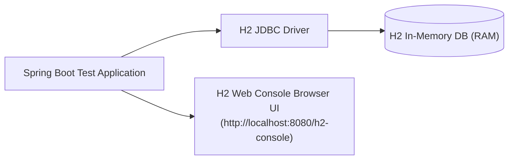

# Lesson 7: H2 In-Memory Database for Fast Testing

> 🌐 **Language / ភាសា:** 🇬🇧 **[English](README.md)** | 🇰🇭 [ភាសាខ្មែរ (Khmer)](README.kh.md)  
> 🧭 **Navigation:** [📚 Module Index](../README.md) | [← Previous Lesson](../06-crudrepository-vs-jparepository/README.md) | [Next Lesson →](../08-crud-operations-jpa/README.md)

> 📂 **Runnable Example Project:**  
> 👉 **Complete Project:** [Todo H2 In-Memory Config & Console](../../examples/02-spring-data-jpa-postgresql)  
> 📄 **Source Code Files:** [`application.yml`](../../examples/02-spring-data-jpa-postgresql/src/main/resources/application.yml) | [`pom.xml`](../../examples/02-spring-data-jpa-postgresql/pom.xml)


---

## Table of Contents
1. [Introduction to H2 In-Memory Database](#introduction-to-h2-in-memory-database)
2. [Maven Dependency Setup](#maven-dependency-setup)
3. [Configuration for Test Profiles](#configuration-for-test-profiles)
4. [Enabling and Accessing H2 Web Console](#enabling-and-accessing-h2-web-console)
5. [Schema & Data Preloading (schema.sql & data.sql)](#schema--data-preloading)
6. [Summary](#summary)

---

## Introduction to H2 In-Memory Database
**H2** is an ultra-fast, open-source relational database engine written in pure Java. Because it can run entirely **in-memory**, it eliminates the requirement for external database instances (like MySQL or Postgres) during continuous integration (CI) test execution and local rapid prototyping.



---

## Maven Dependency Setup

```xml
<dependency>
    <groupId>com.h2database</groupId>
    <artifactId>h2</artifactId>
    <scope>runtime</scope>
</dependency>
```

---

## Configuration for Test Profiles

In `src/test/resources/application-test.yml`:

```yaml
spring:
  datasource:
    url: jdbc:h2:mem:testdb;DB_CLOSE_DELAY=-1;DB_CLOSE_ON_EXIT=FALSE
    driverClassName: org.h2.Driver
    username: sa
    password: ""
  jpa:
    database-platform: org.hibernate.dialect.H2Dialect
    hibernate:
      ddl-auto: create-drop
    show-sql: true
  h2:
    console:
      enabled: true
      path: /h2-console
```

---

## Enabling and Accessing H2 Web Console
When `spring.h2.console.enabled=true`, inspect tables directly in your browser:
- **URL**: `http://localhost:8080/h2-console`
- **JDBC URL**: `jdbc:h2:mem:testdb`
- **Username**: `sa`
- **Password**: *(Leave empty)*

---

## Schema & Data Preloading (schema.sql & data.sql)

### `schema.sql`:
```sql
CREATE TABLE IF NOT EXISTS categories (
    id BIGINT AUTO_INCREMENT PRIMARY KEY,
    name VARCHAR(100) NOT NULL
);
```

### `data.sql`:
```sql
INSERT INTO categories (name) VALUES ('Electronics');
INSERT INTO categories (name) VALUES ('Books');
```

---

## 🧭 Lesson Navigation

| Previous Lesson | Module Index | Next Lesson |
| :--- | :---: | :--- |
| [← Repositories Comparison: CrudRepository vs JpaRepository](../06-crudrepository-vs-jparepository/README.md) | [📚 Module Index](../README.md) | [Full CRUD Operations with Spring Data JPA →](../08-crud-operations-jpa/README.md) |
