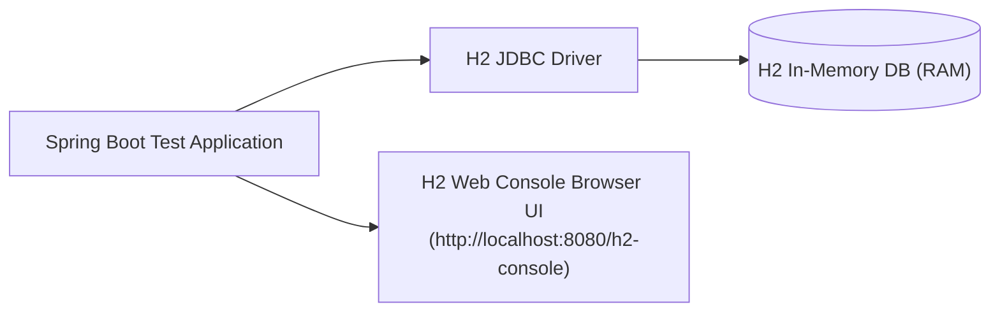

# មេរៀនទី ៧: ការប្រើប្រាស់ H2 In-Memory Database សម្រាប់ Testing (H2 In-Memory Database)
> 🧭 **រុករក:** [📚 មាតិកា Module](../README.md) | [← មេរៀនមុន](../06-crudrepository-vs-jparepository/README.md) | [មេរៀនបន្ទាប់ →](../08-crud-operations-jpa/README.md)

> 📂 **កូដគំរូជាក់ស្តែង (Runnable Example Project):**  
> 👉 **គម្រោងពេញលេញ:** [Todo H2 In-Memory Config & Console](../../examples/02-spring-data-jpa-postgresql)  
> 📄 **File កូដជាក់ស្តែង:** [`application.yml`](../../examples/02-spring-data-jpa-postgresql/src/main/resources/application.yml) | [`pom.xml`](../../examples/02-spring-data-jpa-postgresql/pom.xml)


---

## មាតិកា (Table of Contents)
1. [សេចក្តីផ្តើមអំពី H2 Database](#សេចក្តីផ្តើមអំពី-h2-database)
2. [Maven Dependency Setup](#maven-dependency-setup)
3. [ការកំណត់ Configuration សម្រាប់ Test Profile](#ការកំណត់-configuration-សម្រាប់-test-profile)
4. [ការបើកដំណើរការ H2 Web Console](#ការបើកដំណើរការ-h2-web-console)
5. [ការរៀបចំ Schema និង Data Initialization (schema.sql & data.sql)](#ការរៀបចំ-schema-និង-data-initialization)
6. [សង្ខេប](#សង្ខេប)

---

## សេចក្តីផ្តើមអំពី H2 Database
**H2** គឺជាប្រព័ន្ធ Relational Database ដ៏លឿន និងទម្ងន់ស្រាល ដែលសរសេរឡើងដោយ Java ទាំងស្រុង។ វាអាចដំណើរការជា **In-Memory Mode** (ទិន្នន័យស្ថិតក្នុង RAM កម្មវិធីបិទ ទិន្នន័យរលត់) ដែលស័ក្តិសមឥតខ្ចោះសម្រាប់ការធ្វើ **Unit/Integration Testing** និង **Local Prototyping** ដោយពុំចាំបាច់ Install MySQL ឬ PostgreSQL លើកុំព្យូទ័រឡើយ។



---

## Maven Dependency Setup

```xml
<dependency>
    <groupId>com.h2database</groupId>
    <artifactId>h2</artifactId>
    <scope>runtime</scope>

</dependency>
```

---

## ការកំណត់ Configuration សម្រាប់ Test Profile

នៅក្នុង file `src/test/resources/application-test.yml`៖

```yaml
spring:
  datasource:
    url: jdbc:h2:mem:testdb;DB_CLOSE_DELAY=-1;DB_CLOSE_ON_EXIT=FALSE
    driverClassName: org.h2.Driver
    username: sa
    password: ""
  jpa:
    database-platform: org.hibernate.dialect.H2Dialect
    hibernate:
      ddl-auto: create-drop
    show-sql: true
  h2:
    console:
      enabled: true
      path: /h2-console
```

---

## ការបើកដំណើរការ H2 Web Console
នៅពេលដែល `spring.h2.console.enabled=true`, យើងអាចបើក Web Browser ទៅកាន់៖
- **URL**: `http://localhost:8080/h2-console`
- **JDBC URL**: `jdbc:h2:mem:testdb`
- **User Name**: `sa`
- **Password**: *(ទុកទំនេរ)*

---

## Data Initialization (schema.sql & data.sql)
ដាក់ file ទាំងពីរនៅក្នុង `src/main/resources/` ឬ `src/test/resources/`៖

### `schema.sql`:
```sql
CREATE TABLE IF NOT EXISTS categories (
    id BIGINT AUTO_INCREMENT PRIMARY KEY,
    name VARCHAR(100) NOT NULL
);
```

### `data.sql`:
```sql
INSERT INTO categories (name) VALUES ('Electronics');
INSERT INTO categories (name) VALUES ('Books');
```

---

## 🧭 ការរុករកមេរៀន (Lesson Navigation)

| ថយក្រោយ (Previous) | មាតិកា Module (Index) | បន្ទាប់ (Next) |
| :--- | :---: | :--- |
| [← ការប្រៀបធៀប Repositories: CrudRepository vs JpaRepository](../06-crudrepository-vs-jparepository/README.md) | [📚 បញ្ជីមេរៀន Module](../README.md) | [ប្រតិបត្តិការ CRUD ពេញលេញជាមួយ Spring Data JPA (Full CRUD Operations) →](../08-crud-operations-jpa/README.md) |
