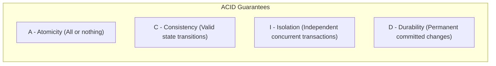
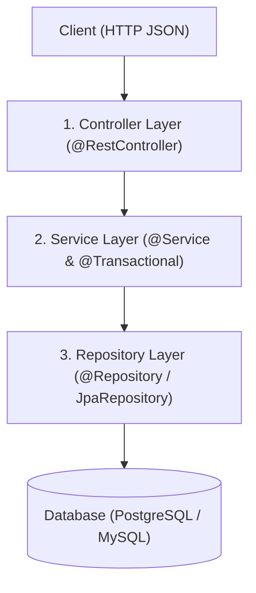

# Lesson 8: Full CRUD Operations with Spring Data JPA

> 🌐 **Language / ភាសា:** 🇬🇧 **[English](README.md)** | 🇰🇭 [ភាសាខ្មែរ (Khmer)](README.kh.md)  
> 🧭 **Navigation:** [📚 Module Index](../README.md) | [← Previous Lesson](../07-h2-database-for-testing/README.md) | [Next Lesson →](../09-todo-list-api-project/README.md)

> 📂 **Runnable Example Project:**  
> 👉 **Complete Project:** [Todo CRUD Operations with JPA](../../examples/02-spring-data-jpa-postgresql)  
> 📄 **Source Code Files:** [`TodoController.java`](../../examples/02-spring-data-jpa-postgresql/src/main/java/com/example/todo/controller/TodoController.java) | [`TodoService.java`](../../examples/02-spring-data-jpa-postgresql/src/main/java/com/example/todo/service/TodoService.java) | [`TodoRepository.java`](../../examples/02-spring-data-jpa-postgresql/src/main/java/com/example/todo/repository/TodoRepository.java)


## Table of Contents

- [1. Database Transactions and ACID Principles](#1-database-transactions-and-acid-principles)
- [2. Applying `@Transactional` in Spring Boot](#2-applying-transactional-in-spring-boot)
- [3. Automatic Rollback Rules and Checked Exceptions](#3-automatic-rollback-rules-and-checked-exceptions)
- [4. Performance Benefits of `@Transactional(readOnly = true)`](#4-performance-benefits-of-transactionalreadonly--true)
- [5. Full Production Architecture: 3-Layer CRUD](#5-full-production-architecture-3-layer-crud)
- [6. Summary](#6-summary)

---

## 1. Database Transactions and ACID Principles

A **Transaction** encapsulates a logical sequence of database operations into an atomic unit of execution. Every participating operation must succeed entirely (Commit) or fail completely (Rollback), avoiding partial state updates.



### Classic Financial Ledger Example: Money Transfer
1. Debit $100 from Account A (`UPDATE accounts SET balance = balance - 100 WHERE id = 'A'`)
2. Credit $100 into Account B (`UPDATE accounts SET balance = balance + 100 WHERE id = 'B'`)

If Step 1 succeeds but a network partition or system exception interrupts Step 2, $100 is irrecoverably lost. Transaction boundaries ensure Step 1 is cleanly **rolled back** if Step 2 faults.

---

## 2. Applying `@Transactional` in Spring Boot

Spring abstracts transaction coordination declaratively via **`@Transactional`**. When placed on service methods, Spring's Aspect-Oriented Programming (AOP) proxy transparently opens, commits, or rolls back physical JDBC transactions.

---

## 3. Automatic Rollback Rules and Checked Exceptions

> ⚠️ **Critical Interview Question & Architectural Gotcha:**
> By default, Spring's `@Transactional` rollback mechanism **only triggers on Unchecked Exceptions (`RuntimeException` and `Error`)!**

If your domain logic throws a standard **Checked Exception** (e.g., `IOException`, `SQLException`, or custom exceptions extending `Exception`), Spring **will NOT roll back** the database transaction, committing corrupted data to disk.

👉 **Best Practice Remedy:** Explicitly declare `rollbackFor = Exception.class`:
```java
@Transactional(rollbackFor = Exception.class)
public void transferFunds(...) throws InsufficientFundsException { ... }
```

---

## 4. Performance Benefits of `@Transactional(readOnly = true)`

Annotating read-only queries with `@Transactional(readOnly = true)` provides critical optimizations:
1. **Performance Gain:** Hibernate disables internal entity snapshotting and the **Dirty Checking Mechanism**, significantly conserving CPU cycles and heap memory.
2. **Read-Replica Routing:** In distributed database clusters (Primary-Replica topologies), read-only transactions can be routed automatically to replica nodes, preserving primary database throughput.

---

## 5. Full Production Architecture: 3-Layer CRUD



### Service Layer Implementation:
```java
package com.example.demo.service;

import com.example.demo.dto.*;
import com.example.demo.entity.Product;
import com.example.demo.exception.ResourceNotFoundException;
import com.example.demo.repository.ProductRepository;
import org.springframework.stereotype.Service;
import org.springframework.transaction.annotation.Transactional;

import java.util.List;

@Service
@Transactional(readOnly = true) // Applied to all read methods in this class by default
public class ProductService {

    private final ProductRepository productRepository;

    public ProductService(ProductRepository productRepository) {
        this.productRepository = productRepository;
    }

    public List<ProductResponse> getAllProducts() {
        return productRepository.findAll()
                .stream()
                .map(p -> new ProductResponse(p.getId(), p.getName(), p.getPrice()))
                .toList();
    }

    public ProductResponse getById(Long id) {
        Product p = productRepository.findById(id)
                .orElseThrow(() -> new ResourceNotFoundException("Product not found with ID=" + id));
        return new ProductResponse(p.getId(), p.getName(), p.getPrice());
    }

    // Write Mutation: Requires read-write transaction boundary
    @Transactional(rollbackFor = Exception.class)
    public ProductResponse create(CreateProductRequest req) {
        Product entity = new Product(req.name(), req.price());
        Product saved = productRepository.save(entity);
        return new ProductResponse(saved.getId(), saved.getName(), saved.getPrice());
    }

    @Transactional(rollbackFor = Exception.class)
    public ProductResponse update(Long id, CreateProductRequest req) {
        Product existing = productRepository.findById(id)
                .orElseThrow(() -> new ResourceNotFoundException("Product not found with ID=" + id));

        existing.setName(req.name());
        existing.setPrice(req.price());
        // Explicit .save() is optional here: Hibernate's Dirty Checking automatically executes UPDATE during commit!

        return new ProductResponse(existing.getId(), existing.getName(), existing.getPrice());
    }

    @Transactional(rollbackFor = Exception.class)
    public void delete(Long id) {
        if (!productRepository.existsById(id)) {
            throw new ResourceNotFoundException("Product not found with ID=" + id);
        }
        productRepository.deleteById(id);
    }
}
```

---

## 6. Summary

- Transactions uphold **ACID** guarantees to preserve relational integrity.
- Declare `@Transactional` on the **Service Layer** where transactional business boundaries belong.
- Configure `rollbackFor = Exception.class` to ensure checked exceptions trigger proper rollbacks.
- Use `readOnly = true` for data queries to bypass Hibernate dirty checking overhead.

---
## 🧭 Lesson Navigation

| Previous Lesson | Module Index | Next Lesson |
| :--- | :---: | :--- |
| [← H2 In-Memory Database for Fast Testing](../07-h2-database-for-testing/README.md) | [📚 Module Index](../README.md) | [Todo List REST API Project with Database →](../09-todo-list-api-project/README.md) |
