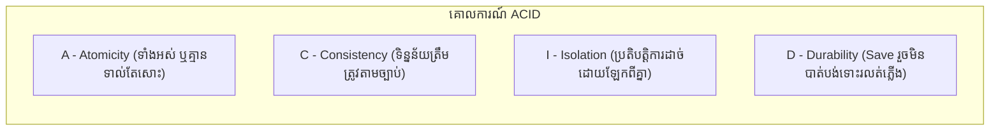
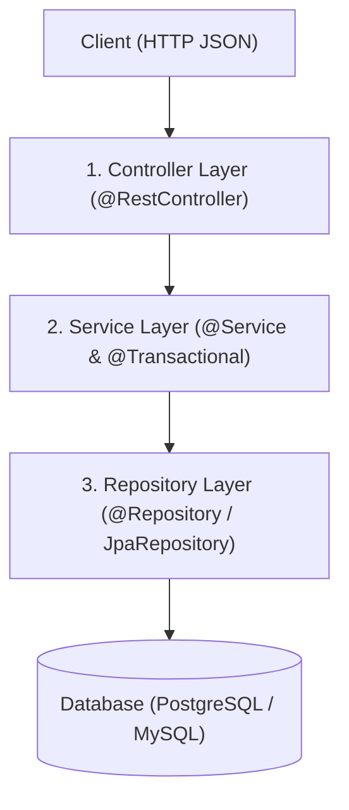

# មេរៀនទី ៨: ប្រតិបត្តិការ CRUD ពេញលេញជាមួយ Spring Data JPA (Full CRUD Operations)
> 🧭 **រុករក:** [📚 មាតិកា Module](../README.md) | [← មេរៀនមុន](../07-h2-database-for-testing/README.md) | [មេរៀនបន្ទាប់ →](../09-todo-list-api-project/README.md)

> 📂 **កូដគំរូជាក់ស្តែង (Runnable Example Project):**  
> 👉 **គម្រោងពេញលេញ:** [Todo CRUD Operations with JPA](../../examples/02-spring-data-jpa-postgresql)  
> 📄 **File កូដជាក់ស្តែង:** [`TodoController.java`](../../examples/02-spring-data-jpa-postgresql/src/main/java/com/example/todo/controller/TodoController.java) | [`TodoService.java`](../../examples/02-spring-data-jpa-postgresql/src/main/java/com/example/todo/service/TodoService.java) | [`TodoRepository.java`](../../examples/02-spring-data-jpa-postgresql/src/main/java/com/example/todo/repository/TodoRepository.java)


## មាតិកា (Table of Contents)

- [1. សញ្ញាណនៃ Database Transaction និងគោលការណ៍ ACID](#1-សញ្ញាណនៃ-database-transaction-និងគោលការណ៍-acid)
- [2. ការប្រើប្រាស់ `@Transactional` ក្នុង Spring Boot](#2-ការប្រើប្រាស់-transactional-ក្នុង-spring-boot)
- [3. ច្បាប់ Rollback ស្វ័យប្រវត្តិ (Rollback Rules)](#3-ច្បាប់-rollback-ស្វ័យប្រវត្តិ-rollback-rules)
- [4. អត្ថប្រយោជន៍នៃ `@Transactional(readOnly = true)`](#4-អត្ថប្រយោជន៍នៃ-transactionalreadonly--true)
- [5. គម្រោងពេញលេញ៖ ស្ថាបត្យកម្ម 3-Layer CRUD (Controller - Service - Repository)](#5-គម្រោងពេញលេញ-ស្ថាបត្យកម្ម-3-layer-crud-controller---service---repository)
- [6. សង្ខេប](#6-សង្ខេប)

---

## 1. សញ្ញាណនៃ Database Transaction និងគោលការណ៍ ACID

**Transaction** គឺជាបណ្តុំនៃប្រតិបត្តិការ Database ច្រើន (Multiple SQL Statements) ដែលត្រូវតែដំណើរការជោគជ័យទាំងអស់គ្នា (Commit) ឬបរាជ័យទាំងអស់គ្នា (Rollback) ដោយមិនអនុញ្ញាតឱ្យមានស្ថានភាពកណ្តាលឡើយ។



### ឧទាហរណ៍ជាក់ស្តែង៖ ការផ្ទេរប្រាក់ (Money Transfer)
1. ដកប្រាក់ $100 ពីគណនី A (`UPDATE accounts SET balance = balance - 100 WHERE id = 'A'`)
2. បញ្ចូលប្រាក់ $100 ទៅគណនី B (`UPDATE accounts SET balance = balance + 100 WHERE id = 'B'`)

ប្រសិនបើជំហានទី ១ ជោគជ័យ តែជំហានទី ២ ដាច់ Server ឬធ្លាក់ Error នោះលុយ $100 នឹងត្រូវបាត់បង់! Transaction ធានាថា ប្រសិនបើជំហានទី ២ បរាជ័យ នោះជំហានទី ១ នឹងត្រូវ **Rollback (ត្រឡប់មកដើមវិញភ្លាមៗ)**។

---

## 2. ការប្រើប្រាស់ `@Transactional` ក្នុង Spring Boot

Spring ផ្តល់នូវ Declarative Transaction Management តាមរយៈ Annotation **`@Transactional`**។ យើងគ្រាន់តែដាក់វានៅលើ Service Method នោះ Spring AOP Proxy នឹងបើក Transaction, Commit, និង Rollback ដោយស្វ័យប្រវត្តិ។

---

## 3. ច្បាប់ Rollback ស្វ័យប្រវត្តិ (Rollback Rules)

> ⚠️ **ចំណុចសម្ភាសន៍ការងារសំខាន់បំផុត (Critical Gotcha):**
> តាមលំនាំដើម (Default) Spring `@Transactional` នឹងធ្វើការ **Rollback តែចំពោះ Unchecked Exceptions (`RuntimeException` និង `Error`) តែប៉ុណ្ណោះ!**

ប្រសិនបើកូដរបស់អ្នកបោះ **Checked Exception** (ដូចជា `IOException`, `SQLException`, ឬ Custom Exception ដែល extends `Exception`) នោះ Spring **នឹងមិន Rollback ឡើយ** (វានឹង Commit ទិន្នន័យខូចចូល DB)!

👉 **ដំណោះស្រាយ:** បន្ថែម `rollbackFor = Exception.class` ជានិច្ច៖
```java
@Transactional(rollbackFor = Exception.class)
public void transferFunds(...) throws InsufficientBalanceException { ... }
```

---

## 4. អត្ថប្រយោជន៍នៃ `@Transactional(readOnly = true)`

នៅលើ Method ណាដែលគ្រាន់តែ `SELECT` ទិន្នន័យ (មិនកែប្រែ ឬ Insert) យើងគួរដាក់ `@Transactional(readOnly = true)` ព្រោះ៖
1. **Performance Boost:** Hibernate នឹងបិទមុខងារ **Dirty Checking Mechanism** (មិនបាច់ចំណាយ RAM និង CPU តាមដានការប្រែប្រួលរបស់ Object)។
2. **Database Routing:** ក្នុងប្រព័ន្ធធំៗដែលមាន Master-Replica Database វានឹងបញ្ជូន Query នេះទៅកាន់ Read-Replica Server ដោយស្វ័យប្រវត្តិ។

---

## 5. គម្រោងពេញលេញ៖ ស្ថាបត្យកម្ម 3-Layer CRUD



### 1. Service Interface & Implementation:
```java
package com.example.demo.service;

import com.example.demo.dto.*;
import com.example.demo.entity.Product;
import com.example.demo.exception.ResourceNotFoundException;
import com.example.demo.repository.ProductRepository;
import org.springframework.stereotype.Service;
import org.springframework.transaction.annotation.Transactional;

import java.util.List;

@Service
@Transactional(readOnly = true) // Default សម្រាប់រាល់ Read Methods ក្នុង Class នេះ
public class ProductService {

    private final ProductRepository productRepository;

    public ProductService(ProductRepository productRepository) {
        this.productRepository = productRepository;
    }

    public List<ProductResponse> getAllProducts() {
        return productRepository.findAll()
                .stream()
                .map(p -> new ProductResponse(p.getId(), p.getName(), p.getPrice()))
                .toList();
    }

    public ProductResponse getById(Long id) {
        Product p = productRepository.findById(id)
                .orElseThrow(() -> new ResourceNotFoundException("រកមិនឃើញផលិតផល ID=" + id));
        return new ProductResponse(p.getId(), p.getName(), p.getPrice());
    }

    // Write Operation: ត្រូវបើក Transaction ពេញលេញ
    @Transactional(rollbackFor = Exception.class)
    public ProductResponse create(CreateProductRequest req) {
        Product entity = new Product(req.name(), req.price());
        Product saved = productRepository.save(entity);
        return new ProductResponse(saved.getId(), saved.getName(), saved.getPrice());
    }

    @Transactional(rollbackFor = Exception.class)
    public ProductResponse update(Long id, CreateProductRequest req) {
        Product existing = productRepository.findById(id)
                .orElseThrow(() -> new ResourceNotFoundException("រកមិនឃើញផលិតផល ID=" + id));

        existing.setName(req.name());
        existing.setPrice(req.price());
        // មិនបាច់ហៅ .save() ក៏បាន ព្រោះ Hibernate មាន Dirty Checking ធ្វើ UPDATE ស្វ័យប្រវត្តិពេល Commit!

        return new ProductResponse(existing.getId(), existing.getName(), existing.getPrice());
    }

    @Transactional(rollbackFor = Exception.class)
    public void delete(Long id) {
        if (!productRepository.existsById(id)) {
            throw new ResourceNotFoundException("រកមិនឃើញផលិតផល ID=" + id);
        }
        productRepository.deleteById(id);
    }
}
```

---

## 6. សង្ខេប

- Transaction គោរពតាមគោលការណ៍ **ACID** ដើម្បីរក្សាភាពត្រឹមត្រូវនៃទិន្នន័យ។
- ដាក់ `@Transactional` នៅលើ **Service Layer** មិនមែនលើ Controller ឬ Repository ឡើយ។
- ប្រើ `rollbackFor = Exception.class` ដើម្បីការពារកុំឱ្យបាត់បង់ Rollback ពេលជួប Checked Exceptions។
- ប្រើ `readOnly = true` លើ Method ដែលគ្រាន់តែ Read ដើម្បីបង្កើនល្បឿន និងសន្សំសំចៃ Memory។

---
## 🧭 ការរុករកមេរៀន (Lesson Navigation)

| ថយក្រោយ (Previous) | មាតិកា Module (Index) | បន្ទាប់ (Next) |
| :--- | :---: | :--- |
| [← ការប្រើប្រាស់ H2 In-Memory Database សម្រាប់ Testing (H2 In-Memory Database)](../07-h2-database-for-testing/README.md) | [📚 បញ្ជីមេរៀន Module](../README.md) | [គម្រោង Todo List REST API ជាមួយ Database (Todo List REST API Project) →](../09-todo-list-api-project/README.md) |
