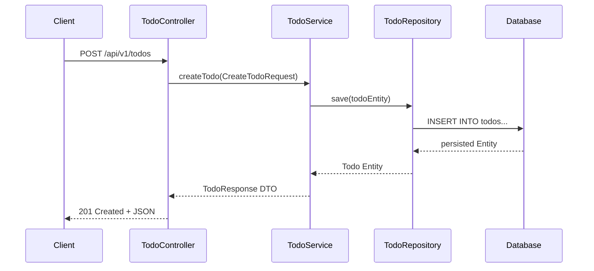

# Lesson 9: Todo List REST API Project with Database

> 🌐 **Language / ភាសា:** 🇬🇧 **[English](README.md)** | 🇰🇭 [ភាសាខ្មែរ (Khmer)](README.kh.md)  
> 🧭 **Navigation:** [📚 Module Index](../README.md) | [← Previous Lesson](../08-crud-operations-jpa/README.md) | [Next Lesson →](../../06-advanced-spring-boot-features/01-task-scheduling/README.md)

> 📂 **Runnable Example Project:**  
> 👉 **Complete Project:** [Todo List REST API Full Project](../../examples/02-spring-data-jpa-postgresql)  
> 📄 **Source Code Files:** [`Todo.java`](../../examples/02-spring-data-jpa-postgresql/src/main/java/com/example/todo/model/Todo.java) | [`TodoController.java`](../../examples/02-spring-data-jpa-postgresql/src/main/java/com/example/todo/controller/TodoController.java) | [`TodoService.java`](../../examples/02-spring-data-jpa-postgresql/src/main/java/com/example/todo/service/TodoService.java) | [`TodoRepository.java`](../../examples/02-spring-data-jpa-postgresql/src/main/java/com/example/todo/repository/TodoRepository.java) | [`application.yml`](../../examples/02-spring-data-jpa-postgresql/src/main/resources/application.yml)


---

## Table of Contents
1. [Project Architecture Overview](#project-architecture-overview)
2. [Todo Entity & Repository Implementation](#todo-entity--repository-implementation)
3. [DTOs & Service Layer Implementation](#dtos--service-layer-implementation)
4. [TodoController Endpoints](#todocontroller-endpoints)
5. [End-to-End API Verification](#end-to-end-api-verification)

---

## Project Architecture Overview
In this capstone lesson for Module 5, we build an end-to-end **Todo RESTful API** powered by Spring Data JPA with real database persistence, pagination, DTO patterns, and status toggles.



---

## Todo Entity & Repository Implementation

```java
package com.example.todo.model;

import jakarta.persistence.*;
import java.time.LocalDateTime;

@Entity
@Table(name = "todos")
public class Todo {

    @Id
    @GeneratedValue(strategy = GenerationType.IDENTITY)
    private Long id;

    @Column(nullable = false, length = 200)
    private String title;

    @Column(length = 1000)
    private String description;

    @Column(nullable = false)
    private boolean completed = false;

    private LocalDateTime createdAt = LocalDateTime.now();

    public Todo() {}
    public Todo(String title, String description) {
        this.title = title;
        this.description = description;
    }

    public Long getId() { return id; }
    public String getTitle() { return title; }
    public void setTitle(String title) { this.title = title; }
    public String getDescription() { return description; }
    public void setDescription(String description) { this.description = description; }
    public boolean isCompleted() { return completed; }
    public void setCompleted(boolean completed) { this.completed = completed; }
    public LocalDateTime getCreatedAt() { return createdAt; }
}
```

```java
package com.example.todo.repository;

import com.example.todo.model.Todo;
import org.springframework.data.jpa.repository.JpaRepository;
import java.util.List;

public interface TodoRepository extends JpaRepository<Todo, Long> {
    List<Todo> findByCompleted(boolean completed);
}
```

---

## DTOs & Service Layer Implementation

```java
package com.example.todo.dto;

import jakarta.validation.constraints.NotBlank;
import java.time.LocalDateTime;

public record CreateTodoRequest(
    @NotBlank(message = "Title must not be blank")
    String title,
    String description
) {}

public record TodoResponse(
    Long id,
    String title,
    String description,
    boolean completed,
    LocalDateTime createdAt
) {}
```

```java
package com.example.todo.service;

import com.example.todo.dto.*;
import com.example.todo.model.Todo;
import com.example.todo.repository.TodoRepository;
import org.springframework.stereotype.Service;
import org.springframework.transaction.annotation.Transactional;
import java.util.List;

@Service
@Transactional
public class TodoService {

    private final TodoRepository todoRepository;

    public TodoService(TodoRepository todoRepository) {
        this.todoRepository = todoRepository;
    }

    public TodoResponse create(CreateTodoRequest request) {
        Todo todo = new Todo(request.title(), request.description());
        Todo saved = todoRepository.save(todo);
        return toDto(saved);
    }

    @Transactional(readOnly = true)
    public List<TodoResponse> findAll(Boolean completed) {
        List<Todo> list = (completed != null) 
            ? todoRepository.findByCompleted(completed)
            : todoRepository.findAll();
        return list.stream().map(this::toDto).toList();
    }

    public TodoResponse toggleCompleted(Long id) {
        Todo todo = todoRepository.findById(id)
            .orElseThrow(() -> new RuntimeException("Todo not found: " + id));
        todo.setCompleted(!todo.isCompleted());
        return toDto(todo);
    }

    public void delete(Long id) {
        todoRepository.deleteById(id);
    }

    private TodoResponse toDto(Todo t) {
        return new TodoResponse(t.getId(), t.getTitle(), t.getDescription(), t.isCompleted(), t.getCreatedAt());
    }
}
```

---

## TodoController Endpoints

```java
package com.example.todo.controller;

import com.example.todo.dto.*;
import com.example.todo.service.TodoService;
import jakarta.validation.Valid;
import org.springframework.http.*;
import org.springframework.web.bind.annotation.*;
import java.net.URI;
import java.util.List;

@RestController
@RequestMapping("/api/v1/todos")
public class TodoController {

    private final TodoService todoService;

    public TodoController(TodoService todoService) {
        this.todoService = todoService;
    }

    @PostMapping
    public ResponseEntity<TodoResponse> create(@Valid @RequestBody CreateTodoRequest req) {
        TodoResponse created = todoService.create(req);
        return ResponseEntity.created(URI.create("/api/v1/todos/" + created.id())).body(created);
    }

    @GetMapping
    public ResponseEntity<List<TodoResponse>> list(@RequestParam(required = false) Boolean completed) {
        return ResponseEntity.ok(todoService.findAll(completed));
    }

    @PatchMapping("/{id}/toggle")
    public ResponseEntity<TodoResponse> toggle(@PathVariable Long id) {
        return ResponseEntity.ok(todoService.toggleCompleted(id));
    }

    @DeleteMapping("/{id}")
    public ResponseEntity<Void> delete(@PathVariable Long id) {
        todoService.delete(id);
        return ResponseEntity.noContent().build();
    }
}
```

---

## 🧭 Lesson Navigation

| Previous Lesson | Module Index | Next Lesson |
| :--- | :---: | :--- |
| [← Full CRUD Operations with Spring Data JPA](../08-crud-operations-jpa/README.md) | [📚 Module Index](../README.md) | [Task Scheduling with @Scheduled and Asynchronous Execution with @Async →](../../06-advanced-spring-boot-features/01-task-scheduling/README.md) |
