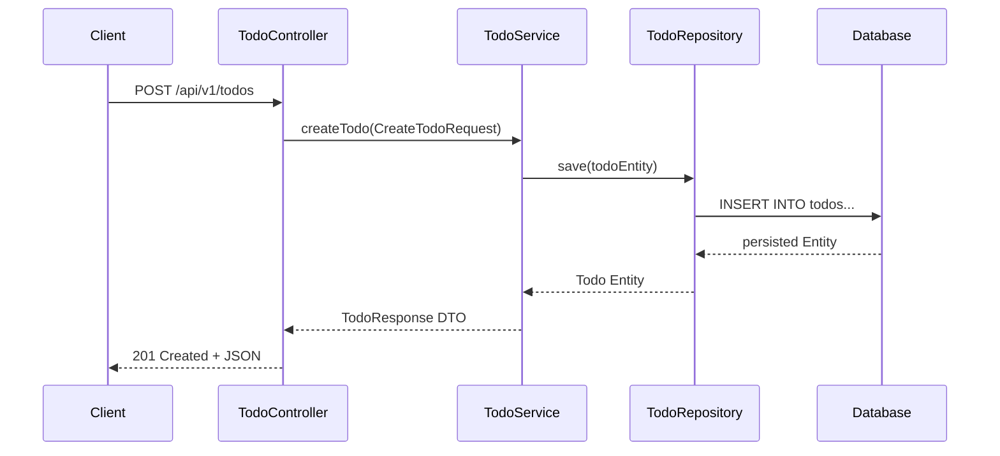

# មេរៀនទី ៩: គម្រោង Todo List REST API ជាមួយ Database (Todo List REST API Project)
> 🧭 **រុករក:** [📚 មាតិកា Module](../README.md) | [← មេរៀនមុន](../08-crud-operations-jpa/README.md) | [មេរៀនបន្ទាប់ →](../../06-advanced-spring-boot-features/01-task-scheduling/README.md)

> 📂 **កូដគំរូជាក់ស្តែង (Runnable Example Project):**  
> 👉 **គម្រោងពេញលេញ:** [Todo List REST API Full Project](../../examples/02-spring-data-jpa-postgresql)  
> 📄 **File កូដជាក់ស្តែង:** [`Todo.java`](../../examples/02-spring-data-jpa-postgresql/src/main/java/com/example/todo/model/Todo.java) | [`TodoController.java`](../../examples/02-spring-data-jpa-postgresql/src/main/java/com/example/todo/controller/TodoController.java) | [`TodoService.java`](../../examples/02-spring-data-jpa-postgresql/src/main/java/com/example/todo/service/TodoService.java) | [`TodoRepository.java`](../../examples/02-spring-data-jpa-postgresql/src/main/java/com/example/todo/repository/TodoRepository.java) | [`application.yml`](../../examples/02-spring-data-jpa-postgresql/src/main/resources/application.yml)


---

## មាតិកា (Table of Contents)
1. [ទិដ្ឋភាពទូទៅនៃគម្រោង Todo API](#ទិដ្ឋភាពទូទៅនៃគម្រោង)
2. [ស្ថាបត្យកម្មប្រព័ន្ធ (Layered Architecture)](#ស្ថាបត្យកម្មប្រព័ន្ធ)
3. [ការបង្កើត Todo Entity & Repository](#ការបង្កើត-todo-entity--repository)
4. [ការបង្កើត DTOs & Service Layer](#ការបង្កើត-dtos--service-layer)
5. [ការបង្កើត TodoController](#ការបង្កើត-todocontroller)
6. [ការធ្វើតេស្ត API ជាមួយ Postman ឬ cURL](#ការធ្វើតេស្ត-api)

---

## ទិដ្ឋភាពទូទៅនៃគម្រោង
នៅក្នុងគម្រោងបញ្ចប់ Module 5 នេះ យើងនឹងសាងសង់ **Todo Management RESTful API** ពេញលេញមួយ ដែលភ្ជាប់ជាមួយ Relational Database តាមរយៈ Spring Data JPA ដោយគាំទ្រ Status Filtering, Pagination, និង Validation។



---

## ការបង្កើត Todo Entity & Repository

```java
package com.example.todo.model;

import jakarta.persistence.*;
import java.time.LocalDateTime;

@Entity
@Table(name = "todos")
public class Todo {

    @Id
    @GeneratedValue(strategy = GenerationType.IDENTITY)
    private Long id;

    @Column(nullable = false, length = 200)
    private String title;

    @Column(length = 1000)
    private String description;

    @Column(nullable = false)
    private boolean completed = false;

    private LocalDateTime createdAt = LocalDateTime.now();

    public Todo() {}
    public Todo(String title, String description) {
        this.title = title;
        this.description = description;
    }

    // Getters & Setters
    public Long getId() { return id; }
    public String getTitle() { return title; }
    public void setTitle(String title) { this.title = title; }
    public String getDescription() { return description; }
    public void setDescription(String description) { this.description = description; }
    public boolean isCompleted() { return completed; }
    public void setCompleted(boolean completed) { this.completed = completed; }
    public LocalDateTime getCreatedAt() { return createdAt; }
}
```

```java
package com.example.todo.repository;

import com.example.todo.model.Todo;
import org.springframework.data.jpa.repository.JpaRepository;
import java.util.List;

public interface TodoRepository extends JpaRepository<Todo, Long> {
    List<Todo> findByCompleted(boolean completed);

}
```

---

## ការបង្កើត DTOs & Service Layer

```java
package com.example.todo.dto;

import jakarta.validation.constraints.NotBlank;
import java.time.LocalDateTime;

public record CreateTodoRequest(
    @NotBlank(message = "Title must not be blank")
    String title,
    String description
) {}

public record TodoResponse(
    Long id,
    String title,
    String description,
    boolean completed,
    LocalDateTime createdAt
) {}
```

```java
package com.example.todo.service;

import com.example.todo.dto.*;
import com.example.todo.model.Todo;
import com.example.todo.repository.TodoRepository;
import org.springframework.stereotype.Service;
import org.springframework.transaction.annotation.Transactional;
import java.util.List;

@Service
@Transactional
public class TodoService {

    private final TodoRepository todoRepository;

    public TodoService(TodoRepository todoRepository) {
        this.todoRepository = todoRepository;
    }

    public TodoResponse create(CreateTodoRequest request) {
        Todo todo = new Todo(request.title(), request.description());
        Todo saved = todoRepository.save(todo);
        return toDto(saved);
    }

    @Transactional(readOnly = true)
    public List<TodoResponse> findAll(Boolean completed) {
        List<Todo> list = (completed != null) 
            ? todoRepository.findByCompleted(completed)
            : todoRepository.findAll();
        return list.stream().map(this::toDto).toList();
    }

    public TodoResponse toggleCompleted(Long id) {
        Todo todo = todoRepository.findById(id)
            .orElseThrow(() -> new RuntimeException("Todo not found: " + id));
        todo.setCompleted(!todo.isCompleted());
        return toDto(todo);
    }

    public void delete(Long id) {
        todoRepository.deleteById(id);
    }

    private TodoResponse toDto(Todo t) {
        return new TodoResponse(t.getId(), t.getTitle(), t.getDescription(), t.isCompleted(), t.getCreatedAt());
    }
}
```

---

## ការបង្កើត TodoController

```java
package com.example.todo.controller;

import com.example.todo.dto.*;
import com.example.todo.service.TodoService;
import jakarta.validation.Valid;
import org.springframework.http.*;
import org.springframework.web.bind.annotation.*;
import java.net.URI;
import java.util.List;

@RestController
@RequestMapping("/api/v1/todos")
public class TodoController {

    private final TodoService todoService;

    public TodoController(TodoService todoService) {
        this.todoService = todoService;
    }

    @PostMapping
    public ResponseEntity<TodoResponse> create(@Valid @RequestBody CreateTodoRequest req) {
        TodoResponse created = todoService.create(req);
        return ResponseEntity.created(URI.create("/api/v1/todos/" + created.id())).body(created);
    }

    @GetMapping
    public ResponseEntity<List<TodoResponse>> list(@RequestParam(required = false) Boolean completed) {
        return ResponseEntity.ok(todoService.findAll(completed));
    }

    @PatchMapping("/{id}/toggle")
    public ResponseEntity<TodoResponse> toggle(@PathVariable Long id) {
        return ResponseEntity.ok(todoService.toggleCompleted(id));
    }

    @DeleteMapping("/{id}")
    public ResponseEntity<Void> delete(@PathVariable Long id) {
        todoService.delete(id);
        return ResponseEntity.noContent().build();
    }
}
```

---

## 🧭 ការរុករកមេរៀន (Lesson Navigation)

| ថយក្រោយ (Previous) | មាតិកា Module (Index) | បន្ទាប់ (Next) |
| :--- | :---: | :--- |
| [← ប្រតិបត្តិការ CRUD ពេញលេញជាមួយ Spring Data JPA (Full CRUD Operations)](../08-crud-operations-jpa/README.md) | [📚 បញ្ជីមេរៀន Module](../README.md) | [ការដំណើរការការងារស្វ័យប្រវត្តិតាមកាលកំណត់ (@Scheduled) និងអសមកាលកម្ម (@Async) →](../../06-advanced-spring-boot-features/01-task-scheduling/README.md) |
