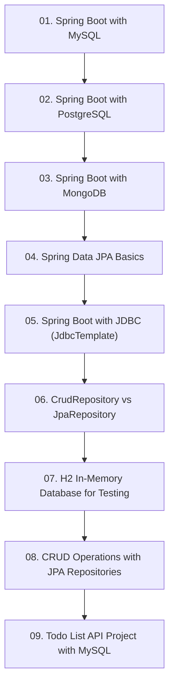

# Module 5: Database Persistence & Spring Data JPA

> 🌐 **Language / ភាសា:** 🇰🇭 [ភាសាខ្មែរ (Khmer)](README.kh.md) | 🇬🇧 **[English](README.md)**

> 📂 **Runnable Example Project for this Module:**  
> 👉 **[Todo List Spring Data JPA & PostgreSQL](../examples/02-spring-data-jpa-postgresql)**  
> Complete Maven project featuring Entities, Repository Interfaces, H2 & PostgreSQL Configurations, and Transactions.

---

## 📖 Module Overview

Robust relational and document persistence: MySQL, PostgreSQL, MongoDB, Spring Data JPA, JdbcTemplate, repository hierarchies, in-memory H2 testing, and a production CRUD project.

---

## 🗺️ Module Learning Roadmap

---

## 📚 Lessons in This Module (9 Lessons)

| Lesson | Topic | Description |
| :---: | :--- | :--- |
| **01** | [Spring Boot with MySQL](01-integration-with-mysql/README.md) | Configuring MySQL drivers, HikariCP, and application.yml settings |
| **02** | [Spring Boot with PostgreSQL](02-integration-with-postgresql/README.md) | Integrating enterprise PostgreSQL with Spring Boot |
| **03** | [Spring Boot with MongoDB](03-integration-with-mongodb/README.md) | NoSQL document persistence with Spring Data MongoDB |
| **04** | [Spring Data JPA Basics](04-spring-data-jpa-basics/README.md) | ORM architecture, JPA annotations, and primary key strategies |
| **05** | [Spring Boot with JDBC (JdbcTemplate)](05-spring-boot-jdbc-jdbctemplate/README.md) | Direct database querying with Spring JdbcTemplate |
| **06** | [CrudRepository vs JpaRepository](06-crudrepository-vs-jparepository/README.md) | Comparing repository abstractions and automated query derivation |
| **07** | [H2 In-Memory Database for Testing](07-h2-database-for-testing/README.md) | In-memory H2 database setup and automated testing configuration |
| **08** | [CRUD Operations with JPA Repositories](08-crud-operations-jpa/README.md) | End-to-end CRUD operations using JpaRepository and services |
| **09** | [Todo List API Project with MySQL](09-todo-list-api-project/README.md) | Hands-on project: Building a complete Todo API backed by MySQL |

---

## 🧭 Navigation

| Previous | Main Index | Next Module |
| :--- | :---: | :--- |
| [Module 4: REST APIs](../04-spring-boot-with-rest-api/README.md) | [📚 Spring Boot Home](../README.md) | [Module 6: Advanced Features →](../06-advanced-spring-boot-features/README.md) |
