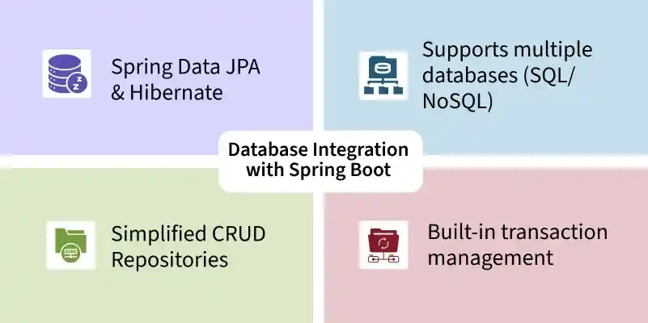
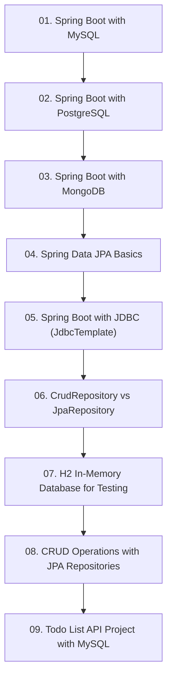

# Module 5: ការតភ្ជាប់ Database និង Spring Data JPA (Database & Data JPA)

> 📂 **គម្រោងកូដគំរូជាក់ស្តែងសម្រាប់ Module នេះ (Runnable Project):**  
> 👉 **[Todo List Spring Data JPA & PostgreSQL](../examples/02-spring-data-jpa-postgresql)**  
> គម្រោង Maven ពេញលេញរួមមាន Entities, Repository Interfaces, H2 & PostgreSQL Configurations, និង Transactions។

---

## 📖 សេចក្តីផ្តើមអំពី Module

គ្រប់គ្រងទិន្នន័យ Database ប្រកបដោយប្រសិទ្ធភាព៖ MySQL, PostgreSQL, MongoDB, Spring Data JPA, JDBC Template, Repositories, In-memory H2, និងគម្រោង Todo List CRUD។

---

## 🗺️ ផែនទីសិក្សាប្រចាំ Module (Learning Roadmap)

---

## 📚 បញ្ជីមេរៀនក្នុង Module (9 Lessons)

| មេរៀន (Lesson) | ប្រធានបទ (Topic) | ការពិពណ៌នា (Description) |
| :---: | :--- | :--- |
| **01** | [Spring Boot with MySQL](01-integration-with-mysql/README.md) | ការតភ្ជាប់ និងកំណត់ DataSource ជាមួយ MySQL Database |
| **02** | [Spring Boot with PostgreSQL](02-integration-with-postgresql/README.md) | ការតភ្ជាប់ និងដំណើរការជាមួយ PostgreSQL Database |
| **03** | [Spring Boot with MongoDB](03-integration-with-mongodb/README.md) | ការតភ្ជាប់ NoSQL Document Database ជាមួយ Spring Data MongoDB |
| **04** | [Spring Data JPA Basics](04-spring-data-jpa-basics/README.md) | ORM Architecture, @Entity, @Table, @Id, @GeneratedValue |
| **05** | [Spring Boot with JDBC (JdbcTemplate)](05-spring-boot-jdbc-jdbctemplate/README.md) | ការប្រើប្រាស់ JdbcTemplate សម្រាប់ High-performance Raw SQL |
| **06** | [CrudRepository vs JpaRepository](06-crudrepository-vs-jparepository/README.md) | ការប្រៀបធៀប Repositories និងការបង្កើត Query Methods |
| **07** | [H2 In-Memory Database for Testing](07-h2-database-for-testing/README.md) | ការប្រើប្រាស់ H2 Console និងការកំណត់ Embedded DB |
| **08** | [CRUD Operations with JPA Repositories](08-crud-operations-jpa/README.md) | ការអនុវត្តប្រតិបត្តិការ Create, Read, Update, Delete ពេញលេញ |
| **09** | [Todo List API Project with MySQL](09-todo-list-api-project/README.md) | គម្រោងជាក់ស្តែង៖ បង្កើត Todo REST API ភ្ជាប់ជាមួយ MySQL |

---

## 🧭 ការរុករក (Navigation)

| ថយក្រោយ (Previous) | មាតិកាចម្បង (Main Index) | បន្ទាប់ (Next Module) |
| :--- | :---: | :--- |
| [Module 4: REST APIs](../04-spring-boot-with-rest-api/README.md) | [📚 មាតិកា Spring Boot](../README.md) | [Module 6: Advanced Features →](../06-advanced-spring-boot-features/README.md) |
