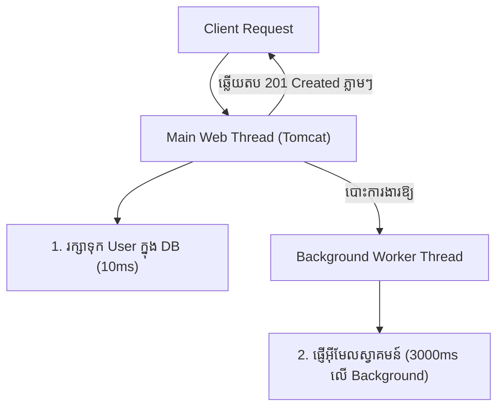

# មេរៀនទី ១: ការដំណើរការការងារស្វ័យប្រវត្តិតាមកាលកំណត់ (@Scheduled) និងអសមកាលកម្ម (@Async)

> 🌐 **ភាសា / Language:** 🇰🇭 **[ភាសាខ្មែរ (Khmer)](README.kh.md)** | 🇬🇧 [English](README.md)  
> 🧭 **រុករក:** [📚 មាតិកា Module](../README.kh.md) | [← មេរៀនមុន](../../05-spring-boot-database-and-data-jpa/09-todo-list-api-project/README.kh.md) | [មេរៀនបន្ទាប់ →](../02-sending-email-smtp/README.kh.md)

## មាតិកា (Table of Contents)

- [1. សេចក្តីផ្តើមអំពី Background Jobs](#1-សេចក្តីផ្តើមអំពី-background-jobs)
- [2. ការដំណើរការការងារតាមកាលកំណត់ជាមួយ `@Scheduled`](#2-ការដំណើរការការងារតាមកាលកំណត់ជាមួយ-scheduled)
- [3. យល់ដឹងអំពី `fixedRate`, `fixedDelay`, និង Cron Expressions](#3-យល់ដឹងអំពី-fixedrate-fixeddelay-និង-cron-expressions)
- [4. ការដំណើរការការងារអសមកាលកម្ម (Asynchronous Processing) ជាមួយ `@Async`](#4-ការដំណើរការការងារអសមកាលកម្ម-asynchronous-processing-ជាមួយ-async)
- [5. ការកំណត់ Thread Pool ផ្ទាល់ខ្លួន (`ThreadPoolTaskExecutor`)](#5-ការកំណត់-thread-pool-ផ្ទាល់ខ្លួន-threadpooltaskexecutor)
- [6. សង្ខេប](#6-សង្ខេប)

---

## 1. សេចក្តីផ្តើមអំពី Background Jobs

នៅក្នុងកម្មវិធី Enterprise មានការងារជាច្រើនដែលមិនត្រូវឱ្យ User អង្គុយចាំឡើយ៖
- ការផ្ញើអ៊ីមែលស្វាគមន៍ ឬ Reset Password (ចំណាយពេល ២-៥ វិនាទី)
- ការទាញយក Report ឬ Export Excel ធំៗ
- ការ Clean Up ទិន្នន័យចាស់ៗរៀងរាល់ពាក់កណ្តាលអធ្រាត្រ (Midnight Batch)

ដើម្បីដោះស្រាយបញ្ហានេះ Spring Boot ផ្តល់នូវយន្តការ **Scheduling** (រត់តាមម៉ោងកំណត់) និង **Async** (រត់លើ Background Thread ផ្សេង) ដោយមិនបាច់ពឹងផ្អែកលើបណ្ណាល័យខាងក្រៅស្មុគស្មាញឡើយ។

---

## 2. ការដំណើរការការងារតាមកាលកំណត់ជាមួយ `@Scheduled`

ជាដំបូង ត្រូវបើកដំណើរការ Scheduling ក្នុង Configuration ឬ Main Class តាមរយៈ `@EnableScheduling`៖

```java
@SpringBootApplication
@EnableScheduling
public class DemoApplication {
    public static void main(String[] args) {
        SpringApplication.run(DemoApplication.class, args);
    }
}
```

---

## 3. យល់ដឹងអំពី `fixedRate`, `fixedDelay`, និង Cron Expressions

### 1. `fixedRate` (រត់តាមចន្លោះពេលថេរ)
ចាប់ផ្តើមរត់រៀងរាល់ ៥ វិនាទីម្តង ដោយមិនខ្វល់ថា Task មុនចប់ឬមិនទាន់ចប់ឡើយ៖
```java
@Scheduled(fixedRate = 5000)
public void runEveryFiveSeconds() {
    System.out.println("fixedRate: " + System.currentTimeMillis());
}
```

### 2. `fixedDelay` (រង់ចាំឱ្យចប់សិន ទើបរាប់ពេល)
រង់ចាំឱ្យ Task មុនរត់ចប់សព្វគ្រប់សិន ទើបរង់ចាំ ៥ វិនាទីទៀត រួចទើបរត់ Task បន្ទាប់ (មានសុវត្ថិភាពខ្ពស់ជាង `fixedRate`)៖
```java
@Scheduled(fixedDelay = 5000)
public void runAfterCompletion() {
    System.out.println("fixedDelay execution");
}
```

### 3. Cron Expression (កំណត់ម៉ោងច្បាស់លាស់)
ទម្រង់ ៦ ខ្ទង់ក្នុង Spring: `[second] [minute] [hour] [day-of-month] [month] [day-of-week]`

```java
// រត់រៀងរាល់ថ្ងៃនៅវេលាម៉ោង 12:00 AM ពាក់កណ្តាលអធ្រាត្រ
@Scheduled(cron = "0 0 0 * * *", zone = "Asia/Phnom_Penh")
public void generateDailyReport() {
    System.out.println("រត់របាយការណ៍ប្រចាំថ្ងៃនៅម៉ោង 12 យប់!");
}
```

---

## 4. ការដំណើរការការងារអសមកាលកម្ម (Asynchronous Processing) ជាមួយ `@Async`

នៅពេល User ចុចចុះឈ្មោះគណនី (Register) យើងចង់ឱ្យ API ឆ្លើយតបមកវិញភ្លាមៗក្នុងពេលត្រឹម 50ms ដោយមិនបាច់រង់ចាំការផ្ញើអ៊ីមែលដែលត្រូវចំណាយពេល 3 វិនាទីឡើយ។



### 1. បើក `@EnableAsync`:
```java
@Configuration
@EnableAsync
public class AsyncConfig {}
```

### 2. បង្កើត Service Method ជាមួយ `@Async`:
```java
@Service
public class EmailService {

    @Async
    public void sendWelcomeEmail(String email, String username) {
        try {
            Thread.sleep(3000); // ក្លែងធ្វើជាផ្ញើអ៊ីមែល ៣ វិនាទី
            System.out.println("អ៊ីមែលត្រូវបានផ្ញើជោគជ័យទៅកាន់: " + email);
        } catch (InterruptedException e) {
            Thread.currentThread().interrupt();
        }
    }
}
```

---

## 5. ការកំណត់ Thread Pool ផ្ទាល់ខ្លួន (`ThreadPoolTaskExecutor`)

តាមលំនាំដើម Spring ប្រើប្រាស់ `SimpleAsyncTaskExecutor` ដែលបង្កើត Thread ថ្មីរាល់ពេលមាន Task (មិន reuse thread ឡើយ ដែលអាចធ្វើឱ្យអស់ Memory)។ ក្នុង Enterprise យើងត្រូវកំណត់ Thread Pool ត្រឹមត្រូវ៖

```java
@Configuration
public class AsyncThreadPoolConfig {

    @Bean(name = "taskExecutor")
    public Executor taskExecutor() {
        ThreadPoolTaskExecutor executor = new ThreadPoolTaskExecutor();
        executor.setCorePoolSize(5);        // Thread អប្បបរមាដែលដំណើរការរហូត
        executor.setMaxPoolSize(20);        // Thread អតិបរមាពេលមានបន្ទុកធ្ងន់
        executor.setQueueCapacity(500);     // ចំនួន Task រង់ចាំក្នុងជួរ Queue
        executor.setThreadNamePrefix("AsyncWorker-");
        executor.initialize();
        return executor;
    }
}
```

---

## 6. សង្ខេប

- ប្រើ `@Scheduled` សម្រាប់ Batch Jobs, Clean up, ឬ Report តាមម៉ោងកំណត់។
- ប្រើ Cron Expression ដើម្បីកំណត់ម៉ោងជាក់លាក់ (ម៉ោង, ថ្ងៃ, សប្តាហ៍)។
- ប្រើ `@Async` ដើម្បីរុញការងារដែលយឺត (ផ្ញើ Mail, Generate PDF) ទៅរត់លើ Background Thread ជៀសវាង Block Web Request។
- កំណត់ `ThreadPoolTaskExecutor` ផ្ទាល់ខ្លួនជានិច្ច ដើម្បីគ្រប់គ្រងធនធាន RAM & CPU របស់ Server។


---
## 🧭 ការរុករកមេរៀន (Lesson Navigation)

| ថយក្រោយ (Previous) | មាតិកា Module (Index) | បន្ទាប់ (Next) |
| :--- | :---: | :--- |
| [← គម្រោង Todo List REST API ជាមួយ Database (Todo List REST API Project)](../../05-spring-boot-database-and-data-jpa/09-todo-list-api-project/README.kh.md) | [📚 បញ្ជីមេរៀន Module](../README.kh.md) | [ការផ្ញើ Email ជាមួយ Spring Boot JavaMailSender (Sending Email with SMTP) →](../02-sending-email-smtp/README.kh.md) |
