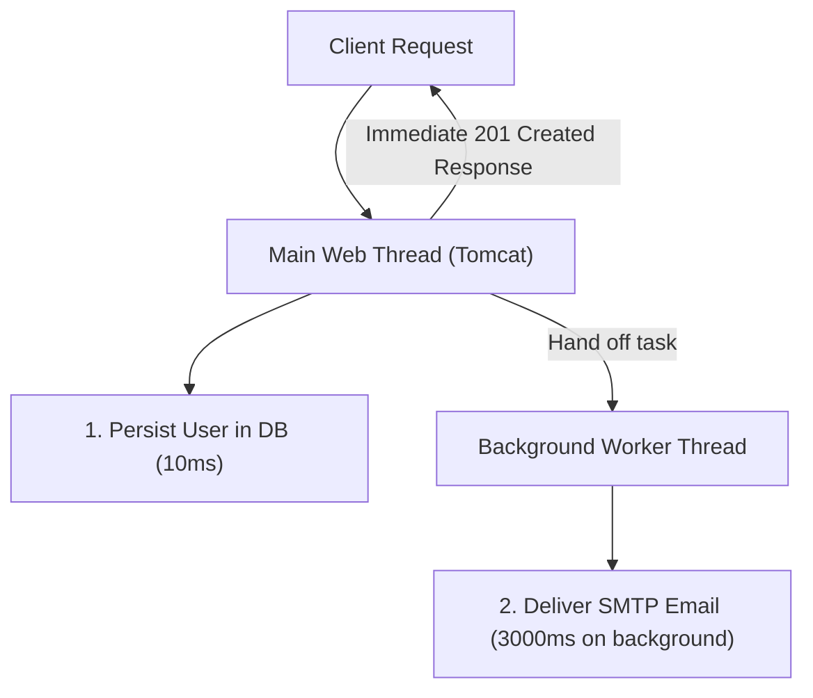

# Lesson 1: Task Scheduling with @Scheduled and Asynchronous Execution with @Async

> 🌐 **Language / ភាសា:** 🇬🇧 **[English](README.md)** | 🇰🇭 [ភាសាខ្មែរ (Khmer)](README.kh.md)  
> 🧭 **Navigation:** [📚 Module Index](../README.md) | [← Previous Lesson](../../05-spring-boot-database-and-data-jpa/09-todo-list-api-project/README.md) | [Next Lesson →](../02-sending-email-smtp/README.md)

## Table of Contents

- [1. Introduction to Background Workloads](#1-introduction-to-background-workloads)
- [2. Periodic Task Scheduling with `@Scheduled`](#2-periodic-task-scheduling-with-scheduled)
- [3. Deep Dive: `fixedRate`, `fixedDelay`, and Cron Expressions](#3-deep-dive-fixedrate-fixeddelay-and-cron-expressions)
- [4. Asynchronous Non-Blocking Processing with `@Async`](#4-asynchronous-non-blocking-processing-with-async)
- [5. Customizing Enterprise Thread Pools (`ThreadPoolTaskExecutor`)](#5-customizing-enterprise-thread-pools-threadpooltaskexecutor)
- [6. Summary](#6-summary)

---

## 1. Introduction to Background Workloads

In production web applications, numerous computational tasks should never block the primary HTTP request thread:
- Dispatching user welcome or password reset emails (2–5 seconds latency)
- Generating large PDF invoices or streaming analytical CSV exports
- Performing database maintenance or cache eviction batches at midnight

Spring Boot provides native support for declarative **Task Scheduling** (time-based execution) and **Asynchronous processing** (`@Async`), eliminating the complexity of configuring external task runners for lightweight tasks.

---

## 2. Periodic Task Scheduling with `@Scheduled`

Enable scheduling capabilities in any configuration or main application class via `@EnableScheduling`:

```java
@SpringBootApplication
@EnableScheduling
public class DemoApplication {
    public static void main(String[] args) {
        SpringApplication.run(DemoApplication.class, args);
    }
}
```

---

## 3. Deep Dive: `fixedRate`, `fixedDelay`, and Cron Expressions

### 1. `fixedRate` (Fixed Interval Execution)
Initiates task execution every fixed duration (e.g., 5000ms), irrespective of whether prior invocations have concluded:
```java
@Scheduled(fixedRate = 5000)
public void runEveryFiveSeconds() {
    System.out.println("fixedRate invocation: " + System.currentTimeMillis());
}
```

### 2. `fixedDelay` (Completion-Dependent Delay)
Waits until the active task completes execution, pauses for the specified duration (5000ms), and then triggers the subsequent execution (safer against thread concurrency collisions):
```java
@Scheduled(fixedDelay = 5000)
public void runAfterCompletion() {
    System.out.println("fixedDelay invocation");
}
```

### 3. Cron Expression (Precise Calendar Scheduling)
Standard 6-field Spring cron format: `[second] [minute] [hour] [day-of-month] [month] [day-of-week]`

```java
// Executes precisely at 00:00:00 midnight every day
@Scheduled(cron = "0 0 0 * * *", zone = "Asia/Phnom_Penh")
public void generateDailyReport() {
    System.out.println("Executing automated daily reporting batch at midnight!");
}
```

---

## 4. Asynchronous Non-Blocking Processing with `@Async`

When a client registers an account, the API should return within 50ms without waiting for a third-party SMTP server to dispatch an email.



### 1. Enable Async Execution:
```java
@Configuration
@EnableAsync
public class AsyncConfig {}
```

### 2. Annotate Service Method with `@Async`:
```java
@Service
public class EmailService {

    @Async
    public void sendWelcomeEmail(String email, String username) {
        try {
            Thread.sleep(3000); // Simulate network latency
            System.out.println("Email successfully dispatched to: " + email);
        } catch (InterruptedException e) {
            Thread.currentThread().interrupt();
        }
    }
}
```

---

## 5. Customizing Enterprise Thread Pools (`ThreadPoolTaskExecutor`)

By default, Spring employs `SimpleAsyncTaskExecutor`, which instantiates a new unpooled thread for every incoming task. In high-traffic environments, this risks memory exhaustion. Configure a managed `ThreadPoolTaskExecutor`:

```java
@Configuration
public class AsyncThreadPoolConfig {

    @Bean(name = "taskExecutor")
    public Executor taskExecutor() {
        ThreadPoolTaskExecutor executor = new ThreadPoolTaskExecutor();
        executor.setCorePoolSize(5);        // Minimum baseline active threads
        executor.setMaxPoolSize(20);        // Elastic upper limit during spikes
        executor.setQueueCapacity(500);     // In-flight task queue capacity
        executor.setThreadNamePrefix("AsyncWorker-");
        executor.initialize();
        return executor;
    }
}
```

---

## 6. Summary

- Leverage `@Scheduled` for periodic background cleanups, reconciliations, and reporting batches.
- Utilize Cron expressions for calendar-specific scheduling.
- Apply `@Async` to offload high-latency operations (notifications, PDF generation) from the main web thread.
- Always configure an explicit `ThreadPoolTaskExecutor` to manage system concurrency safely.


---
## 🧭 Lesson Navigation

| Previous Lesson | Module Index | Next Lesson |
| :--- | :---: | :--- |
| [← Todo List REST API Project with Database](../../05-spring-boot-database-and-data-jpa/09-todo-list-api-project/README.md) | [📚 Module Index](../README.md) | [Sending Email with Spring Boot JavaMailSender →](../02-sending-email-smtp/README.md) |
