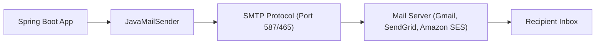

# មេរៀនទី ២: ការផ្ញើ Email ជាមួយ Spring Boot JavaMailSender (Sending Email with SMTP)
> 🧭 **រុករក:** [📚 មាតិកា Module](../README.md) | [← មេរៀនមុន](../01-task-scheduling/README.md) | [មេរៀនបន្ទាប់ →](../03-file-handling-upload/README.md)

---

## មាតិកា (Table of Contents)
1. [សេចក្តីផ្តើមអំពី JavaMailSender ក្នុង Spring Boot](#សេចក្តីផ្តើមអំពី-javamailsender)
2. [Maven Dependency Setup](#maven-dependency-setup)
3. [ការកំណត់ SMTP Configuration ក្នុង application.yml](#ការកំណត់-smtp-configuration)
4. [ការផ្ញើ Simple Text Email](#ការផ្ញើ-simple-text-email)
5. [ការផ្ញើ HTML Email ជាមួយ Attachment (MimeMessage)](#ការផ្ញើ-html-email-ជាមួយ-attachment)
6. [Best Practices សម្រាប់ Production Email Delivery](#best-practices)

---

## សេចក្តីផ្តើមអំពី JavaMailSender
Spring Boot ផ្តល់នូវ `spring-boot-starter-mail` ដែល encapsulate JavaMail API យ៉ាងស្អាត។ តាមរយៈ interface `JavaMailSender`, យើងអាចផ្ញើ Simple Text Email, HTML Template Email (Thymeleaf/Freemarker), និង Attachments (PDFs, Images, Excel) បានយ៉ាងងាយស្រួល។



---

## Maven Dependency Setup

```xml
<dependency>
    <groupId>org.springframework.boot</groupId>
    <artifactId>spring-boot-starter-mail</artifactId>

</dependency>
```

---

## ការកំណត់ SMTP Configuration

```yaml
spring:
  mail:
    host: smtp.gmail.com
    port: 587
    username: your-email@gmail.com
    password: your-app-password # App Password (Not your real password!)
    properties:
      mail:
        smtp:
          auth: true
          starttls:
            enable: true
```

---

## ការផ្ញើ Simple Text Email

```java
package com.example.service;

import org.springframework.mail.SimpleMailMessage;
import org.springframework.mail.javamail.JavaMailSender;
import org.springframework.stereotype.Service;

@Service
public class EmailService {

    private final JavaMailSender mailSender;

    public EmailService(JavaMailSender mailSender) {
        this.mailSender = mailSender;
    }

    public void sendSimpleEmail(String to, String subject, String body) {
        SimpleMailMessage message = new SimpleMailMessage();
        message.setFrom("your-email@gmail.com");
        message.setTo(to);
        message.setSubject(subject);
        message.setText(body);

        mailSender.send(message);
    }
}
```

---

## ការផ្ញើ HTML Email ជាមួយ Attachment

```java
package com.example.service;

import jakarta.mail.MessagingException;
import jakarta.mail.internet.MimeMessage;
import org.springframework.core.io.FileSystemResource;
import org.springframework.mail.javamail.JavaMailSender;
import org.springframework.mail.javamail.MimeMessageHelper;
import org.springframework.stereotype.Service;
import java.io.File;

@Service
public class AdvancedEmailService {

    private final JavaMailSender mailSender;

    public AdvancedEmailService(JavaMailSender mailSender) {
        this.mailSender = mailSender;
    }

    public void sendHtmlEmailWithAttachment(String to, String subject, String htmlBody, File attachment) 
            throws MessagingException {
        MimeMessage message = mailSender.createMimeMessage();
        MimeMessageHelper helper = new MimeMessageHelper(message, true, "UTF-8");

        helper.setFrom("your-email@gmail.com");
        helper.setTo(to);
        helper.setSubject(subject);
        helper.setText(htmlBody, true); // true = HTML content

        if (attachment != null && attachment.exists()) {
            FileSystemResource fileResource = new FileSystemResource(attachment);
            helper.addAttachment(attachment.getName(), fileResource);
        }

        mailSender.send(message);
    }
}
```

---

## Best Practices
- **កុំផ្ញើ Email Synchronously ក្នុង Request Thread**: ប្រើប្រាស់ `@Async` ឬ Message Queue (Kafka/RabbitMQ) ដើម្បីកុំឱ្យ Client រង់ចាំយូរ។
- **កុំសរសេរ Hardcode Credentials**: ប្រើប្រាស់ Environment Variables ឬ Vault សម្រាប់ mail username និង password។
- ប្រើប្រាស់ **Transactional Email Services** ដូចជា SendGrid, Mailgun, ឬ AWS SES សម្រាប់ Production។

---

## 🧭 ការរុករកមេរៀន (Lesson Navigation)

| ថយក្រោយ (Previous) | មាតិកា Module (Index) | បន្ទាប់ (Next) |
| :--- | :---: | :--- |
| [← ការដំណើរការការងារស្វ័យប្រវត្តិតាមកាលកំណត់ (@Scheduled) និងអសមកាលកម្ម (@Async)](../01-task-scheduling/README.md) | [📚 បញ្ជីមេរៀន Module](../README.md) | [ការគ្រប់គ្រង និង Upload File ក្នុង Spring Boot (File Handling & Multipart Upload) →](../03-file-handling-upload/README.md) |
