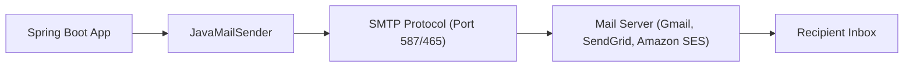

# Lesson 2: Sending Email with Spring Boot JavaMailSender

> 🌐 **Language / ភាសា:** 🇬🇧 **[English](README.md)** | 🇰🇭 [ភាសាខ្មែរ (Khmer)](README.kh.md)  
> 🧭 **Navigation:** [📚 Module Index](../README.md) | [← Previous Lesson](../01-task-scheduling/README.md) | [Next Lesson →](../03-file-handling-upload/README.md)

---

## Table of Contents
1. [Introduction to JavaMailSender](#introduction-to-javamailsender)
2. [Maven Dependency Setup](#maven-dependency-setup)
3. [SMTP Configuration in application.yml](#smtp-configuration)
4. [Sending Simple Text Emails](#sending-simple-text-emails)
5. [Sending HTML Emails with Attachments (MimeMessage)](#sending-html-emails-with-attachments)
6. [Production Delivery Best Practices](#production-delivery-best-practices)

---

## Introduction to JavaMailSender
Spring Boot simplifies email distribution through `spring-boot-starter-mail`. The core abstraction, `JavaMailSender`, transparently manages connection lifecycles, authentication handshakes, and multipart attachment packaging.



---

## Maven Dependency Setup

```xml
<dependency>
    <groupId>org.springframework.boot</groupId>
    <artifactId>spring-boot-starter-mail</artifactId>
</dependency>
```

---

## SMTP Configuration

```yaml
spring:
  mail:
    host: smtp.gmail.com
    port: 587
    username: your-email@gmail.com
    password: your-app-password
    properties:
      mail:
        smtp:
          auth: true
          starttls:
            enable: true
```

---

## Sending Simple Text Emails

```java
package com.example.service;

import org.springframework.mail.SimpleMailMessage;
import org.springframework.mail.javamail.JavaMailSender;
import org.springframework.stereotype.Service;

@Service
public class EmailService {

    private final JavaMailSender mailSender;

    public EmailService(JavaMailSender mailSender) {
        this.mailSender = mailSender;
    }

    public void sendSimpleEmail(String to, String subject, String body) {
        SimpleMailMessage message = new SimpleMailMessage();
        message.setFrom("your-email@gmail.com");
        message.setTo(to);
        message.setSubject(subject);
        message.setText(body);

        mailSender.send(message);
    }
}
```

---

## Sending HTML Emails with Attachments

```java
package com.example.service;

import jakarta.mail.MessagingException;
import jakarta.mail.internet.MimeMessage;
import org.springframework.core.io.FileSystemResource;
import org.springframework.mail.javamail.JavaMailSender;
import org.springframework.mail.javamail.MimeMessageHelper;
import org.springframework.stereotype.Service;
import java.io.File;

@Service
public class AdvancedEmailService {

    private final JavaMailSender mailSender;

    public AdvancedEmailService(JavaMailSender mailSender) {
        this.mailSender = mailSender;
    }

    public void sendHtmlEmailWithAttachment(String to, String subject, String htmlBody, File attachment) 
            throws MessagingException {
        MimeMessage message = mailSender.createMimeMessage();
        MimeMessageHelper helper = new MimeMessageHelper(message, true, "UTF-8");

        helper.setFrom("your-email@gmail.com");
        helper.setTo(to);
        helper.setSubject(subject);
        helper.setText(htmlBody, true);

        if (attachment != null && attachment.exists()) {
            FileSystemResource fileResource = new FileSystemResource(attachment);
            helper.addAttachment(attachment.getName(), fileResource);
        }

        mailSender.send(message);
    }
}
```

---

## Production Delivery Best Practices
- **Do not send emails synchronously on the web request thread**: Delegate email dispatching to background workers using `@Async` or message brokers (Kafka/RabbitMQ).
- **Never commit credentials**: Use environment variables or cloud secrets management (AWS Secrets Manager, HashiCorp Vault).
- Leverage dedicated transactional relay providers (SendGrid, Postmark, AWS SES) for production deliverability.

---

## 🧭 Lesson Navigation

| Previous Lesson | Module Index | Next Lesson |
| :--- | :---: | :--- |
| [← Task Scheduling with @Scheduled and Asynchronous Execution with @Async](../01-task-scheduling/README.md) | [📚 Module Index](../README.md) | [File Handling & Multipart Upload in Spring Boot →](../03-file-handling-upload/README.md) |
