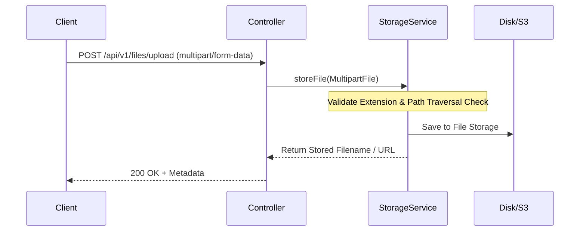

# មេរៀនទី ៣: ការគ្រប់គ្រង និង Upload File ក្នុង Spring Boot (File Handling & Multipart Upload)

> 🌐 **ភាសា / Language:** 🇰🇭 **[ភាសាខ្មែរ (Khmer)](README.kh.md)** | 🇬🇧 [English](README.md)  
> 🧭 **រុករក:** [📚 មាតិកា Module](../README.kh.md) | [← មេរៀនមុន](../02-sending-email-smtp/README.kh.md) | [មេរៀនបន្ទាប់ →](../04-caching/README.kh.md)

---

## មាតិកា (Table of Contents)
1. [សេចក្តីផ្តើមអំពី MultipartFile](#សេចក្តីផ្តើមអំពី-multipartfile)
2. [ការកំណត់ទំហំ File Limit ក្នុង application.yml](#ការកំណត់ទំហំ-file-limit)
3. [ការបង្កើត File Storage Service](#ការបង្កើត-file-storage-service)
4. [ការបង្កើត Upload & Download Controller](#ការបង្កើត-upload--download-controller)
5. [Security Best Practices (Validation & Sanitization)](#security-best-practices)

---

## សេចក្តីផ្តើមអំពី MultipartFile
Spring Boot ប្រើប្រាស់ interface `MultipartFile` ដើម្បីតំណាងឱ្យ file ដែលត្រូវបាន upload តាមរយៈ HTTP `multipart/form-data` request។ វាផ្តល់នូវ methods ងាយៗដើម្បីពិនិត្យឈ្មោះ (`getOriginalFilename()`), ប្រភេទ (`getContentType()`), ទំហំ (`getSize()`), និងទាញយក bytes (`getBytes()`) ឬ save ផ្ទាល់ (`transferTo()`)។



---

## ការកំណត់ទំហំ File Limit

នៅក្នុង `application.yml`៖

```yaml
spring:
  servlet:
    multipart:
      enabled: true
      max-file-size: 10MB
      max-request-size: 20MB
```

---

## ការបង្កើត File Storage Service

```java
package com.example.service;

import org.springframework.stereotype.Service;
import org.springframework.util.StringUtils;
import org.springframework.web.multipart.MultipartFile;
import java.io.IOException;
import java.nio.file.*;
import java.util.UUID;

@Service
public class FileStorageService {

    private final Path storageLocation = Paths.get("uploads").toAbsolutePath().normalize();

    public FileStorageService() {
        try {
            Files.createDirectories(this.storageLocation);
        } catch (Exception ex) {
            throw new RuntimeException("Could not create upload directory", ex);
        }
    }

    public String storeFile(MultipartFile file) {
        String originalName = StringUtils.cleanPath(file.getOriginalFilename());

        // ការពារ Path Traversal Attack
        if (originalName.contains("..")) {
            throw new IllegalArgumentException("Invalid file path sequence: " + originalName);
        }

        // បង្កើត Unique Filename
        String extension = "";
        int i = originalName.lastIndexOf('.');
        if (i > 0) extension = originalName.substring(i);
        String uniqueFileName = UUID.randomUUID().toString() + extension;

        try {
            Path targetLocation = this.storageLocation.resolve(uniqueFileName);
            Files.copy(file.getInputStream(), targetLocation, StandardCopyOption.REPLACE_EXISTING);
            return uniqueFileName;
        } catch (IOException ex) {
            throw new RuntimeException("Could not store file " + uniqueFileName, ex);
        }
    }

    public Path loadFileAsPath(String fileName) {
        return this.storageLocation.resolve(fileName).normalize();
    }
}
```

---

## ការបង្កើត Upload & Download Controller

```java
package com.example.controller;

import com.example.service.FileStorageService;
import org.springframework.core.io.Resource;
import org.springframework.core.io.UrlResource;
import org.springframework.http.*;
import org.springframework.web.bind.annotation.*;
import org.springframework.web.multipart.MultipartFile;
import java.net.MalformedURLException;
import java.nio.file.Path;
import java.util.Map;

@RestController
@RequestMapping("/api/v1/files")
public class FileController {

    private final FileStorageService storageService;

    public FileController(FileStorageService storageService) {
        this.storageService = storageService;
    }

    @PostMapping("/upload")
    public ResponseEntity<Map<String, String>> uploadFile(@RequestParam("file") MultipartFile file) {
        String fileName = storageService.storeFile(file);
        return ResponseEntity.ok(Map.of(
            "fileName", fileName,
            "size", String.valueOf(file.getSize()),
            "contentType", file.getContentType()
        ));
    }

    @GetMapping("/download/{fileName}")
    public ResponseEntity<Resource> downloadFile(@PathVariable String fileName) {
        try {
            Path filePath = storageService.loadFileAsPath(fileName);
            Resource resource = new UrlResource(filePath.toUri());

            if (!resource.exists()) {
                return ResponseEntity.notFound().build();
            }

            return ResponseEntity.ok()
                    .contentType(MediaType.APPLICATION_OCTET_STREAM)
                    .header(HttpHeaders.CONTENT_DISPOSITION, "attachment; filename="" + resource.getFilename() + """)
                    .body(resource);
        } catch (MalformedURLException e) {
            return ResponseEntity.badRequest().build();
        }
    }
}
```

---

## Security Best Practices
- **ការពារ Path Traversal**: ត្រូវ sanitize file path ដោយប្រាកដថាមិនមាន `..` នៅក្នុង filename។
- **ផ្ទៀងផ្ទាត់ MIME Type និង Magic Bytes**: កុំជឿជាក់តែលើ file extension ចុងក្រោយ ត្រូវពិនិត្យ header bytes នៃ file។
- **ប្រើ Object Storage លើ Cloud**: លើ Production គួរតែ upload ទៅ **AWS S3, Google Cloud Storage, ឬ Azure Blob** ជំនួសការទុកលើ Local Server Disk។

---

## 🧭 ការរុករកមេរៀន (Lesson Navigation)

| ថយក្រោយ (Previous) | មាតិកា Module (Index) | បន្ទាប់ (Next) |
| :--- | :---: | :--- |
| [← ការផ្ញើ Email ជាមួយ Spring Boot JavaMailSender (Sending Email with SMTP)](../02-sending-email-smtp/README.kh.md) | [📚 បញ្ជីមេរៀន Module](../README.kh.md) | [ការបង្កើនល្បឿនប្រព័ន្ធជាមួយ Spring Boot Caching (Caching Abstraction) →](../04-caching/README.kh.md) |
