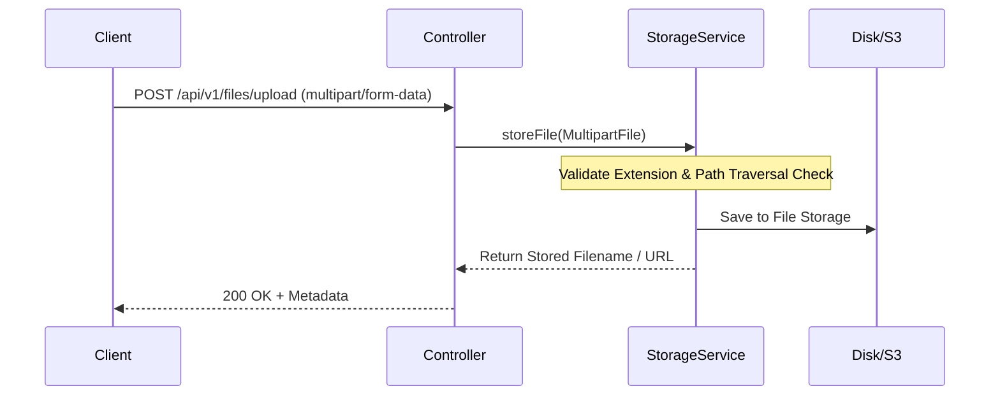

# Lesson 3: File Handling & Multipart Upload in Spring Boot

> 🌐 **Language / ភាសា:** 🇬🇧 **[English](README.md)** | 🇰🇭 [ភាសាខ្មែរ (Khmer)](README.kh.md)  
> 🧭 **Navigation:** [📚 Module Index](../README.md) | [← Previous Lesson](../02-sending-email-smtp/README.md) | [Next Lesson →](../04-caching/README.md)

---

## Table of Contents
1. [Understanding MultipartFile](#understanding-multipartfile)
2. [Configuring Upload Limits in application.yml](#configuring-upload-limits)
3. [Building a Robust File Storage Service](#building-a-robust-file-storage-service)
4. [File Upload & Download REST Controller](#file-upload--download-rest-controller)
5. [Security Best Practices (Validation & Sanitization)](#security-best-practices)

---

## Understanding MultipartFile
Spring Boot represents uploaded files via the `MultipartFile` abstraction. It exposes straightforward APIs to inspect original filename, content length, MIME types, and transfer input streams directly to file storage destinations.



---

## Configuring Upload Limits

In `application.yml`:

```yaml
spring:
  servlet:
    multipart:
      enabled: true
      max-file-size: 10MB
      max-request-size: 20MB
```

---

## Building a Robust File Storage Service

```java
package com.example.service;

import org.springframework.stereotype.Service;
import org.springframework.util.StringUtils;
import org.springframework.web.multipart.MultipartFile;
import java.io.IOException;
import java.nio.file.*;
import java.util.UUID;

@Service
public class FileStorageService {

    private final Path storageLocation = Paths.get("uploads").toAbsolutePath().normalize();

    public FileStorageService() {
        try {
            Files.createDirectories(this.storageLocation);
        } catch (Exception ex) {
            throw new RuntimeException("Could not create upload directory", ex);
        }
    }

    public String storeFile(MultipartFile file) {
        String originalName = StringUtils.cleanPath(file.getOriginalFilename());

        if (originalName.contains("..")) {
            throw new IllegalArgumentException("Invalid path sequence: " + originalName);
        }

        String extension = "";
        int i = originalName.lastIndexOf('.');
        if (i > 0) extension = originalName.substring(i);
        String uniqueFileName = UUID.randomUUID().toString() + extension;

        try {
            Path targetLocation = this.storageLocation.resolve(uniqueFileName);
            Files.copy(file.getInputStream(), targetLocation, StandardCopyOption.REPLACE_EXISTING);
            return uniqueFileName;
        } catch (IOException ex) {
            throw new RuntimeException("Could not store file " + uniqueFileName, ex);
        }
    }

    public Path loadFileAsPath(String fileName) {
        return this.storageLocation.resolve(fileName).normalize();
    }
}
```

---

## File Upload & Download REST Controller

```java
package com.example.controller;

import com.example.service.FileStorageService;
import org.springframework.core.io.Resource;
import org.springframework.core.io.UrlResource;
import org.springframework.http.*;
import org.springframework.web.bind.annotation.*;
import org.springframework.web.multipart.MultipartFile;
import java.net.MalformedURLException;
import java.nio.file.Path;
import java.util.Map;

@RestController
@RequestMapping("/api/v1/files")
public class FileController {

    private final FileStorageService storageService;

    public FileController(FileStorageService storageService) {
        this.storageService = storageService;
    }

    @PostMapping("/upload")
    public ResponseEntity<Map<String, String>> uploadFile(@RequestParam("file") MultipartFile file) {
        String fileName = storageService.storeFile(file);
        return ResponseEntity.ok(Map.of(
            "fileName", fileName,
            "size", String.valueOf(file.getSize()),
            "contentType", file.getContentType()
        ));
    }

    @GetMapping("/download/{fileName}")
    public ResponseEntity<Resource> downloadFile(@PathVariable String fileName) {
        try {
            Path filePath = storageService.loadFileAsPath(fileName);
            Resource resource = new UrlResource(filePath.toUri());

            if (!resource.exists()) {
                return ResponseEntity.notFound().build();
            }

            return ResponseEntity.ok()
                    .contentType(MediaType.APPLICATION_OCTET_STREAM)
                    .header(HttpHeaders.CONTENT_DISPOSITION, "attachment; filename="" + resource.getFilename() + """)
                    .body(resource);
        } catch (MalformedURLException e) {
            return ResponseEntity.badRequest().build();
        }
    }
}
```

---

## Security Best Practices
- **Prevent Path Traversal**: Sanitize incoming file paths to guarantee no directory traversal characters (`..`) are processed.
- **Inspect Magic Bytes**: Never trust client-provided file extensions alone; validate MIME headers against binary signatures.
- **Prefer Cloud Object Storage**: In enterprise cloud architectures, stream files directly to Amazon S3, Google Cloud Storage, or Azure Blob Storage.

---

## 🧭 Lesson Navigation

| Previous Lesson | Module Index | Next Lesson |
| :--- | :---: | :--- |
| [← Sending Email with Spring Boot JavaMailSender](../02-sending-email-smtp/README.md) | [📚 Module Index](../README.md) | [Performance Optimization with Spring Boot Caching →](../04-caching/README.md) |
