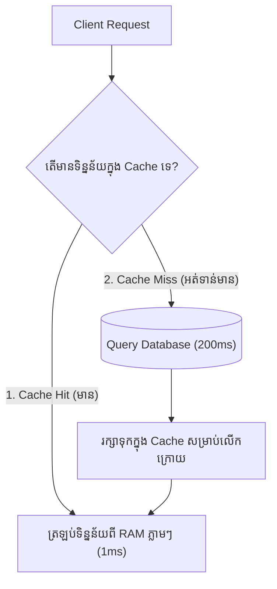

# មេរៀនទី ៤: ការបង្កើនល្បឿនប្រព័ន្ធជាមួយ Spring Boot Caching (Caching Abstraction)
> 🧭 **រុករក:** [📚 មាតិកា Module](../README.md) | [← មេរៀនមុន](../03-file-handling-upload/README.md) | [មេរៀនបន្ទាប់ →](../05-caching-providers-redis/README.md)

> 📂 **កូដគំរូជាក់ស្តែង (Runnable Example Project):**  
> 👉 **គម្រោងពេញលេញ:** [Spring Boot Redis Caching Service](../../examples/03-redis-caching)  
> 📄 **File កូដជាក់ស្តែង:** [`ProductService.java`](../../examples/03-redis-caching/src/main/java/com/example/cache/service/ProductService.java) | [`RedisConfig.java`](../../examples/03-redis-caching/src/main/java/com/example/cache/config/RedisConfig.java)


## មាតិកា (Table of Contents)

- [1. ស្វែងយល់អំពី Caching និងសារៈសំខាន់](#1-ស្វែងយល់អំពី-caching-និងសារៈសំខាន់)
- [2. Spring Cache Abstraction និង Annotations សំខាន់ៗ](#2-spring-cache-abstraction-និង-annotations-សំខាន់ៗ)
- [3. ការប្រើប្រាស់ `@Cacheable`, `@CachePut`, និង `@CacheEvict`](#3-ការប្រើប្រាស់-cacheable-cacheput-និង-cacheevict)
- [4. ការកំណត់ Cache Key តាមរយៈ SpEL (Spring Expression Language)](#4-ការកំណត់-cache-key-តាមរយៈ-spel-spring-expression-language)
- [5. ការប្តូរពី ConcurrentHashMap ទៅជា Distributed Redis Cache](#5-ការប្តូរពី-concurrenthashmap-ទៅជា-distributed-redis-cache)
- [6. សង្ខេប](#6-សង្ខេប)

---

## 1. ស្វែងយល់អំពី Caching និងសារៈសំខាន់

រាល់ពេលដែល Client ហៅ API ទាញយកទិន្នន័យ (ដូចជា Product Catalog ឬ Exchange Rates) ប្រសិនបើយើងតែងតែរត់ទៅ Query Database៖
- Latency ចំណាយពេលពី **50ms ដល់ 500ms**។
- Database CPU នឹងឡើងខ្ពស់ 100% នៅពេលមានមនុស្សចូលមើលរាប់ពាន់នាក់ក្នុងពេលតែមួយ។

**Caching** គឺជាការរក្សាទុកទិន្នន័យដែលគេឧស្សាហ៍ហៅមើល (Frequently Accessed Data) នៅក្នុងអង្គចងចាំ Memory (RAM) ដ៏លឿនដូចផ្លេកបន្ទោរ ដែលអាចទាញយកទិន្នន័យបានក្នុងរង្វង់ត្រឹមតែ **1ms**!



---

## 2. Spring Cache Abstraction និង Annotations សំខាន់ៗ

Spring ផ្តល់នូវ Abstraction ដ៏អស្ចារ្យ ដែលអនុញ្ញាតឱ្យអ្នកបើកប្រើ Caching ដោយគ្រាន់តែដាក់ Annotation លើ Method ប៉ុណ្ណោះ ដោយមិនបាច់សរសេរកូដរញ៉េរញ៉ៃឡើយ។

ដំបូង ត្រូវដាក់ **`@EnableCaching`** លើ Configuration Class៖
```java
@Configuration
@EnableCaching
public class CacheConfig {}
```

---

## 3. ការប្រើប្រាស់ `@Cacheable`, `@CachePut`, និង `@CacheEvict`

| Annotation | តួនាទី និងអាកប្បកិរិយា |
| :--- | :--- |
| **`@Cacheable`** | ពិនិត្យមើល Cache មុន។ បើមាន (Hit) វាមិនដំណើរការ Method ទេ គឺយកពី Cache មក return ភ្លាម។ បើអត់ (Miss) ទើបដំណើរការ Method រួច Save លទ្ធផលចូល Cache។ |
| **`@CachePut`** | ដំណើរការ Method ជានិច្ច ហើយយកលទ្ធផលថ្មីទៅ Update ជំនួសទិន្នន័យចាស់ក្នុង Cache (ប្រើពេល Edit/Update)។ |
| **`@CacheEvict`** | លុបទិន្នន័យចេញពី Cache (ប្រើពេល Delete ឬពេលចង់ Clear Cache ចោល)។ |

---

## 4. ការកំណត់ Cache Key តាមរយៈ SpEL (Spring Expression Language)

```java
@Service
public class ProductService {

    private final ProductRepository productRepository;

    public ProductService(ProductRepository productRepository) {
        this.productRepository = productRepository;
    }

    // 1. រក្សាទុកក្នុង Cache ឈ្មោះ "products" ដោយយក ID ធ្វើជា Key
    @Cacheable(value = "products", key = "#id")
    public Product getProductById(Long id) {
        System.out.println(">>> កំពុង Query Database ស្វែងរក Product ID: " + id);
        return productRepository.findById(id)
                .orElseThrow(() -> new ResourceNotFoundException("រកមិនឃើញ"));
    }

    // 2. ពេលកែប្រែទិន្នន័យ ត្រូវ Update Cache ភ្លាម
    @CachePut(value = "products", key = "#product.id")
    public Product updateProduct(Product product) {
        return productRepository.save(product);
    }

    // 3. ពេលលុបទិន្នន័យ ត្រូវលុប Cache ចោលកុំឱ្យសល់ Data ចាស់
    @CacheEvict(value = "products", key = "#id")
    public void deleteProduct(Long id) {
        productRepository.deleteById(id);
    }

    // 4. លុបទិន្នន័យក្នុង Cache "products" ទាំងអស់ចោលតែម្តង
    @CacheEvict(value = "products", allEntries = true)
    public void clearAllProductCache() {
        System.out.println("បានលុប Cache ផលិតផលទាំងអស់!");
    }
}
```

---

## 5. ការប្តូរពី ConcurrentHashMap ទៅជា Distributed Redis Cache

តាមលំនាំដើម Spring ប្រើ In-Memory `ConcurrentHashMap`។ ប៉ុន្តែនៅក្នុងស្ថាបត្យកម្ម Microservices ដែលមាន Server ចំនួន 5 ដំណើរការទន្ទឹមគ្នា (Load Balanced) Cache ក្នុង Memory ម៉ាស៊ីនមួយ មិនអាចចែករំលែកទៅម៉ាស៊ីនផ្សេងបានឡើយ។ យើងត្រូវប្រើ **Redis** ជា Distributed Centralized Cache!

### `pom.xml`:
```xml
<dependency>
    <groupId>org.springframework.boot</groupId>
    <artifactId>spring-boot-starter-data-redis</artifactId>

</dependency>
```

### `application.yml`:
```yaml
spring:
  cache:
    type: redis
    redis:
      time-to-live: 600000 # កំណត់អាយុកាល Cache 10 នាទី (TTL)
      cache-null-values: false
  data:
    redis:
      host: localhost
      port: 6379
```

---

## 6. សង្ខេប

- Caching កាត់បន្ថយ Latency ពី 500ms មកត្រឹម 1ms និងការពារ Database កុំឱ្យ Overload។
- `@Cacheable`: ទាញយកពី Cache បើមាន បើអត់ទើបរត់ Method។
- `@CachePut`: រត់ Method រួច Update Cache ជានិច្ច។
- `@CacheEvict`: លុបទិន្នន័យដែលលែងត្រឹមត្រូវចេញពី Cache។
- ប្រើ In-Memory Cache សម្រាប់ Local App និងប្រើ **Redis** សម្រាប់ Production Microservices។

---
## 🧭 ការរុករកមេរៀន (Lesson Navigation)

| ថយក្រោយ (Previous) | មាតិកា Module (Index) | បន្ទាប់ (Next) |
| :--- | :---: | :--- |
| [← ការគ្រប់គ្រង និង Upload File ក្នុង Spring Boot (File Handling & Multipart Upload)](../03-file-handling-upload/README.md) | [📚 បញ្ជីមេរៀន Module](../README.md) | [Caching Providers និង Redis Integration (Spring Boot Caching with Redis) →](../05-caching-providers-redis/README.md) |
