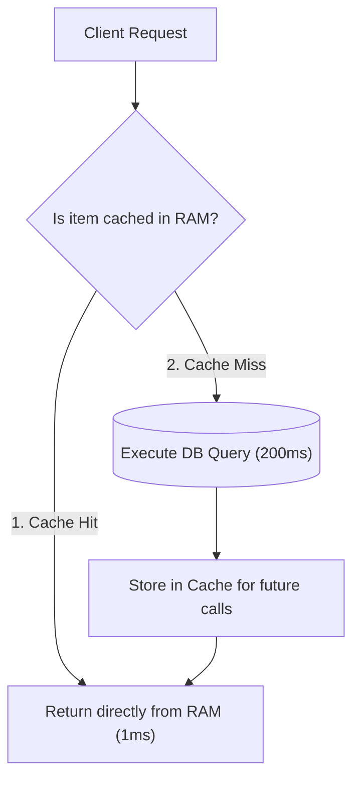

# Lesson 4: Performance Optimization with Spring Boot Caching

> 🌐 **Language / ភាសា:** 🇬🇧 **[English](README.md)** | 🇰🇭 [ភាសាខ្មែរ (Khmer)](README.kh.md)  
> 🧭 **Navigation:** [📚 Module Index](../README.md) | [← Previous Lesson](../03-file-handling-upload/README.md) | [Next Lesson →](../05-caching-providers-redis/README.md)

> 📂 **Runnable Example Project:**  
> 👉 **Complete Project:** [Spring Boot Redis Caching Service](../../examples/03-redis-caching)  
> 📄 **Source Code Files:** [`ProductService.java`](../../examples/03-redis-caching/src/main/java/com/example/cache/service/ProductService.java) | [`RedisConfig.java`](../../examples/03-redis-caching/src/main/java/com/example/cache/config/RedisConfig.java)


## Table of Contents

- [1. Understanding Caching and Its Necessity](#1-understanding-caching-and-its-necessity)
- [2. Spring Cache Abstraction and Core Annotations](#2-spring-cache-abstraction-and-core-annotations)
- [3. Deep Dive: `@Cacheable`, `@CachePut`, and `@CacheEvict`](#3-deep-dive-cacheable-cacheput-and-cacheevict)
- [4. Custom Cache Key Resolution via SpEL (Spring Expression Language)](#4-custom-cache-key-resolution-via-spel-spring-expression-language)
- [5. Transitioning from ConcurrentHashMap to Distributed Redis](#5-transitioning-from-concurrenthashmap-to-distributed-redis)
- [6. Summary](#6-summary)

---

## 1. Understanding Caching and Its Necessity

Whenever clients query static or slow-changing datasets (such as product catalogs, shipping rates, or exchange tickers):
- Database queries incur **50ms to 500ms** of latency.
- High concurrent load spikes database CPU utilization toward 100%.

**Caching** retains frequently requested datasets in ultra-fast RAM storage, serving responses in **< 1ms** and eliminating unnecessary database roundtrips.



---

## 2. Spring Cache Abstraction and Core Annotations

Spring provides a clean, declarative cache abstraction allowing developers to enable caching without coupling business logic to specific caching vendors.

Enable caching globally via **`@EnableCaching`**:
```java
@Configuration
@EnableCaching
public class CacheConfig {}
```

---

## 3. Deep Dive: `@Cacheable`, `@CachePut`, and `@CacheEvict`

| Annotation | Behavior and Lifecycle |
| :--- | :--- |
| **`@Cacheable`** | Inspects cache first. On hit, short-circuits execution and returns the cached instance. On miss, invokes the underlying method and stores the returned value. |
| **`@CachePut`** | Always executes the underlying method and refreshes the targeted cache entry with the method result (used during update mutations). |
| **`@CacheEvict`** | Invalidates and purges one or more target entries from the cache (used during delete mutations). |

---

## 4. Custom Cache Key Resolution via SpEL (Spring Expression Language)

```java
@Service
public class ProductService {

    private final ProductRepository productRepository;

    public ProductService(ProductRepository productRepository) {
        this.productRepository = productRepository;
    }

    // 1. Cache lookups keyed by resource ID
    @Cacheable(value = "products", key = "#id")
    public Product getProductById(Long id) {
        System.out.println(">>> Executing expensive DB query for Product ID: " + id);
        return productRepository.findById(id)
                .orElseThrow(() -> new ResourceNotFoundException("Not found"));
    }

    // 2. Synchronize cache on mutation
    @CachePut(value = "products", key = "#product.id")
    public Product updateProduct(Product product) {
        return productRepository.save(product);
    }

    // 3. Purge specific cache entry on deletion
    @CacheEvict(value = "products", key = "#id")
    public void deleteProduct(Long id) {
        productRepository.deleteById(id);
    }

    // 4. Invalidate the entire cache namespace
    @CacheEvict(value = "products", allEntries = true)
    public void clearAllProductCache() {
        System.out.println("All product caches evicted successfully!");
    }
}
```

---

## 5. Transitioning from ConcurrentHashMap to Distributed Redis

By default, Spring Boot instantiates an in-memory `ConcurrentHashMap`. In a horizontally scaled microservice deployment (e.g., 5 load-balanced instances), local JVM memory cannot be shared across nodes. Adopt **Redis** as a unified distributed cache:

### `pom.xml`:
```xml
<dependency>
    <groupId>org.springframework.boot</groupId>
    <artifactId>spring-boot-starter-data-redis</artifactId>
</dependency>
```

### `application.yml`:
```yaml
spring:
  cache:
    type: redis
    redis:
      time-to-live: 600000 # Time-to-live expiration (10 minutes)
      cache-null-values: false
  data:
    redis:
      host: localhost
      port: 6379
```

---

## 6. Summary

- Caching accelerates read performance by two orders of magnitude while preserving database health.
- `@Cacheable` serves cached objects on hits and populates on misses.
- `@CachePut` maintains cache freshness following updates.
- `@CacheEvict` discards stale records to uphold data consistency.
- Use default in-memory maps for local prototyping and distributed **Redis** for production clusters.

---
## 🧭 Lesson Navigation

| Previous Lesson | Module Index | Next Lesson |
| :--- | :---: | :--- |
| [← File Handling & Multipart Upload in Spring Boot](../03-file-handling-upload/README.md) | [📚 Module Index](../README.md) | [Distributed Caching with Redis →](../05-caching-providers-redis/README.md) |
