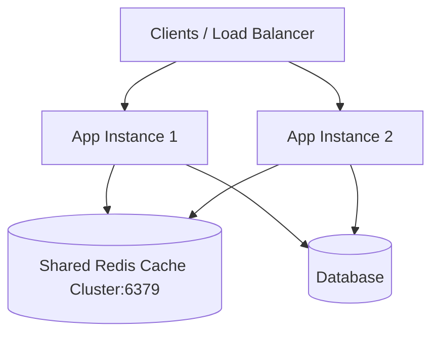

# មេរៀនទី ៥: Caching Providers និង Redis Integration (Spring Boot Caching with Redis)

> 🌐 **ភាសា / Language:** 🇰🇭 **[ភាសាខ្មែរ (Khmer)](README.kh.md)** | 🇬🇧 [English](README.md)  
> 🧭 **រុករក:** [📚 មាតិកា Module](../README.kh.md) | [← មេរៀនមុន](../04-caching/README.kh.md) | [មេរៀនបន្ទាប់ →](../06-transaction-management/README.kh.md)

> 📂 **កូដគំរូជាក់ស្តែង (Runnable Example Project):**  
> 👉 **គម្រោងពេញលេញ:** [Redis Cache Manager & Docker Compose](../../examples/03-redis-caching)  
> 📄 **File កូដជាក់ស្តែង:** [`RedisConfig.java`](../../examples/03-redis-caching/src/main/java/com/example/cache/config/RedisConfig.java) | [`docker-compose.yml`](../../examples/03-redis-caching/docker-compose.yml) | [`application.yml`](../../examples/03-redis-caching/src/main/resources/application.yml) | [`ProductController.java`](../../examples/03-redis-caching/src/main/java/com/example/cache/controller/ProductController.java)


---

## មាតិកា (Table of Contents)
1. [ហេតុអ្វីត្រូវប្រើ Distributed Cache (Redis) ជំនួស In-Memory Cache?](#ហេតុអ្វីត្រូវប្រើ-redis)
2. [Maven Dependency Setup](#maven-dependency-setup)
3. [ការកំណត់រចនាសម្ព័ន្ធ Redis ក្នុង application.yml](#ការកំណត់-redis)
4. [ការបង្កើត RedisCacheManager Configuration ជាមួយ TTL](#ការបង្កើត-rediscachemanager)
5. [ការប្រើប្រាស់ @Cacheable, @CachePut, @CacheEvict ជាមួយ Redis](#ការប្រើប្រាស់-cache-annotations)
6. [Docker Compose សម្រាប់ Redis](#docker-compose-សម្រាប់-redis)

---

## ហេតុអ្វីត្រូវប្រើ Distributed Cache (Redis)?
In-Memory Cache (ដូចជា ConcurrentHashMap ឬ Caffeine) ដំណើរការបានល្អតែលើ Single Server ប៉ុណ្ណោះ។ នៅពេលដែលប្រព័ន្ធត្រូវបាន Scale ជាច្រើន Instances នៅពីក្រោយ Load Balancer, In-Memory Cache នឹងបង្កឱ្យមានបញ្ហា **Cache Inconsistency**។ **Redis** ដើរតួជា Centralized In-Memory Key-Value Data Store ដែល Instances ទាំងអស់ចែករំលែកទិន្នន័យ Cache ជាមួយគ្នា។



---

## Maven Dependency Setup

```xml
<dependencies>
    <!-- Spring Cache Abstraction -->
    <dependency>
        <groupId>org.springframework.boot</groupId>
        <artifactId>spring-boot-starter-cache</artifactId>
    </dependency>

    <!-- Spring Data Redis -->
    <dependency>
        <groupId>org.springframework.boot</groupId>
        <artifactId>spring-boot-starter-data-redis</artifactId>
    </dependency>
</dependencies>
```

---

## ការកំណត់រចនាសម្ព័ន្ធ Redis

```yaml
spring:
  cache:
    type: redis
  data:
    redis:
      host: localhost
      port: 6379
      timeout: 2000
```

---

## ការបង្កើត RedisCacheManager Configuration ជាមួយ TTL

```java
package com.example.config;

import org.springframework.cache.annotation.EnableCaching;
import org.springframework.context.annotation.Bean;
import org.springframework.context.annotation.Configuration;
import org.springframework.data.redis.cache.RedisCacheConfiguration;
import org.springframework.data.redis.cache.RedisCacheManager;
import org.springframework.data.redis.connection.RedisConnectionFactory;
import org.springframework.data.redis.serializer.GenericJackson2JsonRedisSerializer;
import org.springframework.data.redis.serializer.RedisSerializationContext;
import java.time.Duration;

@Configuration
@EnableCaching
public class RedisConfig {

    @Bean
    public RedisCacheManager cacheManager(RedisConnectionFactory connectionFactory) {
        RedisCacheConfiguration config = RedisCacheConfiguration.defaultCacheConfig()
                .entryTtl(Duration.ofMinutes(15)) // Cache expire ក្នុងរយៈពេល 15 នាទី
                .disableCachingNullValues()
                .serializeValuesWith(
                        RedisSerializationContext.SerializationPair.fromSerializer(
                                new GenericJackson2JsonRedisSerializer()
                        )
                );

        return RedisCacheManager.builder(connectionFactory)
                .cacheDefaults(config)
                .build();
    }
}
```

---

## ការប្រើប្រាស់ Cache Annotations

```java
@Service
public class ProductService {

    private final ProductRepository productRepo;

    public ProductService(ProductRepository productRepo) {
        this.productRepo = productRepo;
    }

    // ទាញយកពី Redis បើមាន, បើអត់ទើប query database រួច save ចូល Redis
    @Cacheable(value = "products", key = "#id")
    public ProductResponse getById(Long id) {
        return productRepo.findById(id).map(this::toDto).orElseThrow();
    }

    // ធ្វើបច្ចុប្បន្នភាពទិន្នន័យក្នុង DB និង Update Cache ក្នុងពេលតែមួយ
    @CachePut(value = "products", key = "#result.id()")
    public ProductResponse update(Long id, UpdateProductRequest req) {
        // update logic
        return toDto(saved);
    }

    // លុប Cache key ចេញពី Redis ពេល entity ត្រូវបានលុប
    @CacheEvict(value = "products", key = "#id")
    public void delete(Long id) {
        productRepo.deleteById(id);
    }
}
```

---

## 🧭 ការរុករកមេរៀន (Lesson Navigation)

| ថយក្រោយ (Previous) | មាតិកា Module (Index) | បន្ទាប់ (Next) |
| :--- | :---: | :--- |
| [← ការបង្កើនល្បឿនប្រព័ន្ធជាមួយ Spring Boot Caching (Caching Abstraction)](../04-caching/README.kh.md) | [📚 បញ្ជីមេរៀន Module](../README.kh.md) | [ការគ្រប់គ្រង Transaction ជាមួយ @Transactional (Declarative Transaction Management) →](../06-transaction-management/README.kh.md) |
