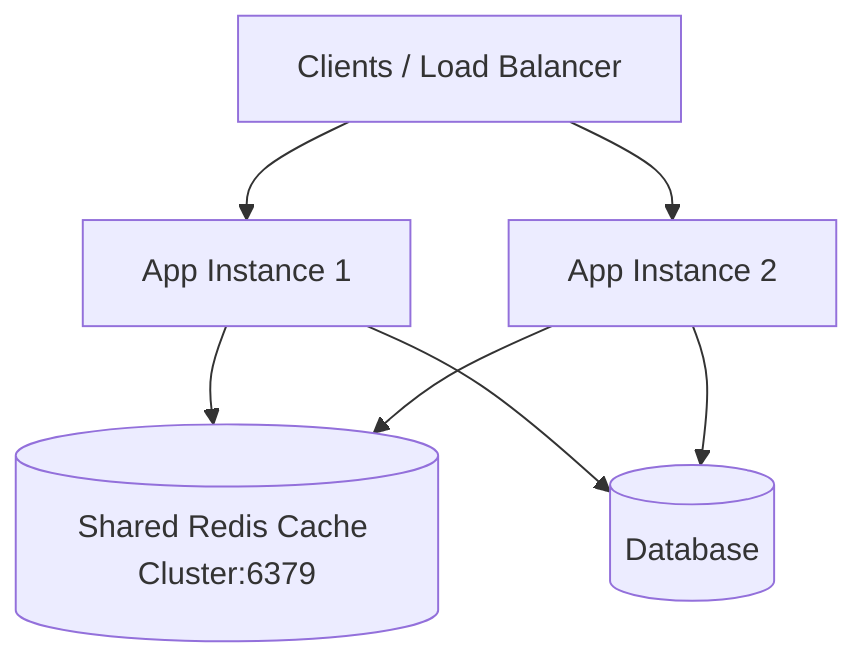

# Lesson 5: Distributed Caching with Redis

> 🌐 **Language / ភាសា:** 🇬🇧 **[English](README.md)** | 🇰🇭 [ភាសាខ្មែរ (Khmer)](README.kh.md)  
> 🧭 **Navigation:** [📚 Module Index](../README.md) | [← Previous Lesson](../04-caching/README.md) | [Next Lesson →](../06-transaction-management/README.md)

> 📂 **Runnable Example Project:**  
> 👉 **Complete Project:** [Redis Cache Manager & Docker Compose](../../examples/03-redis-caching)  
> 📄 **Source Code Files:** [`RedisConfig.java`](../../examples/03-redis-caching/src/main/java/com/example/cache/config/RedisConfig.java) | [`docker-compose.yml`](../../examples/03-redis-caching/docker-compose.yml) | [`application.yml`](../../examples/03-redis-caching/src/main/resources/application.yml) | [`ProductController.java`](../../examples/03-redis-caching/src/main/java/com/example/cache/controller/ProductController.java)


---

## Table of Contents
1. [Why Distributed Caching (Redis) Over Local Caches?](#why-distributed-caching-redis)
2. [Maven Dependency Setup](#maven-dependency-setup)
3. [Configuring Redis in application.yml](#configuring-redis)
4. [Configuring RedisCacheManager with TTL and JSON Serialization](#configuring-rediscachemanager)
5. [Using @Cacheable, @CachePut, and @CacheEvict with Redis](#using-cache-annotations)
6. [Docker Compose for Redis](#docker-compose-for-redis)

---

## Why Distributed Caching (Redis)?
In-memory caches (such as Caffeine or standard HashMaps) reside in local JVM heap space. When horizontally scaling an application across multiple container instances, local caching causes **data inconsistency** because cache writes on Instance A are invisible to Instance B. **Redis** solves this by serving as an external, blazing-fast shared caching layer.



---

## Maven Dependency Setup

```xml
<dependencies>
    <!-- Spring Cache Abstraction -->
    <dependency>
        <groupId>org.springframework.boot</groupId>
        <artifactId>spring-boot-starter-cache</artifactId>
    </dependency>

    <!-- Spring Data Redis -->
    <dependency>
        <groupId>org.springframework.boot</groupId>
        <artifactId>spring-boot-starter-data-redis</artifactId>
    </dependency>
</dependencies>
```

---

## Configuring Redis

```yaml
spring:
  cache:
    type: redis
  data:
    redis:
      host: localhost
      port: 6379
      timeout: 2000
```

---

## Configuring RedisCacheManager with TTL

```java
package com.example.config;

import org.springframework.cache.annotation.EnableCaching;
import org.springframework.context.annotation.Bean;
import org.springframework.context.annotation.Configuration;
import org.springframework.data.redis.cache.RedisCacheConfiguration;
import org.springframework.data.redis.cache.RedisCacheManager;
import org.springframework.data.redis.connection.RedisConnectionFactory;
import org.springframework.data.redis.serializer.GenericJackson2JsonRedisSerializer;
import org.springframework.data.redis.serializer.RedisSerializationContext;
import java.time.Duration;

@Configuration
@EnableCaching
public class RedisConfig {

    @Bean
    public RedisCacheManager cacheManager(RedisConnectionFactory connectionFactory) {
        RedisCacheConfiguration config = RedisCacheConfiguration.defaultCacheConfig()
                .entryTtl(Duration.ofMinutes(15))
                .disableCachingNullValues()
                .serializeValuesWith(
                        RedisSerializationContext.SerializationPair.fromSerializer(
                                new GenericJackson2JsonRedisSerializer()
                        )
                );

        return RedisCacheManager.builder(connectionFactory)
                .cacheDefaults(config)
                .build();
    }
}
```

---

## Using Cache Annotations

```java
@Service
public class ProductService {

    private final ProductRepository productRepo;

    public ProductService(ProductRepository productRepo) {
        this.productRepo = productRepo;
    }

    @Cacheable(value = "products", key = "#id")
    public ProductResponse getById(Long id) {
        return productRepo.findById(id).map(this::toDto).orElseThrow();
    }

    @CachePut(value = "products", key = "#result.id()")
    public ProductResponse update(Long id, UpdateProductRequest req) {
        return toDto(saved);
    }

    @CacheEvict(value = "products", key = "#id")
    public void delete(Long id) {
        productRepo.deleteById(id);
    }
}
```

---

## 🧭 Lesson Navigation

| Previous Lesson | Module Index | Next Lesson |
| :--- | :---: | :--- |
| [← Performance Optimization with Spring Boot Caching](../04-caching/README.md) | [📚 Module Index](../README.md) | [Declarative Transaction Management with @Transactional →](../06-transaction-management/README.md) |
