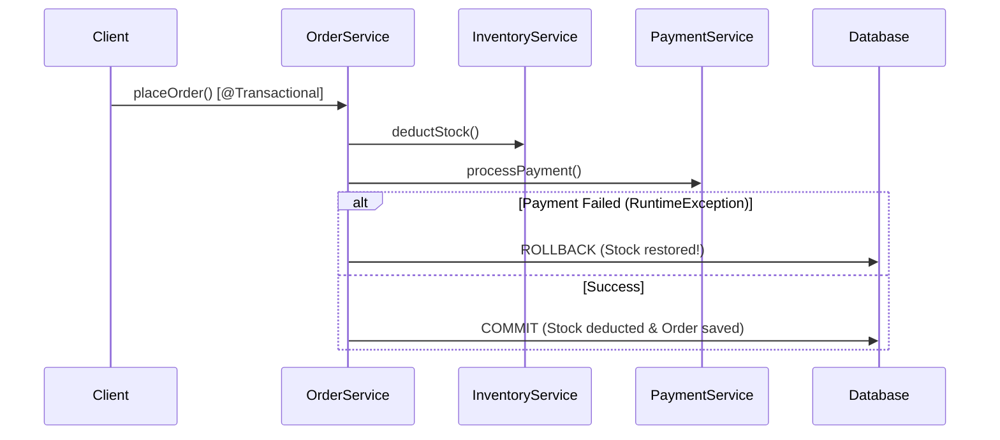

# Lesson 6: Declarative Transaction Management with @Transactional

> 🌐 **Language / ភាសា:** 🇬🇧 **[English](README.md)** | 🇰🇭 [ភាសាខ្មែរ (Khmer)](README.kh.md)  
> 🧭 **Navigation:** [📚 Module Index](../README.md) | [← Previous Lesson](../05-caching-providers-redis/README.md) | [Next Lesson →](../07-dto-mapping/README.md)

> 📂 **Runnable Example Project:**  
> 👉 **Complete Project:** [Spring Boot @Transactional Todo Service](../../examples/02-spring-data-jpa-postgresql)  
> 📄 **Source Code Files:** [`TodoService.java`](../../examples/02-spring-data-jpa-postgresql/src/main/java/com/example/todo/service/TodoService.java)


---

## Table of Contents
1. [ACID Properties in Relational Databases](#acid-properties)
2. [Declarative Transactions with @Transactional](#declarative-transactions)
3. [Transaction Propagation Behaviors](#transaction-propagation-behaviors)
4. [Transaction Isolation Levels](#transaction-isolation-levels)
5. [Rollback Semantics (Checked vs Unchecked Exceptions)](#rollback-semantics)
6. [The Self-Invocation Proxy Pitfall](#the-self-invocation-proxy-pitfall)

---

## ACID Properties
A database transaction is a logical unit of work adhering strictly to ACID principles:
- **Atomicity**: All operations succeed together or all changes are rolled back (All-or-Nothing).
- **Consistency**: Database invariants and business rules are preserved before and after execution.
- **Isolation**: Concurrent transactions execute independently without dirty reads or state collisions.
- **Durability**: Committed data survives unexpected hardware or server failures.



---

## Declarative Transactions with @Transactional

```java
@Service
@Transactional
public class OrderService {

    private final OrderRepository orderRepo;
    private final InventoryRepository inventoryRepo;

    public OrderService(OrderRepository orderRepo, InventoryRepository inventoryRepo) {
        this.orderRepo = orderRepo;
        this.inventoryRepo = inventoryRepo;
    }

    public OrderResponse placeOrder(CreateOrderRequest req) {
        inventoryRepo.deductStock(req.productId(), req.quantity());
        Order saved = orderRepo.save(new Order(req.productId(), req.quantity()));
        return toDto(saved);
    }

    @Transactional(readOnly = true)
    public OrderResponse getOrderById(Long id) {
        return orderRepo.findById(id).map(this::toDto).orElseThrow();
    }
}
```

---

## Transaction Propagation Behaviors

| Propagation | Semantics |
| :--- | :--- |
| `REQUIRED` *(Default)* | Joins existing transaction or creates a new one if none exists |
| `REQUIRES_NEW` | Always suspends current transaction and creates a completely independent transaction |
| `SUPPORTS` | Executes within transaction if present; executes non-transactionally otherwise |
| `NOT_SUPPORTED` | Always executes non-transactionally, suspending any active transaction |
| `MANDATORY` | Requires an active transaction, throwing an exception if none is present |

---

## Rollback Semantics
By default:
- Spring automatically rolls back for **Unchecked Exceptions** (`RuntimeException` and subclasses).
- Spring **does not** roll back for **Checked Exceptions** (`java.lang.Exception`).

To rollback on checked exceptions:
```java
@Transactional(rollbackFor = {Exception.class, CustomException.class})
public void process() throws CustomException {
    // Will rollback upon throwing CustomException
}
```

---

## The Self-Invocation Proxy Pitfall
Spring intercepts transaction boundaries using dynamic AOP proxies. If method `a()` calls method `b()` inside the exact same class instance, the proxy boundary is bypassed and `@Transactional` on `b()` will not take effect.

---

## 🧭 Lesson Navigation

| Previous Lesson | Module Index | Next Lesson |
| :--- | :---: | :--- |
| [← Distributed Caching with Redis](../05-caching-providers-redis/README.md) | [📚 Module Index](../README.md) | [DTO Mapping with MapStruct and Java Records →](../07-dto-mapping/README.md) |
