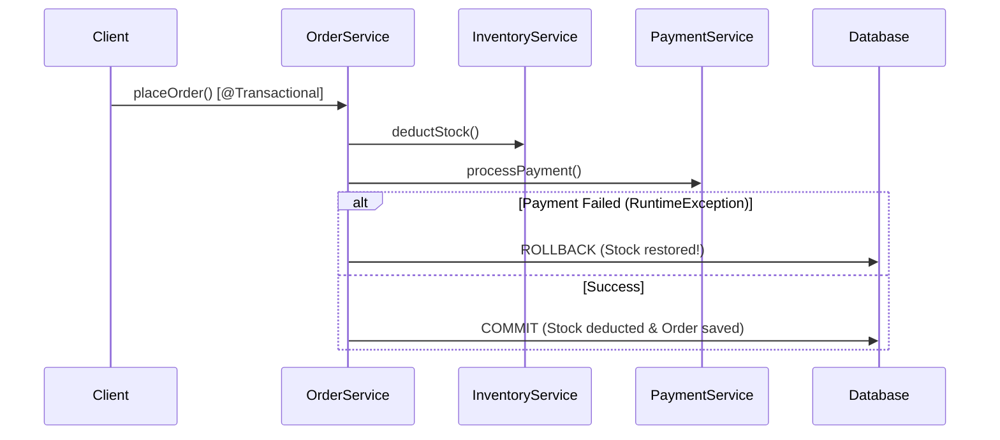

# មេរៀនទី ៦: ការគ្រប់គ្រង Transaction ជាមួយ @Transactional (Declarative Transaction Management)
> 🧭 **រុករក:** [📚 មាតិកា Module](../README.md) | [← មេរៀនមុន](../05-caching-providers-redis/README.md) | [មេរៀនបន្ទាប់ →](../07-dto-mapping/README.md)

> 📂 **កូដគំរូជាក់ស្តែង (Runnable Example Project):**  
> 👉 **គម្រោងពេញលេញ:** [Spring Boot @Transactional Todo Service](../../examples/02-spring-data-jpa-postgresql)  
> 📄 **File កូដជាក់ស្តែង:** [`TodoService.java`](../../examples/02-spring-data-jpa-postgresql/src/main/java/com/example/todo/service/TodoService.java)


---

## មាតិកា (Table of Contents)
1. [គោលការណ៍ ACID នៃ Database Transactions](#គោលការណ៍-acid)
2. [Declarative Transaction Management ជាមួយ @Transactional](#declarative-transaction-management)
3. [Transaction Propagation Behaviors](#transaction-propagation-behaviors)
4. [Transaction Isolation Levels](#transaction-isolation-levels)
5. [Rollback Rules (Checked vs Unchecked Exceptions)](#rollback-rules)
6. [កំហុសទូទៅ (Self-Invocation Pitfall)](#កំហុសទូទៅ-self-invocation)

---

## គោលការណ៍ ACID
Transaction គឺជាឯកតានៃការងារ (Unit of Work) ដែលត្រូវតែបំពេញតាមគោលការណ៍ ACID៖
- **A (Atomicity)**: ប្រតិបត្តិការទាំងអស់ត្រូវតែជោគជ័យទាំងអស់ បើបរាជ័យមួយត្រូវ rollback ត្រឡប់មកដើមវិញទាំងអស់ (All or Nothing)។
- **C (Consistency)**: រក្សាទិន្នន័យឱ្យស្ថិតក្នុងស្ថានភាពត្រឹមត្រូវតាមច្បាប់អាជីវកម្ម។
- **I (Isolation)**: Transactions ដែលដំណើរការដំណាលគ្នាមិនត្រូវរំខានគ្នាទៅវិញទៅមកឡើយ។
- **D (Durability)**: ពេល commit រួចរាល់ ទិន្នន័យត្រូវបានកត់ត្រាទុកជាអចិន្ត្រៃយ៍ ទោះបីជា Server ដាច់ភ្លើងក៏ដោយ។



---

## Declarative Transaction Management ជាមួយ @Transactional

ដាក់ `@Transactional` នៅលើ Service Class ឬ Service Method៖

```java
@Service
@Transactional
public class OrderService {

    private final OrderRepository orderRepo;
    private final InventoryRepository inventoryRepo;

    public OrderService(OrderRepository orderRepo, InventoryRepository inventoryRepo) {
        this.orderRepo = orderRepo;
        this.inventoryRepo = inventoryRepo;
    }

    public OrderResponse placeOrder(CreateOrderRequest req) {
        inventoryRepo.deductStock(req.productId(), req.quantity());
        Order saved = orderRepo.save(new Order(req.productId(), req.quantity()));
        return toDto(saved);
    }

    @Transactional(readOnly = true)
    public OrderResponse getOrderById(Long id) {
        return orderRepo.findById(id).map(this::toDto).orElseThrow();
    }
}
```

---

## Transaction Propagation Behaviors

| Propagation | អាកប្បកិរិយា |
| :--- | :--- |
| `REQUIRED` *(Default)* | ប្រសិនបើមាន Transaction ស្រាប់ ចូលរួមជាមួយវា; បើគ្មានទេ បង្កើត Transaction ថ្មី |
| `REQUIRES_NEW` | បង្កើត Transaction ថ្មីស្រឡាងជានិច្ច ដោយផ្អាក (suspend) Transaction បច្ចុប្បន្នបណ្តោះអាសន្ន |
| `SUPPORTS` | ប្រសិនបើមាន Transaction ដំណើរការក្នុង Transaction; បើគ្មាន ដំណើរការដោយគ្មាន Transaction |
| `NOT_SUPPORTED` | ដំណើរការដោយគ្មាន Transaction ជានិច្ច (ផ្អាក Transaction ដែលមានស្រាប់) |
| `MANDATORY` | ទាមទារឱ្យមាន Transaction ជាដាច់ខាត បើគ្មាននឹងបោះ Exception |

---

## Rollback Rules

តាមលំនាំដើម (Default):
- Spring នឹង **Rollback** តែចំពោះ **Unchecked Exceptions** (`RuntimeException` និង `Error`) ប៉ុណ្ណោះ។
- ចំពោះ **Checked Exceptions** (`Exception`), Spring **មិន Rollback ឡើយ**!

### ដំណោះស្រាយ:
```java
@Transactional(rollbackFor = {Exception.class, CustomCheckedException.class})
public void updateAccount() throws CustomCheckedException {
    // នឹង rollback ទោះបីជាបោះ Checked Exception ក៏ដោយ
}
```

---

## កំហុសទូទៅ: Self-Invocation
Spring AOP Proxy ដំណើរការបានលុះត្រាតែ method ត្រូវបានហៅពីខាងក្រៅ Class (External Caller)។ ប្រសិនបើ method A ហៅ method B ក្នុង class តែមួយ `@Transactional` លើ method B នឹងមិនមានប្រសិទ្ធភាពឡើយ!

---

## 🧭 ការរុករកមេរៀន (Lesson Navigation)

| ថយក្រោយ (Previous) | មាតិកា Module (Index) | បន្ទាប់ (Next) |
| :--- | :---: | :--- |
| [← Caching Providers និង Redis Integration (Spring Boot Caching with Redis)](../05-caching-providers-redis/README.md) | [📚 បញ្ជីមេរៀន Module](../README.md) | [ការបម្លែងទិន្នន័យ DTO ជាមួយ MapStruct និង ModelMapper (DTO Mapping Patterns) →](../07-dto-mapping/README.md) |
