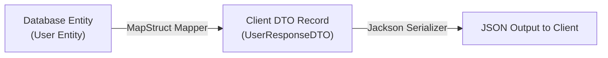

# Lesson 7: DTO Mapping with MapStruct and Java Records

> 🌐 **Language / ភាសា:** 🇬🇧 **[English](README.md)** | 🇰🇭 [ភាសាខ្មែរ (Khmer)](README.kh.md)  
> 🧭 **Navigation:** [📚 Module Index](../README.md) | [← Previous Lesson](../06-transaction-management/README.md) | [Next Lesson →](../../07-microservices-with-spring-boot/01-microservices-step-by-step-guide/README.md)

> 📂 **Runnable Example Project:**  
> 👉 **Complete Project:** [Java 17 Records DTOs & Mapping](../../examples/01-rest-api-crud)  
> 📄 **Source Code Files:** [`CreateBookRequest.java`](../../examples/01-rest-api-crud/src/main/java/com/example/bookstore/dto/CreateBookRequest.java) | [`BookResponse.java`](../../examples/01-rest-api-crud/src/main/java/com/example/bookstore/dto/BookResponse.java) | [`BookService.java`](../../examples/01-rest-api-crud/src/main/java/com/example/bookstore/service/BookService.java)


---

## Table of Contents
1. [Why Use Data Transfer Objects (DTOs)?](#why-use-dtos)
2. [Mapping Strategies: Manual vs Reflection vs Compile-Time](#mapping-strategies)
3. [Modern Java Records as DTOs](#modern-java-records-as-dtos)
4. [High-Performance Mapping with MapStruct](#high-performance-mapping-with-mapstruct)
5. [Handling Nested Objects and Custom Expressions](#handling-nested-objects)
6. [Summary](#summary)

---

## Why Use Data Transfer Objects (DTOs)?
Exposing JPA Entities directly to REST API responses is an anti-pattern:
1. **Security Vulnerabilities**: Risk of leaking private data (e.g. password hashes, internal roles).
2. **Infinite Recursion**: Bidirectional associations (`@ManyToOne` <-> `@OneToMany`) trigger JSON infinite recursion loops.
3. **Tight Coupling**: Database schema changes inadvertently break public API contracts.



---

## High-Performance Mapping with MapStruct

**MapStruct** is an annotation processor generating type-safe mapping code at compile-time, delivering hand-written execution speeds with zero reflection overhead.

### Maven Dependencies:
```xml
<dependency>
    <groupId>org.mapstruct</groupId>
    <artifactId>mapstruct</artifactId>
    <version>1.5.5.Final</version>
</dependency>
<dependency>
    <groupId>org.mapstruct</groupId>
    <artifactId>mapstruct-processor</artifactId>
    <version>1.5.5.Final</version>
    <scope>provided</scope>
</dependency>
```

---

## Creating the Mapper Interface

```java
package com.example.mapper;

import com.example.dto.CreateUserRequest;
import com.example.dto.UserResponse;
import com.example.model.User;
import org.mapstruct.Mapper;
import org.mapstruct.Mapping;

@Mapper(componentModel = "spring")
public interface UserMapper {

    @Mapping(target = "fullName", expression = "java(user.getFirstName() + ' ' + user.getLastName())")
    UserResponse toDto(User user);

    @Mapping(target = "id", ignore = true)
    @Mapping(target = "createdAt", ignore = true)
    User toEntity(CreateUserRequest request);
}
```

---

## Injecting and Using the Mapper in Services

```java
@Service
public class UserService {

    private final UserRepository userRepo;
    private final UserMapper userMapper;

    public UserService(UserRepository userRepo, UserMapper userMapper) {
        this.userRepo = userRepo;
        this.userMapper = userMapper;
    }

    public UserResponse createUser(CreateUserRequest req) {
        User user = userMapper.toEntity(req);
        User saved = userRepo.save(user);
        return userMapper.toDto(saved);
    }
}
```

---

## 🧭 Lesson Navigation

| Previous Lesson | Module Index | Next Lesson |
| :--- | :---: | :--- |
| [← Declarative Transaction Management with @Transactional](../06-transaction-management/README.md) | [📚 Module Index](../README.md) | [Microservices Architecture Step-by-Step Guide →](../../07-microservices-with-spring-boot/01-microservices-step-by-step-guide/README.md) |
