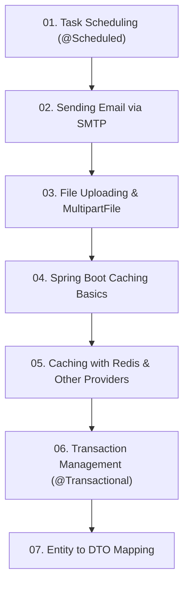

# Module 6: មុខងារកម្រិតខ្ពស់របស់ Spring Boot (Advanced Features)

> 🌐 **ភាសា / Language:** 🇰🇭 **[ភាសាខ្មែរ (Khmer)](README.kh.md)** | 🇬🇧 [English](README.md)

> 📂 **គម្រោងកូដគំរូជាក់ស្តែងសម្រាប់ Module នេះ (Runnable Project):**  
> 👉 **[Redis Caching & Performance](../examples/03-redis-caching)**  
> គម្រោង Maven ពេញលេញរួមមាន Redis CacheManager, JSON Serialization, Docker Compose, និង Caching Annotations។

---

## 📖 សេចក្តីផ្តើមអំពី Module

មុខងារសំខាន់ៗសម្រាប់ប្រព័ន្ធ Enterprise៖ Task Scheduling, ការផ្ញើ Email តាម SMTP, ការ Upload ឯកសារ, Caching (Redis), Transaction Management (@Transactional), និង DTO Mapping។

---

## 🗺️ ផែនទីសិក្សាប្រចាំ Module (Learning Roadmap)

---

## 📚 បញ្ជីមេរៀនក្នុង Module (7 Lessons)

| មេរៀន (Lesson) | ប្រធានបទ (Topic) | ការពិពណ៌នា (Description) |
| :---: | :--- | :--- |
| **01** | [Task Scheduling (@Scheduled)](01-task-scheduling/README.kh.md) | ការរត់ការងារស្វ័យប្រវត្តិតាម fixedRate, fixedDelay, និង Cron |
| **02** | [Sending Email via SMTP](02-sending-email-smtp/README.kh.md) | ការផ្ញើអ៊ីមែលអត្ថបទធម្មតា និង HTML ជាមួយ Spring Mail |
| **03** | [File Uploading & MultipartFile](03-file-handling-upload/README.kh.md) | ការទទួល និងរក្សាទុក File Upload ជាមួយ MultipartFile |
| **04** | [Spring Boot Caching Basics](04-caching/README.kh.md) | ការបង្កើនល្បឿន API ជាមួយ @Cacheable, @CachePut, @CacheEvict |
| **05** | [Caching with Redis & Other Providers](05-caching-providers-redis/README.kh.md) | ការតភ្ជាប់ Distributed Redis Cache និង EhCache |
| **06** | [Transaction Management (@Transactional)](06-transaction-management/README.kh.md) | គោលការណ៍ ACID, Rollback Rules, និង Isolation Levels |
| **07** | [Entity to DTO Mapping](07-dto-mapping/README.kh.md) | ការបម្លែង Entity ទៅ DTO ជាមួយ ModelMapper, MapStruct, និង Records |

---

## 🧭 ការរុករក (Navigation)

| ថយក្រោយ (Previous) | មាតិកាចម្បង (Main Index) | បន្ទាប់ (Next Module) |
| :--- | :---: | :--- |
| [Module 5: Database & JPA](../05-spring-boot-database-and-data-jpa/README.kh.md) | [📚 មាតិកា Spring Boot](../README.kh.md) | [Module 7: Microservices →](../07-microservices-with-spring-boot/README.kh.md) |
