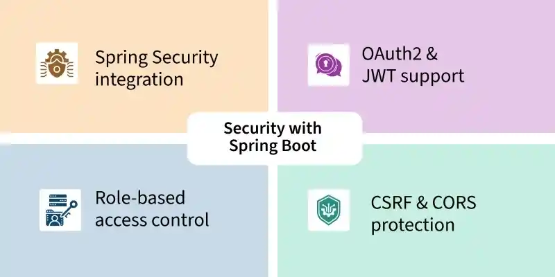
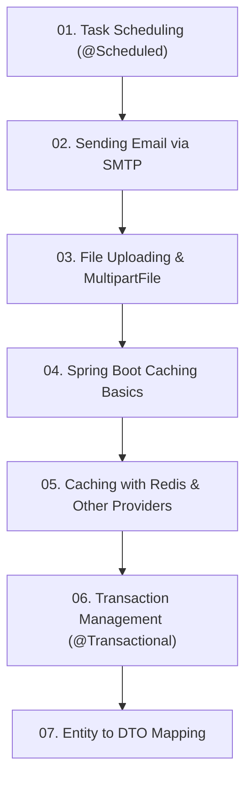

# Module 6: Advanced Enterprise Features in Spring Boot

> 🌐 **Language / ភាសា:** 🇰🇭 [ភាសាខ្មែរ (Khmer)](README.kh.md) | 🇬🇧 **[English](README.md)**

> 📂 **Runnable Example Project for this Module:**  
> 👉 **[Redis Caching & Performance](../examples/03-redis-caching)**  
> Complete Maven project featuring Redis CacheManager, JSON Serialization, Docker Compose, and Caching Annotations.

---

## 📖 Module Overview

Enterprise capabilities: task scheduling, SMTP email dispatch, file upload handling, caching abstraction and Redis, declarative @Transactional management, and DTO mapping.

---

## 🗺️ Module Learning Roadmap

---

## 📚 Lessons in This Module (7 Lessons)

| Lesson | Topic | Description |
| :---: | :--- | :--- |
| **01** | [Task Scheduling (@Scheduled)](01-task-scheduling/README.md) | Automating background jobs with @Scheduled and cron expressions |
| **02** | [Sending Email via SMTP](02-sending-email-smtp/README.md) | Configuring JavaMailSender for text and HTML email dispatch |
| **03** | [File Uploading & MultipartFile](03-file-handling-upload/README.md) | Handling single and multi-file uploads with MultipartFile |
| **04** | [Spring Boot Caching Basics](04-caching/README.md) | Spring Cache abstraction: @Cacheable, @CachePut, and @CacheEvict |
| **05** | [Caching with Redis & Other Providers](05-caching-providers-redis/README.md) | Configuring distributed Redis cache and multi-tenant providers |
| **06** | [Transaction Management (@Transactional)](06-transaction-management/README.md) | ACID guarantees, declarative @Transactional boundaries, and rollbacks |
| **07** | [Entity to DTO Mapping](07-dto-mapping/README.md) | Decoupling persistence models with ModelMapper and MapStruct |

---

## 🧭 Navigation

| Previous | Main Index | Next Module |
| :--- | :---: | :--- |
| [Module 5: Database & JPA](../05-spring-boot-database-and-data-jpa/README.md) | [📚 Spring Boot Home](../README.md) | [Module 7: Microservices →](../07-microservices-with-spring-boot/README.md) |
