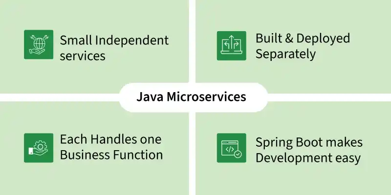
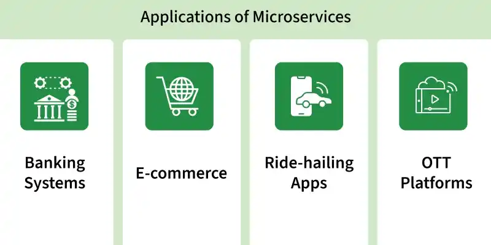
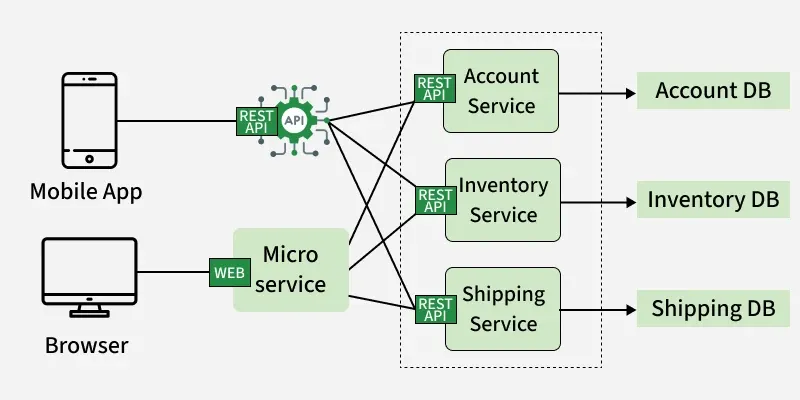
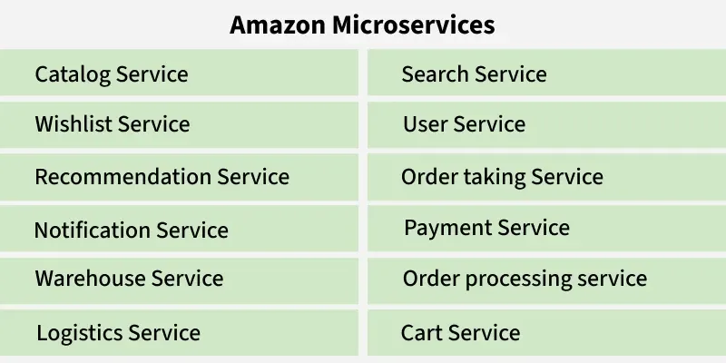
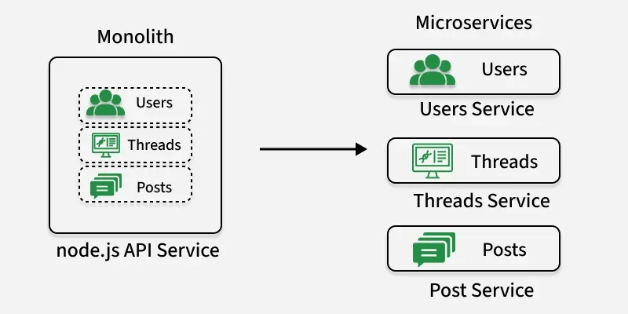
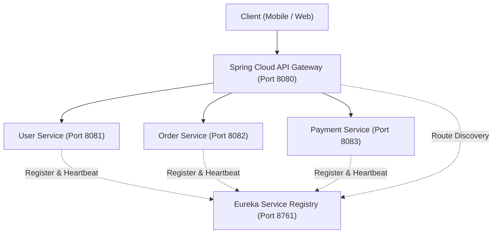

# មេរៀនទី ១: ស្ថាបត្យកម្ម Microservices (Microservices Architecture Step-by-Step Guide)

> 🌐 **ភាសា / Language:** 🇰🇭 **[ភាសាខ្មែរ (Khmer)](README.kh.md)** | 🇬🇧 [English](README.md)  
> 🧭 **រុករក:** [📚 មាតិកា Module](../README.kh.md) | [← មេរៀនមុន](../../06-advanced-spring-boot-features/07-dto-mapping/README.kh.md) | [មេរៀនបន្ទាប់ →](../02-inter-service-communication/README.kh.md)  
> 📂 **កូដគំរូជាក់ស្តែង (Runnable Example Project):**  
> 👉 **គម្រោងពេញលេញ:** [E-Commerce Microservices Platform](../../examples/05-microservices-ecommerce)  
> 📄 **File កូដជាក់ស្តែង:** [`docker-compose.yml`](../../examples/05-microservices-ecommerce/docker-compose.yml) | [`EurekaServerApplication.java`](../../examples/05-microservices-ecommerce/eureka-server/src/main/java/com/example/eureka/EurekaServerApplication.java) | [`ApiGatewayApplication.java`](../../examples/05-microservices-ecommerce/api-gateway/src/main/java/com/example/gateway/ApiGatewayApplication.java)

---

<p align="center">
  
  
</p>

---

## មាតិកា (Table of Contents)

1. [សេចក្តីផ្តើមអំពីស្ថាបត្យកម្ម Microservices (What is Microservices Architecture?)](#1-សេចក្តីផ្តើមអំពីស្ថាបត្យកម្ម-microservices)
2. [ការអនុវត្តជាក់ស្តែងក្នុងពិភពពិត (Real-World Applications)](#2-ការអនុវត្តជាក់ស្តែងក្នុងពិភពពិត-real-world-applications)
3. [របៀបដំណើរការនៃ Microservices (Working of Microservices Architecture)](#3-របៀបដំណើរការនៃ-microservices-working)
4. [សមាសធាតុស្នូលទាំង ៩ នៃ Microservices (Main Components)](#4-សមាសធាតុស្នូលទាំង-៩-នៃ-microservices)
5. [ឧទាហរណ៍ជាក់ស្តែងកម្រិតពិភពលោក៖ Amazon E-Commerce Application](#5-ឧទាហរណ៍ជាក់ស្តែងកម្រិតពិភពលោក-amazon-e-commerce)
6. [ជំហានទាំង ៩ ក្នុងការផ្លាស់ប្តូរពី Monolithic ទៅ Microservices (Migration Steps)](#6-ជំហានទាំង-៩-ក្នុងការផ្លាស់ប្តូរពី-monolithic-ទៅ-microservices)
7. [បញ្ហាប្រឈមនៃស្ថាបត្យកម្ម Microservices (Challenges of Microservices)](#7-បញ្ហាប្រឈមនៃស្ថាបត្យកម្ម-microservices)
8. [ការអនុវត្តជាមួយ Spring Boot & Spring Cloud Ecosystem](#8-ការអនុវត្តជាមួយ-spring-boot--spring-cloud-ecosystem)
9. [តារាងប្រៀបធៀប៖ Monolithic vs Microservices Architecture](#9-តារាងប្រៀបធៀប-monolithic-vs-microservices)
10. [ការរុករកមេរៀន (Lesson Navigation)](#10-ការរុករកមេរៀន-lesson-navigation)

---

## 1. សេចក្តីផ្តើមអំពីស្ថាបត្យកម្ម Microservices

**Microservices** គឺជាស្ថាបត្យកម្មសូហ្វវែរ (Software Architecture) មួយប្រភេទ ដែលកម្មវិធីធំទាំងមូលត្រូវបានបំបែកចេញជាសេវាកម្មតូចៗ និងមានភាពឯករាជ្យពីគ្នា (Small, Independent Services) ដែលប្រាស្រ័យទាក់ទងគ្នាទៅវិញទៅមកតាមរយៈបណ្តាញ (Network Protocol ដូចជា HTTP REST APIs ឬ Message Brokers)។

សេវាកម្មនីមួយៗទទួលបន្ទុកលើមុខងារអាជីវកម្មជាក់លាក់មួយ (Specific Business Functionality) ហើយអាចត្រូវបានអភិវឌ្ឍ សាកល្បង (Test) និង Deploy ដាក់ឱ្យដំណើរការដាច់ដោយឡែកពីគ្នាទាំងស្រុង។

### លក្ខណៈពិសេសចម្បងៗ (Key Characteristics):
- **បច្ចេកវិទ្យាចម្រុះ (Polyglot Architecture):** សេវាកម្មនីមួយៗអាចសរសេរឡើងដោយប្រើភាសាកូដ (Programming Languages) ឬ Frameworks ខុសៗគ្នាបាន ដូចជា Java (Spring Boot) សម្រាប់ Order Service, Python សម្រាប់ Recommendation AI, និង Node.js សម្រាប់ Notification Service។
- **ភាពឯករាជ្យ និងធូររលុង (Loosely Coupled):** សេវាកម្មនីមួយៗមិនអាស្រ័យលើ Codebase របស់សេវាកម្មផ្សេងឡើយ ដែលអនុញ្ញាតឱ្យក្រុមការងារ (Team) អាចធ្វើការ Scale, Update, ឬ Deploy បានយ៉ាងរហ័សដោយមិនប៉ះពាល់ដល់ប្រព័ន្ធទាំងមូល។

> **ឧទាហរណ៍ជាក់ស្តែង (Example):**  
> នៅក្នុងប្រព័ន្ធ **E-Commerce Platform** ដ៏ធំមួយ យើងមិនសរសេរកូដទាំងអស់ក្នុងកម្មវិធីតែមួយឡើយ ប៉ុន្តែយើងបំបែកវាជាសេវាកម្មតូចៗដូចជា៖
> - **Product Catalog Service:** គ្រប់គ្រងបញ្ជីទំនិញ
> - **User Authentication Service:** គ្រប់គ្រងគណនី និងការ Login
> - **Cart Service:** គ្រប់គ្រងកន្ត្រកទំនិញ
> - **Payment Service:** គ្រប់គ្រងប្រតិបត្តិការទូទាត់ប្រាក់
> - **Order Management Service:** គ្រប់គ្រងការកុម្ម៉ង់ទិញ  
> សេវាកម្មទាំងអស់នេះធ្វើការរួមគ្នាដោយប្រាស្រ័យទាក់ទងគ្នាតាមរយៈ **RESTful APIs** ឬ **Event Streams**។

---

## 2. ការអនុវត្តជាក់ស្តែងក្នុងពិភពពិត (Real-World Applications)

ស្ថាបត្យកម្ម Microservices ត្រូវបានទទួលយក និងប្រើប្រាស់យ៉ាងទូលំទូលាយបំផុតនៅក្នុងប្រព័ន្ធបច្ចេកវិទ្យាទំនើបៗ ដែលទាមទារនូវ **Scalability** (សមត្ថភាពពង្រីកប្រព័ន្ធ), **Flexibility** (ភាពបត់បែន), និងការគ្រប់គ្រងសេវាកម្មឯករាជ្យ៖

- **Amazon:** កាលពីដំបូងឡើយ Amazon គឺជាកម្មវិធី Monolithic ដ៏ធំមួយ។ Amazon បានចាប់ផ្តើមផ្លាស់ប្តូរទៅកាន់ Microservices តាំងពីដើមដំបូង ដោយបំបែកវេទិកាទាំងមូលទៅជាសមាសភាគតូចៗរាប់ពាន់។ ការផ្លាស់ប្តូរនេះអនុញ្ញាតឱ្យក្រុមវិស្វករអាចបញ្ចេញមុខងារថ្មីៗ (Individual Feature Deployments) បានរាប់ពាន់ដងក្នុងមួយថ្ងៃដោយមិនរំខានដល់ប្រព័ន្ធទូទៅឡើយ។
- **ប្រព័ន្ធធនាគារ និង FinTech (Banking & FinTech Systems):** ស្ថាប័នហិរញ្ញវត្ថុបែងចែកប្រព័ន្ធជាសេវាឯករាជ្យសម្រាប់ Accounts, Transactions, Fraud Detection (ការស្វែងរកការក្លែងបន្លំ), និង Customer Support។ ការធ្វើបែបនេះធានាបាននូវកម្រិតសុវត្ថិភាពខ្ពស់បំផុត ភាពជឿជាក់ (Reliability) និងការអនុវត្តស្របតាមបទប្បញ្ញត្តិហិរញ្ញវត្ថុ (Regulatory Compliance)។
- **ប្រព័ន្ធសុខាភិបាល (Healthcare Systems):** កំណត់ត្រាអ្នកជំងឺ (Patient Records), ការកក់ការណាត់ជួប (Appointment Scheduling), ការទូទាត់វិក្កយបត្រ (Billing), និងរបាយការណ៍វេជ្ជសាស្ត្រ (Reporting) ត្រូវបានដាក់ជាសេវាកម្មដាច់ដោយឡែក ដែលបង្កើនប្រសិទ្ធភាពនៃការគ្រប់គ្រងទិន្នន័យ និងភាពរឹងមាំនៃប្រព័ន្ធ។
- **Uber:** តាមរយៈការផ្លាស់ប្តូរពី Monolithic មកកាន់ Microservices ដំណើរការប្រតិបត្តិការរបស់ Uber (ការកក់រថយន្ត, គណនាថ្លៃធ្វើដំណើរ, ផែនទី GPS, និងការទូទាត់) កាន់តែមានភាពរលូន បង្កើនល្បឿនក្នុងការស្វែងរក និងទ្រទ្រង់ចរាចរណ៍អ្នកប្រើប្រាស់រាប់លាននាក់ក្នុងពេលតែមួយ។

---

## 3. របៀបដំណើរការនៃ Microservices (Working)

គោលការណ៍ស្នូលនៃដំណើរការស្ថាបត្យកម្ម Microservices គឺការបែងចែកកម្មវិធីទៅជាសេវាកម្មតូចៗដែលសហការគ្នាដើម្បីសម្រេចកិច្ចការអាជីវកម្មរួមមួយ៖

1. **Business Function (មុខងារអាជីវកម្មជាក់លាក់):** សេវាកម្មនីមួយៗគ្រប់គ្រងលើមុខងារតែមួយគត់ ដូចជា Authentication ឬ Product Management។
2. **API Communication (ការប្រាស្រ័យទាក់ទងគ្នាតាម API):** សេវាកម្មផ្លាស់ប្តូរទិន្នន័យរវាងគ្នាទៅវិញទៅមកតាមរយៈ APIs (ដូចជា REST ឬ gRPC)។
3. **Independent Operation (ដំណើរការឯករាជ្យ):** សេវាកម្មនីមួយៗដំណើរការលើ Process/Container ផ្ទាល់ខ្លួន និងប្រាស្រ័យទាក់ទងគ្នាដោយប្រើប្រូតូកូល HTTP ឬ Asynchronous Messaging។
4. **Request Handling (ការបញ្ជូន និងឆ្លើយតបសំណើ):** សំណើពីអ្នកប្រើប្រាស់ត្រូវបានបញ្ជូនឆ្ពោះទៅកាន់សេវាកម្មគោលដៅ ដើម្បីដំណើរការទិន្នន័យ និងឆ្លើយតបមកវិញ។

<p align="center">
  
</p>

ដូចដែលបានបង្ហាញក្នុងរូបភាពខាងលើ៖
- អ្នកប្រើប្រាស់តាមរយៈ **Mobile App** ឬ **Web Browser** ផ្ញើសំណើចូលមក
- សំណើឆ្លងកាត់ **REST API / Web Microservice Layer** (API Gateway)
- Gateway ធ្វើការ Route សំណើបន្តទៅកាន់សេវាកម្មជំនាញខាងក្នុងដូចជា **Account Service**, **Inventory Service**, និង **Shipping Service**
- សេវាកម្មនីមួយៗមានមូលដ្ឋានទិន្នន័យដាច់ដោយឡែករបស់ខ្លួន (**Account DB**, **Inventory DB**, **Shipping DB**) ស្របតាមគោលការណ៍ *Database per Microservice*។

---

## 4. សមាសធាតុស្នូលទាំង ៩ នៃ Microservices

សមាសធាតុសំខាន់ៗដែលបង្កើតបានជាស្ថាបត្យកម្ម Microservices ពេញលេញរួមមាន៖

1. **Microservices (សេវាកម្មស្នូល):** សេវាកម្មតូចៗឯករាជ្យដែលផ្តោតលើ Business Capability ជាក់លាក់ និងអាចអភិវឌ្ឍ, Deploy, និងពង្រីក (Scale) ដាច់ដោយឡែកពីគ្នា។
2. **API Gateway (ច្រកទ្វារ API):** ច្រកចេញចូលតែមួយគត់ (Single Entry Point) សម្រាប់គ្រប់សំណើរបស់ Client ដោយទទួលបន្ទុករៀបចំផ្លូវ (Routing), ការផ្ទៀងផ្ទាត់អត្តសញ្ញាណ (Authentication/Authorization), SSL Termination, និង Rate Limiting។
3. **Service Registry and Discovery (បញ្ជីឈ្មោះ និងការរុករកសេវាកម្ម):** ប្រព័ន្ធកត់ត្រា និងគ្រប់គ្រងព័ត៌មានអំពី IP និង Port របស់ Service Instances ដែលកំពុងដំណើរការ (ដូចជា Netflix Eureka ឬ Consul) ដើម្បីឱ្យសេវាកម្មនានាអាចស្វែងរកគ្នាឃើញដោយស្វ័យប្រវត្តិ។
4. **Load Balancer (ប្រព័ន្ធបែងចែកបន្ទុក):** បែងចែកចរាចរណ៍ទិន្នន័យ (Traffic) ស្មើៗគ្នាទៅកាន់ Instances ជាច្រើននៃសេវាកម្មនីមួយៗ ដើម្បីបង្កើន Availability និងកាត់បន្ថយ Bottlenecks។
5. **Deployment & Infrastructure (ហេដ្ឋារចនាសម្ព័ន្ធ និងការដាក់ឱ្យដំណើរការ):** ប្រើប្រាស់ **Docker** សម្រាប់វេចខ្ចប់សេវាកម្មនីមួយៗជា Container ឯករាជ្យ និងប្រើ **Kubernetes** សម្រាប់គ្រប់គ្រងការ Deploy, Auto-scaling, និង Orchestration។
6. **Event Bus / Message Broker (ប្រព័ន្ធផ្ញើសារអសមកាល):** ជួយឱ្យសេវាកម្មនានាអាចប្រាស្រ័យទាក់ទងគ្នាដោយ Asynchronous Messaging (ដូចជា Apache Kafka ឬ RabbitMQ) ដើម្បីកាត់បន្ថយការពឹងផ្អែកគ្នាដោយផ្ទាល់ (Loose Coupling)។
7. **Database per Microservice (មូលដ្ឋានទិន្នន័យដាច់ដោយឡែកក្នុងមួយសេវា):** សេវាកម្មនីមួយៗជាម្ចាស់ដាច់មុខលើ Database ផ្ទាល់ខ្លួន ការពារកុំឱ្យសេវាផ្សេងចូលកែទិន្នន័យផ្ទាល់ និងធានាបាននូវ Data Isolation។
8. **Caching (ប្រព័ន្ធផ្ទុកទិន្នន័យបណ្តោះអាសន្ន):** រក្សាទុកទិន្នន័យដែលត្រូវបានហៅញឹកញាប់ក្នុង Memory (ដូចជា Redis) ដើម្បីកាត់បន្ថយបន្ទុកលើ Database និងបង្កើនល្បឿនឆ្លើយតប (Response Time)។
9. **Fault Tolerance & Resilience (ភាពធន់ និងការទប់ទល់កំហុស):** រក្សាប្រព័ន្ធឱ្យមានស្ថិរភាពទោះបីជាមានសេវាកម្មណាមួយគាំងក៏ដោយ ដោយប្រើប្រាស់យន្តការ **Circuit Breaker** (ដូចជា Resilience4j), **Retries**, **Timeouts**, និង **Fallback Methods**។

---

## 5. ឧទាហរណ៍ជាក់ស្តែងកម្រិតពិភពលោក៖ Amazon E-Commerce

ដើម្បីយល់ច្បាស់ពីរបៀបដែល Microservices ត្រូវបានអនុវត្តនៅក្នុងប្រព័ន្ធខ្នាតធំ សូមពិនិត្យមើលប្រព័ន្ធរបស់ **Amazon E-Commerce Application**៖

ហាងទំនិញអនឡាញរបស់ Amazon ដំណើរការដោយពឹងផ្អែកលើសេវាកម្មតូចៗឯកទេសរាប់ពាន់ ដែលសហការគ្នាដើម្បីបង្កើតបានជាបទពិសោធន៍ទិញទំនិញដ៏រលូន និងលឿនរហ័សបំផុត។

<p align="center">
  
</p>

### សេវាកម្មទាំង ១២ ដែលដើរតួយ៉ាងសំខាន់ក្នុង Amazon E-Commerce:

1. **User Service:** គ្រប់គ្រងគណនីអ្នកប្រើប្រាស់ ព័ត៌មានផ្ទាល់ខ្លួន និងចំណូលចិត្ត ដើម្បីផ្តល់នូវបទពិសោធន៍ផ្ទាល់ខ្លួន (Personalized Experience)។
2. **Search Service:** ជួយឱ្យអតិថិជនស្វែងរកទំនិញបានលឿនរហ័ស តាមរយៈការរៀបចំ Indexing និងម៉ាស៊ីនស្វែងរកកម្រិតខ្ពស់។
3. **Catalog Service:** គ្រប់គ្រងបញ្ជីទំនិញ រូបភាព ការពិពណ៌នា និងប្រភេទផលិតផលឱ្យមានភាពត្រឹមត្រូវ និងងាយស្រួលចូលមើល។
4. **Cart Service:** គ្រប់គ្រងការបន្ថែម ដកចេញ ឬកែប្រែចំនួនទំនិញក្នុងកន្ត្រករបស់អតិថិជនមុនពេលធ្វើការទូទាត់ប្រាក់។
5. **Wishlist Service:** អនុញ្ញាតឱ្យអតិថិជនរក្សាទុកទំនិញដែលពួកគេពេញចិត្តទុកសម្រាប់ទិញពេលក្រោយ។
6. **Order Taking Service:** ទទួលសំណើបញ្ជាទិញពីអតិថិជន ពិនិត្យសុពលភាពនៃទំនិញ និងបញ្ជាក់ព័ត៌មានបឋម។
7. **Order Processing Service:** ត្រួតពិនិត្យដំណើរការបំពេញការបញ្ជាទិញទាំងមូល ដោយសហការជាមួយ Inventory និង Shipping ដើម្បីបញ្ជូនទំនិញ។
8. **Payment Service:** គ្រប់គ្រងប្រតិបត្តិការទូទាត់ប្រាក់ប្រកបដោយសុវត្ថិភាពខ្ពស់ និងរក្សាទុកប្រវត្តិទូទាត់។
9. **Logistics Service:** សម្របសម្រួលកិច្ចការដឹកជញ្ជូន គណនាថ្លៃសេវាដឹក និងប្រព័ន្ធតាមដានទីតាំងកញ្ចប់ទំនិញ (Tracking)។
10. **Warehouse Service:** តាមដានចំនួនស្តុកទំនិញក្នុងឃ្លាំង និងជូនដំណឹងនៅពេលត្រូវការបន្ថែមស្តុក (Restocking)។
11. **Notification Service:** ផ្ញើសារជូនដំណឹងទៅកាន់អតិថិជនតាម Email ឬ SMS អំពីស្ថានភាពនៃការកុម្ម៉ង់ និងប្រូម៉ូសិនពិសេសៗ។
12. **Recommendation Service:** វិភាគប្រវត្តិរុករក និងការទិញ ដើម្បីណែនាំផលិតផលដែលត្រូវនឹងចំណូលចិត្តរបស់អតិថិជន។

---

## 6. ជំហានទាំង ៩ ក្នុងការផ្លាស់ប្តូរពី Monolithic ទៅ Microservices

ការបំលែងប្រព័ន្ធពី Monolithic មកកាន់ Microservices មិនមែនធ្វើឡើងដោយការលុបសរសេរឡើងវិញទាំងអស់ក្នុងពេលតែមួយឡើយ (Big Bang Rewrite តែងតែបរាជ័យ) ប៉ុន្តែត្រូវអនុវត្តជាជំហានៗតាមបែប **Strangler Fig Pattern**៖

<p align="center">
  
</p>

### ជំហានលម្អិតទាំង ៩ (The 9 Key Steps):

- **Step 1 – Assess Monolith (វាយតម្លៃប្រព័ន្ធ Monolith):** វិភាគស្ថាបត្យកម្មចាស់ ស្វែងយល់ពីកូដដែលជាប់ជំពាក់គ្នាខ្លាំង (Coupling) និងកំណត់រកផ្នែកណាដែលសមស្របបំផុតក្នុងការដកស្រង់ចេញមុនគេ។
- **Step 2 – Define Services (កំណត់ព្រំដែនសេវាកម្ម):** បែងចែកកម្មវិធីជាមុខងារអាជីវកម្មដាច់ដោយឡែក (Bounded Contexts តាមគោលការណ៍ Domain-Driven Design)។
- **Step 3 – Gradual Migration (បំលែងបន្តិចម្តងៗ):** ប្រើប្រាស់ **Strangler Fig Pattern** ដោយបង្កើតសេវាកម្មថ្មីនៅខាងក្រៅ ហើយបង្វែរចរាចរណ៍ទិន្នន័យ (Traffic) បន្តិចម្តងៗរហូតដល់ផ្នែកចាស់នៃ Monolith លែងប្រើប្រាស់។
- **Step 4 – Define APIs (កំណត់កិច្ចសន្យា API):** រៀបចំ API Contracts ច្បាស់លាស់ (REST, OpenAPI, ឬ gRPC) សម្រាប់ទំនាក់ទំនងរវាងសេវាកម្ម។
- **Step 5 – Set Up CI/CD (រៀបចំស្វ័យប្រវត្តិកម្ម CI/CD):** បង្កើត Pipeline សម្រាប់ Test, Build Docker Image, និង Deploy ដោយស្វ័យប្រវត្តិ ដើម្បីឱ្យការ Release មានភាពរហ័ស និងគ្មាន Downtime។
- **Step 6 – Service Discovery (រៀបចំប្រព័ន្ធស្វែងរកសេវា):** ដំឡើង Service Registry (ដូចជា Eureka) ដើម្បីឱ្យសេវាកម្មនានាអាចរកឃើញគ្នាដោយស្វ័យប្រវត្តិតាមឈ្មោះ Logical Name។
- **Step 7 – Logging & Monitoring (រៀបចំប្រព័ន្ធត្រួតពិនិត្យ និងតាមដាន):** ដំឡើង Centralized Logging (ELK/OpenSearch) និង Distributed Tracing (Zipkin/Jaeger) ដើម្បីតាមដានដំណើរការ និងស្វែងរកបញ្ហាបានភ្លាមៗ។
- **Step 8 – Manage Security (គ្រប់គ្រងសុវត្ថិភាព):** អនុវត្តការផ្ទៀងផ្ទាត់អត្តសញ្ញាណកណ្តាល (Centralized Auth ដូចជា OAuth2/JWT) និងកំណត់ Security Policies នៅត្រឹម API Gateway។
- **Step 9 – Improve Iteratively (កែលម្អជាប្រចាំ):** តាមដានរង្វាស់រង្វាល់ (Metrics) និងកែសម្រួលពង្រីកសេវាកម្មជាបន្តបន្ទាប់ដោយផ្អែកលើតម្រូវការជាក់ស្តែង។

---

## 7. បញ្ហាប្រឈមនៃស្ថាបត្យកម្ម Microservices

ទោះបីជា Microservices ផ្តល់នូវអត្ថប្រយោជន៍ដ៏មហិមាក៏ដោយ វាក៏នាំមកនូវភាពស្មុគស្មាញផ្នែកវិស្វកម្មដែលអង្គភាពត្រូវត្រៀមខ្លួនដោះស្រាយ៖

1. **ភាពស្មុគស្មាញក្នុងការប្រាស្រ័យទាក់ទង និង Network Latency:**
   - ការហៅទូរស័ព្ទរវាង Process ក្នុង RAM (Monolith) ត្រូវបានជំនួសដោយការហៅកាត់ Network (Remote Procedure Call) ដែលធ្វើឱ្យមាន Latency បន្ថែម និងប្រឈមនឹងបញ្ហា Network Failures។
2. **ភាពស៊ីសង្វាក់គ្នានៃទិន្នន័យ (Distributed Data Consistency):**
   - ក្នុង Monolith យើងប្រើ ACID Transactions ក្នុង Database តែមួយ។ ប៉ុន្តែក្នុង Microservices ដែលប្រើ Database ដាច់ដោយឡែក យើងត្រូវប្រើប្រាស់ **Eventual Consistency** និង **Saga Pattern** ដើម្បីសម្របសម្រួល Distributed Transactions។
3. **ភាពស្មុគស្មាញក្នុងការអភិវឌ្ឍ ការធ្វើតេស្ត និងការ Deploy:**
   - ការគ្រប់គ្រង Services រាប់សិប ឬរាប់រយទាមទារនូវចំណេះដឹង DevOps ខ្ពស់ ការប្រើប្រាស់ Container Orchestration (Kubernetes) និងការធ្វើតេស្តស្មុគស្មាញជាងមុន (Contract Testing, End-to-End Testing)។

---

## 8. ការអនុវត្តជាមួយ Spring Boot & Spring Cloud Ecosystem

នៅក្នុងពិភព **Java & Spring Boot** យើងមានប្រព័ន្ធអេកូឡូស៊ី **Spring Cloud** ដែលផ្តល់នូវដំណោះស្រាយពេញលេញសម្រាប់សមាសធាតុស្នូលនៃ Microservices៖



### ឧទាហរណ៍ជាក់ស្តែងទី ១៖ Eureka Service Discovery
```java
// Eureka Server Application
@SpringBootApplication
@EnableEurekaServer
public class EurekaServerApplication {
    public static void main(String[] args) {
        SpringApplication.run(EurekaServerApplication.class, args);
    }
}
```

### ឧទាហរណ៍ជាក់ស្តែងទី ២៖ API Gateway Routing
```yaml
# application.yml នៃ Spring Cloud Gateway
server:
  port: 8080

spring:
  cloud:
    gateway:
      routes:
        - id: order-service
          uri: lb://ORDER-SERVICE
          predicates:
            - Path=/api/v1/orders/**
        - id: user-service
          uri: lb://USER-SERVICE
          predicates:
            - Path=/api/v1/users/**
```

### ឧទាហរណ៍ជាក់ស្តែងទី ៣៖ Fault Tolerance ជាមួយ Resilience4j Circuit Breaker
```java
@Service
public class OrderService {

    private final PaymentClient paymentClient;

    public OrderService(PaymentClient paymentClient) {
        this.paymentClient = paymentClient;
    }

    @CircuitBreaker(name = "paymentService", fallbackMethod = "fallbackPayment")
    public PaymentResponse processOrderPayment(OrderRequest request) {
        return paymentClient.charge(request.amount());
    }

    // Fallback method ដំណើរការនៅពេល Payment Service មានបញ្ហា ឬ Timeout
    public PaymentResponse fallbackPayment(OrderRequest request, Throwable t) {
        return new PaymentResponse("PENDING_OFFLINE", "Payment delayed, queued for retry");
    }
}
```

---

## 9. តារាងប្រៀបធៀប៖ Monolithic vs Microservices

| លក្ខណៈវិនិច្ឆ័យ | ស្ថាបត្យកម្ម Monolithic | ស្ថាបត្យកម្ម Microservices |
| :--- | :--- | :--- |
| **រចនាសម្ព័ន្ធកូដ (Codebase)** | រួមបញ្ចូលគ្នាក្នុង Codebase តែមួយ | បំបែកជា Repository ឬ Services ដាច់ដោយឡែក |
| **មូលដ្ឋានទិន្នន័យ (Database)** | Shared Single Database រួមគ្នា | **Database per Microservice** (ឯករាជ្យ) |
| **ការដាក់ឱ្យដំណើរការ (Deployment)** | Deploy ទាំងមូលក្នុងពេលតែមួយ (All-or-nothing) | **Deploy ដាច់ដោយឡែកពីគ្នា** គ្មាន Downtime |
| **ការពង្រីកទំហំ (Scalability)** | Scale ទាំងមូល (Horizontal Scaling of entire app) | **Scale ចំសេវាកម្មដែលត្រូវការ** (Cost-efficient) |
| **ភាពធន់នឹងកំហុស (Fault Isolation)** | កំហុសក្នុង Module មួយអាចធ្វើឱ្យគាំងទាំងមូល | កំហុសត្រូវបានឃាត់ក្នុងសេវាកម្មមួយ (Resilient) |
| **បច្ចេកវិទ្យា (Technology Stack)** | កម្រិតជាប់នឹងភាសា ឬ Framework តែមួយ | **Polyglot** (ប្រើភាសាសមស្របតាមកិច្ចការនីមួយៗ) |
| **ភាពស្មុគស្មាញដំបូង (Initial Complexity)**| ទាប (ងាយស្រួលបង្កើត និងរៀបចំដំបូង) | ខ្ពស់ (ទាមទារប្រព័ន្ធ DevOps, Network, Discovery) |

---

## 10. ការរុករកមេរៀន (Lesson Navigation)

| ថយក្រោយ (Previous) | មាតិកា Module (Index) | បន្ទាប់ (Next) |
| :--- | :---: | :--- |
| [← ការបម្លែងទិន្នន័យ DTO ជាមួយ MapStruct និង ModelMapper](../../06-advanced-spring-boot-features/07-dto-mapping/README.kh.md) | [📚 បញ្ជីមេរៀន Module](../README.kh.md) | [ការប្រាស្រ័យទាក់ទងគ្នាក្នុង Microservices (RestClient, WebClient, និង FeignClient) →](../02-inter-service-communication/README.kh.md) |
