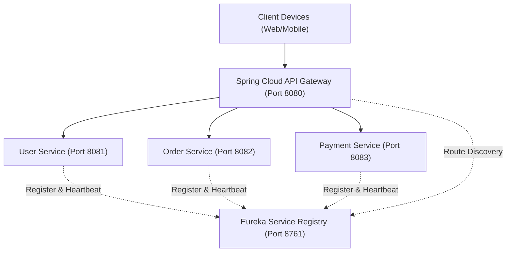

# Lesson 1: Microservices Architecture Step-by-Step Guide

> 🌐 **Language / ភាសា:** 🇬🇧 **[English](README.md)** | 🇰🇭 [ភាសាខ្មែរ (Khmer)](README.kh.md)  
> 🧭 **Navigation:** [📚 Module Index](../README.md) | [← Previous Lesson](../../06-advanced-spring-boot-features/07-dto-mapping/README.md) | [Next Lesson →](../02-inter-service-communication/README.md)  
> 📂 **Runnable Example Project:**  
> 👉 **Complete Project:** [E-Commerce Microservices Platform](../../examples/05-microservices-ecommerce)  
> 📄 **Source Code Files:** [`docker-compose.yml`](../../examples/05-microservices-ecommerce/docker-compose.yml) | [`EurekaServerApplication.java`](../../examples/05-microservices-ecommerce/eureka-server/src/main/java/com/example/eureka/EurekaServerApplication.java) | [`ApiGatewayApplication.java`](../../examples/05-microservices-ecommerce/api-gateway/src/main/java/com/example/gateway/ApiGatewayApplication.java)

---

<p align="center">
  
  
</p>

---

## Table of Contents

1. [What is Microservices Architecture?](#1-what-is-microservices-architecture)
2. [Real-World Applications of Microservices](#2-real-world-applications-of-microservices)
3. [Working of Microservices Architecture](#3-working-of-microservices-architecture)
4. [Main Components of Microservices Architecture](#4-main-components-of-microservices-architecture)
5. [Real-World Example: Amazon E-Commerce Application](#5-real-world-example-amazon-e-commerce-application)
6. [Migrating from Monolithic to Microservices Architecture (9 Steps)](#6-migrating-from-monolithic-to-microservices-architecture)
7. [Challenges of Microservices Architecture](#7-challenges-of-microservices-architecture)
8. [Hands-on Implementation with Spring Boot & Spring Cloud](#8-hands-on-implementation-with-spring-boot--spring-cloud)
9. [Monolithic vs Microservices Architectural Comparison](#9-monolithic-vs-microservices-architectural-comparison)
10. [Lesson Navigation](#10-lesson-navigation)

---

## 1. What is Microservices Architecture?

**Microservices** is an architecture where an application is divided into small, independent services that communicate over a network (using lightweight protocols such as HTTP REST APIs or messaging queues). Each service handles a specific function and can be developed, tested, and deployed separately.

### Key Characteristics:
- **Polyglot Stacks:** Services can be built using different programming languages and frameworks (e.g., Spring Boot for transactional order services, Python for recommendation systems, and Node.js for real-time notifications).
- **Loosely Coupled:** Each microservice is loosely coupled and can be developed, deployed, and scaled independently without risking collateral damage to the rest of the application.

> **Example:**  
> An e-commerce platform uses separate microservices for product catalog, user authentication, cart, payments, and order management, which communicate cleanly through APIs.

---

## 2. Real-World Applications of Microservices

Microservices architecture is widely used in modern enterprise applications where scalability, flexibility, and independent service management are paramount:

- **Amazon:** Initially a monolithic app, Amazon adopted microservices early on, breaking its platform into smaller, fine-grained components. This shift allowed for individual feature deployments hundreds or thousands of times a day, greatly enhancing functionality and customer experience.
- **Banking & FinTech:** Independent services for accounts, transactions, fraud detection, and customer support, ensuring high security, reliability, auditability, and strict compliance with financial regulations.
- **Healthcare Systems:** Patient records, appointment scheduling, billing, and reporting operate as separate services, improving sensitive data isolation, fault tolerance, and system reliability.
- **Uber:** By switching from a monolithic structure to microservices, Uber operations became significantly smoother, resulting in increased webpage views, resilient dispatch capabilities, and search efficiency under massive global concurrency.

---

## 3. Working of Microservices Architecture

The working of microservices architecture focuses on dividing the application into small, independent services that collaborate over network boundaries to perform different business functions:

1. **Business Function:** Each microservice handles one specific feature, such as authentication, payment, or product management.
2. **API Communication:** Services exchange data with each other through standardized APIs (REST, gRPC, or GraphQL).
3. **Independent Operation:** Each service runs independently in its own process or container, communicating via HTTP or asynchronous messaging.
4. **Request Handling:** User requests are routed to the required service for processing and response.

<p align="center">
  
</p>

As illustrated in the architecture diagram above:
- Client traffic originating from **Mobile Apps** or **Web Browsers** connects to the front-facing **REST API / Web Microservice layer** (API Gateway).
- The gateway directs incoming requests to dedicated internal microservices: **Account Service**, **Inventory Service**, and **Shipping Service**.
- Each service operates against its own isolated datastore (**Account DB**, **Inventory DB**, **Shipping DB**) adhering strictly to the *Database per Microservice* pattern.

---

## 4. Main Components of Microservices Architecture

A resilient microservices ecosystem comprises nine essential building blocks:

1. **Microservices:** Small, independent services that focus on a specific business capability and can be developed, deployed, and scaled independently.
2. **API Gateway:** A single entry point that routes client requests to the appropriate microservices and handles common cross-cutting concerns like authentication, SSL termination, request routing, and rate limiting.
3. **Service Registry and Discovery:** Maintains a real-time registry of available service instances (such as Netflix Eureka or HashiCorp Consul) and enables dynamic service-to-service lookup without hardcoded IP addresses.
4. **Load Balancer:** Distributes incoming traffic evenly across multiple service instances to improve availability, performance, and fault resilience.
5. **Deployment & Infrastructure:** Uses **Docker** containerization for consistent runtime encapsulation, while **Kubernetes** orchestrates deployment, health checking, auto-scaling, and rolling updates.
6. **Event Bus / Message Broker:** Enables asynchronous communication between services through messaging (such as Apache Kafka or RabbitMQ), effectively eliminating direct synchronous coupling.
7. **Database per Microservice:** Each microservice owns its dedicated database, ensuring data isolation, schema independence, loose coupling, and independent scaling.
8. **Caching:** Stores frequently accessed read data in-memory (using Redis or Hazelcast) to reduce database load and accelerate response times.
9. **Fault Tolerance and Resilience:** Keeps the system stable during network or downstream service failures using mechanisms such as **Circuit Breakers** (Resilience4j), retries, fallbacks, and timeouts.

---

## 5. Real-World Example: Amazon E-Commerce Application

Amazon’s online retail platform runs on thousands of small, specialized microservices, each handling a specific task. Working together seamlessly, they create a fast, uninterrupted shopping experience.

<p align="center">
  
</p>

### The 12 Core Microservices Powering the Platform:

1. **User Service:** Handles user accounts, profile settings, and preferences, making sure each customer has a personalized experience.
2. **Search Service:** Helps users find products quickly by indexing product data and providing lightning-fast search queries.
3. **Catalog Service:** Manages product listings, specifications, images, and categories, ensuring details are accurate and accessible.
4. **Cart Service:** Lets users add, remove, or modify items in their shopping cart before moving to checkout.
5. **Wishlist Service:** Allows users to save items for later, keeping track of desired products over time.
6. **Order Taking Service:** Ingests customer orders, validating item availability and initial order requests.
7. **Order Processing Service:** Oversees the complete fulfillment lifecycle, coordinating with inventory and logistics to finalize fulfillment.
8. **Payment Service:** Manages secure monetary transactions, payment method tokens, and financial ledgers.
9. **Logistics Service:** Coordinates delivery workflows, carrier tracking, estimated arrival times, and shipping fees.
10. **Warehouse Service:** Tracks stock levels across fulfillment centers and initiates automated restocking alerts.
11. **Notification Service:** Dispatches real-time email, SMS, and push notifications regarding order updates and promotions.
12. **Recommendation Service:** Applies machine learning models over browsing and purchase history to provide real-time product recommendations.

---

## 6. Migrating from Monolithic to Microservices Architecture

Migrating an enterprise system from a monolith to microservices requires a methodical, incremental approach rather than a high-risk "big bang" rewrite:

<p align="center">
  
</p>

### The 9 Essential Migration Steps:

- **Step 1 – Assess Monolith:** Analyze the existing application, audit dependencies, identify tight coupling, and select domain boundaries suitable for initial extraction.
- **Step 2 – Define Services:** Divide the application into separate business functions or capabilities following Domain-Driven Design (DDD) bounded contexts.
- **Step 3 – Gradual Migration:** Employ the **Strangler Fig Pattern** to replace monolith components incrementally by intercepting traffic at the routing layer.
- **Step 4 – Define APIs:** Create clear, versioned APIs (RESTful HTTP/JSON or gRPC contracts) for communication between new microservices and legacy components.
- **Step 5 – Set Up CI/CD:** Automate unit testing, container compilation, and deployment pipelines for rapid, low-risk releases.
- **Step 6 – Service Discovery:** Enable microservices to register dynamically and discover peer endpoints using a service registry.
- **Step 7 – Logging & Monitoring:** Implement centralized logging (ELK / OpenSearch) and distributed tracing (OpenTelemetry / Zipkin) to observe end-to-end request flows.
- **Step 8 – Manage Security:** Apply consistent security policies, centralized authentication (OAuth2 / OIDC / JWT), and mTLS or API gateway validation.
- **Step 9 – Improve Iteratively:** Continuously refine service boundaries and database schemas based on runtime telemetry and production feedback.

---

## 7. Challenges of Microservices Architecture

While microservices provide unprecedented scalability and team autonomy, they introduce operational and architectural complexities:

1. **Distributed Communication & Network Latency:**
   - In-memory function calls are replaced with remote network calls over TCP/HTTP. Network latency, packet loss, and transient timeouts must be handled proactively.
2. **Distributed Data Consistency:**
   - With isolated databases, traditional ACID transactions cannot span multiple services without heavy locks. Applications must adopt **Eventual Consistency** and choreography/orchestration patterns like the **Saga Pattern**.
3. **Operational & Deployment Overhead:**
   - Managing dozens or hundreds of independent artifacts introduces complexity in testing, monitoring, container management, and continuous delivery.

---

## 8. Hands-on Implementation with Spring Boot & Spring Cloud

In the Java ecosystem, **Spring Cloud** provides a comprehensive, production-grade toolkit to realize the microservices architectural vision:



### 1. Service Discovery with Netflix Eureka Server
```java
@SpringBootApplication
@EnableEurekaServer
public class EurekaServerApplication {
    public static void main(String[] args) {
        SpringApplication.run(EurekaServerApplication.class, args);
    }
}
```

### 2. Edge Routing with Spring Cloud Gateway
```yaml
server:
  port: 8080

spring:
  cloud:
    gateway:
      routes:
        - id: order-service
          uri: lb://ORDER-SERVICE
          predicates:
            - Path=/api/v1/orders/**
        - id: user-service
          uri: lb://USER-SERVICE
          predicates:
            - Path=/api/v1/users/**
```

### 3. Fault Tolerance with Resilience4j Circuit Breaker
```java
@Service
public class OrderService {

    private final PaymentClient paymentClient;

    public OrderService(PaymentClient paymentClient) {
        this.paymentClient = paymentClient;
    }

    @CircuitBreaker(name = "paymentService", fallbackMethod = "fallbackPayment")
    public PaymentResponse processOrderPayment(OrderRequest request) {
        return paymentClient.charge(request.amount());
    }

    // Fallback executed when Payment Service experiences latency or failure
    public PaymentResponse fallbackPayment(OrderRequest request, Throwable t) {
        return new PaymentResponse("PENDING_OFFLINE", "Payment delayed, queued for asynchronous retry");
    }
}
```

---

## 9. Monolithic vs Microservices Architectural Comparison

| Dimension | Monolithic Architecture | Microservices Architecture |
| :--- | :--- | :--- |
| **Codebase** | Single consolidated codebase | Autonomous repositories per service |
| **Persistence** | Shared monolithic database | **Database per Microservice** (isolated schema) |
| **Deployment** | All-or-nothing redeployments | **Independent, rolling deployments** per service |
| **Scaling** | Scale the entire monolith horizontally | **Fine-grained scaling** for resource-hungry services |
| **Fault Isolation** | A memory leak or error can crash entire app | Failures are bounded to single service (**Circuit Breaker**) |
| **Tech Diversity**| Locked into a single language and framework | **Polyglot** (best tool for the specific job) |
| **Initial Setup** | Simpler initial build and local testing | Requires DevOps automation, service mesh, and discovery |

---

## 10. Lesson Navigation

| Previous Lesson | Module Index | Next Lesson |
| :--- | :---: | :--- |
| [← DTO Mapping with MapStruct and Java Records](../../06-advanced-spring-boot-features/07-dto-mapping/README.md) | [📚 Module Index](../README.md) | [Inter-Service Microservices Communication (RestClient, WebClient, and FeignClient) →](../02-inter-service-communication/README.md) |
